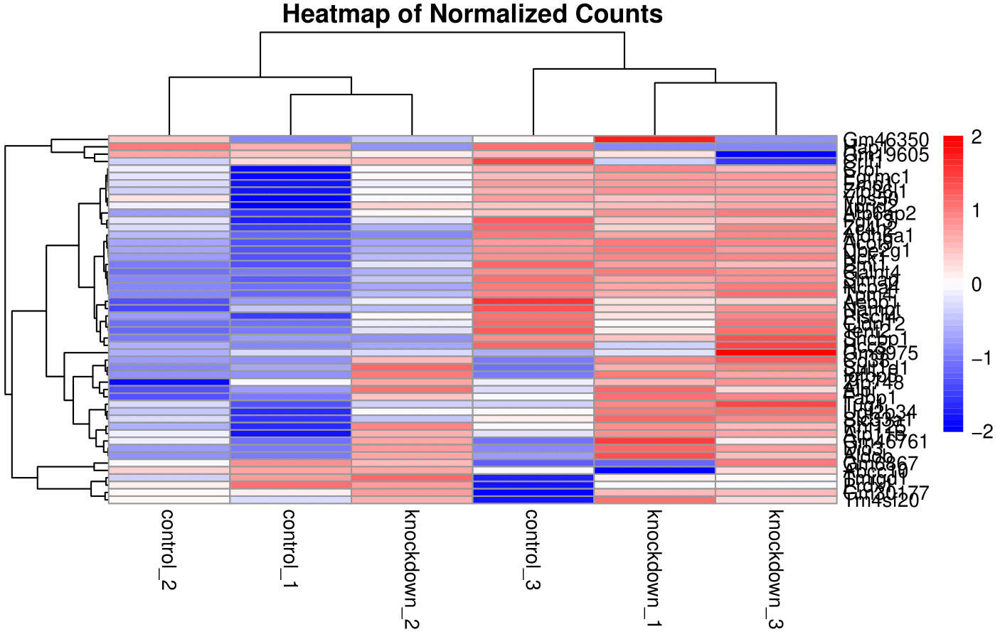

# Mouse-analysis

RNA sequencing analysis of **"[BRCA mutational status shapes the stromal microenvironment of pancreatic cancer linking CLU+ CAF expression with HSF1 signaling (KPC) (house mouse)](https://pmc.ncbi.nlm.nih.gov/articles/PMC9622893/)"** from the Weizmann Institute of Science. Sequencing runs were sourced from **PRJNA825537**, **PRJNA825538**, and **PRJNA825539**, using the GRCm39 RefSeq assembly as the reference genome. Reference files were downloaded via the NCBI datasets command-line tool and reads were downloaded from the SRA.

## Motivation

This project stems from my experience working as a scribe for a breast surgeon. Inspired by the skills I acquired from the **Biostars Handbook**, I explored the Sequence Read Archive (SRA) and searched for "BRCA". Among the results, this mouse study stood out. While working with the human genome might have been computationally intensive for my system, I found this mouse study to be a manageable and meaningful entry point into RNA sequencing analysis. Moreover, cancer research commonly employs mouse models, making this project a great way to integrate my background with new skills.

### Initial Focus

The analysis began with **PRJNA825538**, with plans to analyze the other two datasets (**PRJNA825537** and **PRJNA825539**) later.

---

## Workflow Overview

The general workflow for this project included the following steps:

1. **Build Genome Index:**
   - Use `hisat2` to build the genome index.
   - Index the reference genome using `samtools`.

2. **Alignment and Indexing:**
   - Generate alignments with `hisat2`.
   - Index the resulting BAM files.

3. **BigWig File Generation:**
   - Convert BAM files to BigWig format for easier visualization in IGV.

4. **Feature Counts Analysis:**
   - Use `featureCounts` from the `subread` R package to analyze read counts.

5. **Classification-Based Quantification:**
   - Perform quantification using `salmon` in a Bash environment.

6. **Differential Expression Analysis:**
   - Conduct differential expression analysis using:
     - Feature counts output. The normalized counts are in a seperate file. 
     - Salmon classification output. The DESeq2 output file has the normalized counts in the same file. 
   - Generate heatmaps for both analyses to compare results. Differential expression done using DESeq2. 

---

## Current Progress

For **PRJNA825538**, the design matrix was as follows:

| Sample         | Condition    |
|----------------|--------------|
| `control_1`    | `control`    |
| `control_2`    | `control`    |
| `control_3`    | `control`    |
| `knockdown_1`  | `knockdown`  |
| `knockdown_2`  | `knockdown`  |
| `knockdown_3`  | `knockdown`  |

---

This project not only allowed me to practice RNA sequencing analysis but also provided valuable insights into how cancer-related research is conducted using mouse models. The methods and outputs have enhanced my understanding of differential expression and bioinformatics workflows.

## Heatmaps for PRJNA825538
### Feature counts differential expression heatmap

### Classification based differential expression heatmap

### Analysis of heatmaps
So, what is going on here? From both heatmaps, it looks like there are a few spots of overlapping expression and intersample variability between biological replicates of the same condition. Filtering through the [classification deseq output](classificationresultsPRJNA825538/classification_method.csv) for transcripts with the highest variance, we find that that these transcripts are: 
| Transcript        | Control Variance   |
|-------------|--------------------|
| NM_009076.3 | 997,537            |
| NM_011664.5 | 984,432            |
| NR_102727.1 | 984,164            |
| NM_024277.2 | 978,717            |
| NM_013765.2 | 928,688            |
| NM_001368637.1 | 926,174         |
| NM_019883.4 | 909,616            |
| NM_018796.3 | 894,188            |
| NM_016738.5 | 885,135            |
| NM_018853.3 | 882,073            |

| Transcript          | Knockdown Variance   |
|---------------|----------------------|
| NM_001407444.1 | 983,226              |
| NM_011029.4    | 926,273              |
| NM_001355384.1 | 862,754              |
| NR_110342.1    | 846,139              |
| NM_009076.3    | 796,498              |
| NM_024175.3    | 783,252              |
| NM_025587.2    | 778,767              |
| NM_172086.2    | 742,409              |
| NM_009084.5    | 719,561              |
| NM_001424562.1 | 693,605              |

Filtering through the [feature counts deseq output](featureresultsPRJNA825538/normalized_counts.csv), we find that the genes with the highest variance are: 
| Gene    | Control Variance    |  
|---------|---------------------|
| Hsdl1   | 9.67926e-05         |
| Rnf6    | 8.89335e-05         |
| Lonrf3  | 7.61594e-05         |
| St7     | 7.44192e-05         |
| Dnajc13 | 7.2517e-05          |
| Rilpl2  | 7.24769e-05         |
| Cdk16   | 6.60855e-05         |
| Ndufb9  | 6.1521e-05          |
| Pola2   | 5.63509e-05         |
| Mlph    | 5.46395e-06         |

| Gene    | Knockdown Variance   |
|---------|----------------------|
| Ldah    | 9.82739e-05          |
| Stk24   | 9.62228e-05          |
| Rnf7    | 9.42757e-05          |
| Ccdc25  | 8.80526e-05          |
| Rab11a  | 8.51672e-07          |
| Gnai1   | 7.80612e-05          |
| Stambpl1| 7.47716e-05          |
| Vopp1   | 7.29683e-06          |
| Rpl36al | 7.2966e-05           |
| Rab17   | 7.27788e-05          |

Looking at IGV with some of these transcripts and genes, they mostly fall into two situations: 
The transcripts or genes are located near low coverage, high expression areas. 
THe transcripts or genes are located in an adequate coverage, high expression area. 

The genes and transcripts in the first situations show intersample variability in biological replicates due to low coverage. The genes and transcripts in the second situation are most likely biological differences. 

### Analysis of differentially expressed genes - which genes are the most up or down regulated across all samples? 

Both files were filtered so that FDR was <= 0.05. 

Classification based DESeq2: 

| name           | baseMean | baseMeanA | baseMeanB | foldChange  | log2FoldChange | lfcSE | stat  | PValue  | PAdj    | FDR   | falsePos | control_1 | control_2 | control_3 | knockdown_1 | knockdown_2 | knockdown_3 |
|----------------|----------|-----------|-----------|-------------|----------------|-------|-------|---------|---------|-------|----------|-----------|-----------|-----------|-------------|-------------|-------------|
| NM_001309795.1 | 919.4    | 300.7     | 1538.1    | 5.11        | 2.4            | 0.21  | 11.39 | 4.8e-30 | 1.5e-25 | 0     | 0        | 324.9     | 322.5     | 254.8     | 1216.3      | 1718.2      | 1679.8      |
| NM_025622.3    | 1922     | 1449.3    | 2394.8    | 1.652       | 0.7            | 0.07  | 10.78 | 4.1e-27 | 1.3e-22 | 0     | 0        | 1473.9    | 1439.1    | 1434.8    | 2489.3      | 2273.1      | 2421.9      |
| NM_010518.2    | 170      | 61.6      | 278.5     | 4.529       | 2.2            | 0.24  | 9.22  | 3.1e-20 | 9.6e-16 | 0     | 0        | 68.3      | 63.2      | 53.2      | 293.6       | 307.5       | 234.4       |
| NM_001407779.1 | 133.8    | 267.6     | 0         | 0.001       | -10.5          | 1.2   | -8.72 | 2.8e-18 | 8.6e-14 | 0     | 0        | 260.5     | 261       | 281.4     | 0           | 0           | 0           |
| NM_001079830.2 | 124.9    | 0         | 249.8     | 1433.18     | 10.5           | 1.21  | 8.67  | 4.2e-18 | 1.3e-13 | 0     | 0        | 0         | 0         | 0         | 277.1       | 244.7       | 227.7       |
| NM_001403594.1 | 127.2    | 254.4     | 0         | 0.001       | -10.4          | 1.21  | -8.56 | 1.1e-17 | 3.4e-13 | 0     | 0        | 270.4     | 216.4     | 276.3     | 0           | 0           | 0           |
| NM_016736.3    | 123.5    | 247       | 0         | 0.001       | -10.4          | 1.22  | -8.52 | 1.6e-17 | 5.0e-13 | 0     | 0        | 211       | 252.6     | 277.3     | 0           | 0           | 0           |
| NM_001305264.1 | 109.7    | 0         | 219.3     | 1258.457    | 10.3           | 1.21  | 8.48  | 2.3e-17 | 7.1e-13 | 0     | 0        | 0         | 0         | 0         | 247.4       | 212.4       | 198.2       |
| NM_178939.3    | 91.3     | 0         | 182.6     | 1047.057    | 10             | 1.21  | 8.28  | 1.3e-16 | 3.9e-12 | 0     | 0        | 0         | 0         | 0         | 194.3       | 175.4       | 178.2       |
| NM_001159562.1 | 1488.8   | 877.7     | 2099.8    | 2.39        | 1.3            | 0.16  | 8.02  | 1.1e-15 | 3.4e-11 | 0     | 0        | 942       | 934.7     | 756.3     | 1886.3      | 2012.8      | 2400.4      |
| NM_001277123.1 | 61.8     | 0         | 123.6     | 709.503     | 9.5            | 1.23  | 7.68  | 1.6e-14 | 4.9e-10 | 0     | 0        | 0         | 0         | 0         | 127.2       | 133.9       | 109.8       |
| NM_001418641.1 | 64.3     | 128.6     | 0         | 0.001       | -9.4           | 1.27  | -7.43 | 1.1e-13 | 3.3e-09 | 0     | 0        | 163.4     | 122.1     | 100.3     | 0           | 0           | 0           |
| NM_133741.2    | 54.2     | 0         | 108.4     | 622.474     | 9.3            | 1.26  | 7.38  | 1.6e-13 | 4.9e-09 | 0     | 0        | 0         | 0         | 0         | 124.6       | 113.6       | 87.1        |
| NM_001420970.1 | 83.6     | 167.1     | 0         | 0.001       | -9.8           | 1.35  | -7.25 | 4.2e-13 | 1.3e-08 | 0     | 0        | 85.2      | 177.7     | 238.4     | 0           | 0           | 0           |
| NM_001372564.1 | 44.1     | 0         | 88.2      | 506.37      | 9              | 1.26  | 7.15  | 8.9e-13 | 2.8e-08 | 0     | 0        | 0         | 0         | 0         | 100.2       | 86.8        | 77.7        |
| NM_001166429.1 | 74.4     | 0         | 148.7     | 853.61      | 9.7            | 1.39  | 7.01  | 2.5e-12 | 7.7e-08 | 0     | 0        | 0         | 0         | 0         | 138.5       | 235.4       | 72.3        |
| NM_054083.2    | 41.5     | 0         | 83        | 476.265     | 8.9            | 1.28  | 6.97  | 3.1e-12 | 9.6e-08 | 0     | 0        | 0         | 0         | 0         | 101.1       | 72.9        | 75          |
| NM_001403595.1 | 105.9    | 0         | 211.8     | 1213.954    | 10.2           | 1.48  | 6.92  | 4.4e-12 | 1.4e-07 | 0     | 0        | 0         | 0         | 0         | 65.3        | 366.5       | 203.6       |
| NR_156449.1    | 61.1     | 122.2     | 0         | 0.002       | -9.3           | 1.35  | -6.9  | 5.0e-12 | 1.6e-07 | 0     | 0        | 182.3     | 112.8     | 71.6      | 0           | 0           | 0           |
| NM_001164572.1 | 38.9     | 77.8      | 0         | 0.002       | -8.7           | 1.26  | -6.88 | 5.9e-12 | 1.9e-07 | 0     | 0        | 77.3      | 69.1      | 87        | 0           | 0           | 0           |
| NM_001347601.2 | 49.2     | 98.4      | 0         | 0.002       | -9             | 1.32  | -6.82 | 9.0e-12 | 2.8e-07 | 0     | 0        | 112.9     | 61.5      | 120.8     | 0           | 0           | 0           |
| XM_030248314.1 | 33       | 0         | 66        | 378.019     | 8.6            | 1.27  | 6.72  | 1.8e-11 | 5.5e-07 | 0     | 0        | 0         | 0         | 0         | 68          | 59.1        | 71          |
| XR_001785575.2 | 40.9     | 0         | 81.8      | 468.051     | 8.9            | 1.32  | 6.71  | 1.9e-11 | 6.0e-07 | 0     | 0        | 0         | 0         | 0         | 77.5        | 58.2        | 109.8       |
| NM_027823.2    | 34.6     | 69.2      | 0         | 0.003       | -8.5           | 1.27  | -6.71 | 2.0e-11 | 6.2e-07 | 0     | 0        | 70.3      | 75.8      | 61.4      | 0           | 0           | 0           |
| NM_001420869.1 | 302.1    | 391.9     | 212.3     | 0.542       | -0.9           | 0.13  | -6.65 | 2.9e-11 | 9.0e-07 | 0     | 0        | 395.2     | 405.9     | 374.6     | 202.1       | 227.1       | 207.6       |
| NM_013556.2    | 580.5    | 430.9     | 730       | 1.693       | 0.8            | 0.12  | 6.52  | 7.3e-11 | 2.3e-06 | 0     | 0        | 400.2     | 469.9     | 422.7     | 717.9       | 766.3       | 705.9       |
| NM_207229.3    | 122.2    | 174.2     | 70.2      | 0.4         | -1.3           | 0.21  | -6.44 | 1.2e-10 | 3.8e-06 | 0     | 0        | 169.4     | 180.2     | 173       | 67.1        | 64.6        | 79          |
| NM_172570.5    | 196.9    | 274.8     | 118.9     | 0.431       | -1.2           | 0.19  | -6.4  | 1.6e-10 | 4.8e-06 | 0     | 0        | 240.7     | 288       | 295.8     | 112.4       | 114.5       | 129.9       |
| NM_008621.3    | 852.6    | 593.2     | 1112      | 1.876       | 0.9            | 0.14  | 6.36  | 2.0e-10 | 6.1e-06 | 0     | 0        | 545.8     | 586.9     | 646.8     | 1256.4      | 1014.7      | 1064.9      |
| XM_017317209.3 | 1470.3   | 1880.7    | 1059.9    | 0.564       | -0.8           | 0.13  | -6.31 | 2.7e-10 | 8.5e-06 | 0     | 0        | 1726.5    | 1910.7    | 2004.8    | 1203.2      | 975.9       | 1000.6      |
| NM_001358042.1 | 31.4     | 0         | 62.8      | 359.555     | 8.5            | 1.35  | 6.3   | 2.9e-10 | 9.2e-06 | 0     | 0        | 0         | 0         | 0         | 70.6        | 41.5        | 76.4        |
| NM_001413585.1 | 1587.8   | 1989      | 1186.5    | 0.596       | -0.7           | 0.12  | -6.26 | 4.0e-10 | 1.2e-05 | 0     | 0        | 1970.2    | 1998.2    | 1998.7    | 1030.7      | 1316.6      | 1212.3      |
| XM_006497568.5 | 33.3     | 66.7      | 0         | 0.003       | -8.5           | 1.36  | -6.21 | 5.2e-10 | 1.6e-05 | 0     | 0        | 94.1      | 45.5      | 60.4      | 0           | 0           | 0           |
| NM_008410.3    | 4106.5   | 3278.4    | 4934.6    | 1.505       | 0.6            | 0.1   | 6.19  | 6.2e-10 | 1.9e-05 | 0     | 0        | 2968.6    | 3252.9    | 3613.6    | 5016.9      | 4791.9      | 4995.1      |
| NM_001360934.1 | 32.3     | 64.6      | 0         | 0.003       | -8.4           | 1.36  | -6.18 | 6.3e-10 | 2.0e-05 | 0     | 0        | 77.3      | 76.6      | 39.9      | 0           | 0           | 0           |
| NM_001417457.1 | 113.3    | 64.2      | 162.4     | 2.535       | 1.3            | 0.22  | 6.03  | 1.7e-09 | 5.2e-05 | 0     | 0        | 68.3      | 58.9      | 65.5      | 180.4       | 151.4       | 155.4       |
| NM_027211.2    | 316.5    | 179.9     | 453.1     | 2.52        | 1.3            | 0.22  | 6.02  | 1.7e-09 | 5.4e-05 | 0     | 0        | 183.2     | 197.9     | 158.6     | 549.8       | 423.8       | 385.8       |
| XM_006519542.5 | 22       | 0         | 44.1      | 252.475     | 8              | 1.33  | 6.02  | 1.8e-09 | 5.6e-05 | 0     | 0        | 0         | 0         | 0         | 48.8        | 37.9        | 45.5        |
| NM_009362.2    | 3756.6   | 4864.3    | 2648.9    | 0.545       | -0.9           | 0.15  | -6    | 2.0e-09 | 6.2e-05 | 0     | 0        | 4236.5    | 4640.7    | 5715.6    | 2421.3      | 2790.2      | 2735.3      |
| NM_145539.2    | 280      | 154.1     | 405.9     | 2.636       | 1.4            | 0.23  | 5.99  | 2.1e-09 | 6.4e-05 | 0     | 0        | 179.3     | 164.2     | 118.7     | 440.9       | 421.9       | 355         |
| NM_172119.2    | 31.9     | 5.9       | 57.9      | 9.745       | 3.3            | 0.55  | 5.92  | 3.2e-09 | 9.9e-05 | 0     | 0        | 5         | 6.7       | 6.1       | 76.7        | 48.9        | 48.2        |
| XM_030244688.2 | 22.4     | 44.8      | 0         | 0.004       | -7.9           | 1.35  | -5.86 | 4.6e-09 | 1.4e-04 | 0     | 0        | 38.6      | 39.6      | 56.3      | 0           | 0           | 0           |
| XM_006522100.5 | 18.8     | 0         | 37.7      | 215.466     | 7.8            | 1.34  | 5.79  | 7.2e-09 | 2.3e-04 | 0     | 0        | 0         | 0         | 0         | 34.9        | 37.9        | 40.2        |
| NM_028071.3    | 444.6    | 326.3     | 562.8     | 1.722       | 0.8            | 0.14  | 5.7   | 1.2e-08 | 3.7e-04 | 0     | 0        | 311       | 368       | 299.9     | 575.9       | 542         | 570.6       |
| NM_009701.4    | 118.8    | 67.8      | 169.7     | 2.499       | 1.3            | 0.23  | 5.67  | 1.4e-08 | 4.5e-04 | 0     | 0        | 73.3      | 74.9      | 55.3      | 180.4       | 168         | 160.7       |
| NM_027492.2    | 17.6     | 35.2      | 0         | 0.005       | -7.5           | 1.35  | -5.61 | 2.0e-08 | 6.3e-04 | 0     | 0        | 33.7      | 36.2      | 35.8      | 0           | 0           | 0           |
| NM_001163006.2 | 20.2     | 40.4      | 0         | 0.005       | -7.7           | 1.38  | -5.6  | 2.1e-08 | 6.6e-04 | 0     | 0        | 44.6      | 48        | 28.7      | 0           | 0           | 0           |
| NM_178267.4    | 21.8     | 0         | 43.5      | 248.823     | 8              | 1.45  | 5.5   | 3.8e-08 | 1.2e-03 | 0     | 0        | 0         | 0         | 0         | 26.1        | 41.5        | 63          |
| NM_025669.2    | 48.2     | 96.3      | 0         | 0.002       | -9             | 1.64  | -5.48 | 4.2e-08 | 1.3e-03 | 0     | 0        | 52.5      | 32.8      | 203.7     | 0           | 0           | 0           |
| NM_001163468.1 | 22.5     | 0         | 45        | 257.292     | 8              | 1.48  | 5.42  | 5.8e-08 | 1.8e-03 | 0     | 0        | 0         | 0         | 0         | 30.5        | 32.3        | 72.3        |
| NM_001286567.1 | 17       | 0         | 33.9      | 2024413.66  | 20.9           | 3.91  | 5.36  | 8.4e-08 | 2.6e-03 | 0     | 0        | 0         | 0         | 0         | 0           | 0           | 101.8       |
| NM_001271542.1 | 16.5     | 0         | 33        | 1972786.542 | 20.9           | 3.91  | 5.35  | 8.9e-08 | 2.8e-03 | 0     | 0        | 0         | 0         | 0         | 0           | 0           | 99.1        |
| NM_001408582.1 | 15.6     | 0         | 31.3      | 1851961.428 | 20.8           | 3.91  | 5.33  | 1.0e-07 | 3.1e-03 | 0     | 0        | 0         | 0         | 0         | 0           | 0           | 93.8        |
| NM_001166667.1 | 14.7     | 0         | 29.5      | 1767831.101 | 20.8           | 3.91  | 5.31  | 1.1e-07 | 3.5e-03 | 0     | 0        | 0         | 0         | 0         | 0           | 0           | 88.4        |
| XR_003956230.2 | 14.7     | 0         | 29.5      | 1767831.101 | 20.8           | 3.91  | 5.31  | 1.1e-07 | 3.5e-03 | 0     | 0        | 0         | 0         | 0         | 0           | 0           | 88.4        |
| NM_007592.4    | 201.1    | 91.6      | 310.6     | 3.392       | 1.8            | 0.33  | 5.27  | 1.4e-07 | 4.3e-03 | 0     | 0        | 87.2      | 102.7     | 84.9      | 434.8       | 255.8       | 241.1       |
| NM_001403130.1 | 18.4     | 0         | 36.9      | 211.364     | 7.7            | 1.49  | 5.19  | 2.1e-07 | 6.6e-03 | 1e-04 | 0        | 0         | 0         | 0         | 54.9        | 22.2        | 33.5        |
| NR_028101.1    | 4226.9   | 3720.4    | 4733.3    | 1.273       | 0.3            | 0.07  | 5.18  | 2.2e-07 | 6.8e-03 | 1e-04 | 0        | 3751.1    | 3532.5    | 3877.6    | 4892.3      | 4526.9      | 4780.8      |
| NM_030263.6    | 15.4     | 0         | 30.9      | 176.848     | 7.5            | 1.44  | 5.18  | 2.2e-07 | 6.9e-03 | 1e-04 | 0        | 0         | 0         | 0         | 36.6        | 21.2        | 34.8        |
| NM_009643.3    | 24.3     | 0         | 48.5      | 278.357     | 8.1            | 1.57  | 5.17  | 2.4e-07 | 7.4e-03 | 1e-04 | 0        | 0         | 0         | 0         | 28.8        | 88.6        | 28.1        |
| NM_007426.4    | 50.7     | 21.9      | 79.3      | 3.626       | 1.9            | 0.36  | 5.14  | 2.7e-07 | 8.3e-03 | 1e-04 | 0        | 22.8      | 23.6      | 19.4      | 95.8        | 76.6        | 65.6        |
| NR_166766.1    | 14.2     | 28.4      | 0         | 0.007       | -7.2           | 1.41  | -5.13 | 2.9e-07 | 9.1e-03 | 1e-04 | 0        | 24.8      | 33.7      | 26.6      | 0           | 0           | 0           |
| NM_001358780.1 | 13       | 0         | 26        | 148.774     | 7.2            | 1.41  | 5.12  | 3.1e-07 | 9.7e-03 | 1e-04 | 0        | 0         | 0         | 0         | 25.3        | 25.9        | 26.8        |
| NM_001355005.1 | 1646.2   | 1813.2    | 1479.2    | 0.817       | -0.3           | 0.06  | -5.09 | 3.6e-07 | 1.1e-02 | 1e-04 | 0        | 1823.6    | 1765.8    | 1850.3    | 1485.5      | 1494.8      | 1457.4      |
| NM_001276413.1 | 275.7    | 360.3     | 191.1     | 0.53        | -0.9           | 0.18  | -5.08 | 3.7e-07 | 1.2e-02 | 1e-04 | 0        | 333.8     | 356.2     | 390.9     | 213.5       | 164.3       | 195.6       |
| NM_029673.3    | 25.4     | 0         | 50.8      | 290.43      | 8.2            | 1.61  | 5.08  | 3.8e-07 | 1.2e-02 | 1e-04 | 0        | 0         | 0         | 0         | 27          | 27.7        | 97.8        |
| NM_008235.3    | 12.5     | 0         | 25        | 143.595     | 7.2            | 1.42  | 5.03  | 4.8e-07 | 1.5e-02 | 1e-04 | 0        | 0         | 0         | 0         | 27          | 24          | 24.1        |
| NM_016762.2    | 12.9     | 25.9      | 0         | 0.007       | -7.1           | 1.43  | -4.96 | 6.9e-07 | 2.1e-02 | 2e-04 | 0        | 30.7      | 24.4      | 22.5      | 0           | 0           | 0           |
| NM_001109909.1 | 27.9     | 55.8      | 0         | 0.003       | -8.2           | 1.67  | -4.92 | 8.9e-07 | 2.8e-02 | 2e-04 | 0        | 73.3      | 80.8      | 13.3      | 0           | 0           | 0           |
| XM_017322385.3 | 644.9    | 749.7     | 540.1     | 0.72        | -0.5           | 0.1   | -4.91 | 9.2e-07 | 2.9e-02 | 2e-04 | 0        | 748.8     | 779.8     | 720.5     | 515.8       | 566         | 538.5       |
| NM_011693.3    | 266      | 337.2     | 194.7     | 0.578       | -0.8           | 0.16  | -4.88 | 1.0e-06 | 3.3e-02 | 2e-04 | 0        | 294.2     | 352       | 365.4     | 194.3       | 195.7       | 194.2       |

Feature based DESeq2

| Gene        | Chr         | Start     | End       | Strand | Length | logFC              | logCPM           | F                | PValue               | FDR                  | control_1         | control_2           | control_3          | knockdown_1       | knockdown_2       | knockdown_3       |
|-------------|-------------|-----------|-----------|--------|--------|--------------------|------------------|------------------|----------------------|----------------------|-------------------|---------------------|--------------------|-------------------|-------------------|-------------------|
| Aldob       | NC_000070.7 | 49535993  | 49549546  | -      | 2018   | 2.41665481809119   | 3.24011090149378 | 49.941813007993  | 2.47451088185298e-05 | 0.0225922843513177   | 1.52493092590977  | 1.7764917174018     | 1.90063815606268   | 4.48182990591731  | 3.69463043161127  | 3.48661959579657  |
| Angpt2      | NC_000074.7 | 18740279  | 18791578  | -      | 3560   | 1.82730489599433   | 3.85448208357427 | 65.8220861661918 | 7.00088816308163e-06 | 0.013317033307366    | 2.92596702447778  | 2.71346479097889    | 2.5554527502089    | 4.71653861120056  | 4.47314598267567  | 4.1967371023182   |
| Anxa13      | NC_000081.7 | 58204860  | 58261123  | -      | 1408   | 1.33859891781677   | 6.40296348890081 | 61.2867280947579 | 9.72401117733918e-06 | 0.013317033307366    | 5.63151326081465  | 5.71247048099289    | 5.4130226582958    | 7.2023400610873   | 6.81245188082852  | 6.69379229135356  |
| Bc1         | NC_000073.7 | 144468207 | 144468360 | +      | 154    | -0.956071063603026 | 4.90962503920596 | 33.4601301339169 | 0.000138097044950847 | 0.0439479404001973   | 5.42678735790173  | 5.3345291362591     | 5.1223601810901    | 4.25499542773589  | 4.42484759024282  | 4.40524419928827  |
| Car8        | NC_000070.7 | 8141491   | 8239226   | -      | 6909   | 1.60901716086599   | 6.58596171271678 | 78.01772213814   | 3.14925717249679e-06 | 0.0115010871939583   | 5.47863575728871  | 5.52886469514026    | 5.71497421537173   | 7.49196038069641  | 6.84340423614192  | 7.11694103602427  |
| Cd38        | NC_000071.7 | 44026153  | 44069714  | +      | 3009   | 2.15904806884926   | 2.6307452146583  | 45.5215117782145 | 3.75772597300505e-05 | 0.0250652693982863   | 1.38702636238591  | 1.46182044596844    | 1.25901527761821   | 3.32728543452318  | 2.92321234329378  | 3.65934707737434  |
| Cyp2c65     | NC_000085.7 | 39049450  | 39082392  | +      | 1941   | 1.35441596370692   | 6.31721663491058 | 32.6175476311315 | 0.000153407871833727 | 0.0454253146975759   | 5.21894091122713  | 5.21792383008467    | 5.9332295713029    | 7.1747816784805   | 6.46377727687891  | 6.78986350887316  |
| Cyp4f14     | NC_000083.7 | 33122331  | 33136353  | -      | 4156   | 1.90760170393109   | 2.38844167422469 | 33.9191888867938 | 0.000132068863812326 | 0.0438468627856921   | 1.06399483295059  | 1.46182044596844    | 1.41219362814258   | 3.29351695090213  | 2.96884255183585  | 2.63677331011049  |
| D17H6S56E-5 | NC_000083.7 | 35215654  | 35219605  | -      | 3372   | -0.771274245458774 | 8.4907508057435  | 35.8284367967002 | 0.000103816962557284 | 0.0379139547259199   | 8.72858034646617  | 8.86901322084768    | 8.87222940718536   | 8.18376713697245  | 7.95514579468291  | 8.01437972145288  |
| Ddc         | NC_000077.7 | 11764101  | 11848144  | -      | 2449   | 1.24731542159481   | 5.01079239678706 | 55.1551902361016 | 1.57391772589753e-05 | 0.0172438426049334   | 4.4265190758366   | 4.2031778368529     | 4.18671845829105   | 5.6697579556875   | 5.4320354605146   | 5.37521041795049  |
| Dhrs3       | NC_000070.7 | 144618712 | 144654214 | +      | 4261   | 1.52149856249194   | 3.58416032049347 | 39.606796338654  | 6.79246784846796e-05 | 0.0311312040935839   | 2.76825054209731  | 2.31974367503865    | 2.95515709324725   | 4.00671171178923  | 4.35782674245895  | 4.01784498138544  |
| Dio3        | NC_000078.7 | 110245664 | 110247531 | +      | 1868   | 3.20955605550737   | 3.17753049250414 | 93.3149643123823 | 1.38476940598265e-06 | 0.00758576680597294  | 0.870561070447464 | 1.33957609166922    | 1.08761985720896   | 4.40484744517765  | 3.74795142969877  | 3.73852795430435  |
| Fn1         | NC_000067.7 | 71624632  | 71692393  | -      | 8471   | -0.913395500195529 | 6.31294409771812 | 43.4873146947904 | 4.52965670378798e-05 | 0.0254876845982412   | 6.65810396720432  | 6.58271068421537    | 6.83526319740883   | 5.84317021135756  | 5.79710174551054  | 5.71572654242011  |
| Gjb4        | NC_000070.7 | 127234892 | 127247874 | -      | 4086   | -0.899691849976688 | 6.37148365410836 | 45.0296043802448 | 3.88928057476148e-05 | 0.0250652693982863   | 6.77675748407243  | 6.80687819750879    | 6.65894226085679   | 5.78360164625171  | 5.94713047534177  | 5.82860508381148  |
| Gm13205     | NC_000070.7 | 149031946 | 149036779 | -      | 1487   | -1.24424949017519  | 3.55449551892048 | 36.4095183421285 | 9.71299235618339e-05 | 0.0379139547259199   | 3.95140091689552  | 4.07494959637726    | 4.02981562624209   | 2.90360065398042  | 2.67052286793163  | 2.93452949507855  |
| Gm20082     | NC_000082.7 | 15689589  | 15690074  | +      | 486    | 1.4368088950717    | 3.4579287624929  | 36.4962164363447 | 9.61701602075065e-05 | 0.0379139547259199   | 2.97492723588929  | 2.50176993069097    | 2.34319264003948   | 4.10732364978212  | 3.87322111800584  | 3.98574784785792  |
| Hap1        | NC_000077.7 | 100238153 | 100247808 | -      | 4402   | -2.17824875762902  | 2.1924418159425  | 41.0098766928016 | 5.99942347859588e-05 | 0.0298771289234075   | 2.52693445426876  | 2.89803431912138    | 3.0041876367345    | 0.933517335889103 | 0.984887705496488 | 0.957808596739451 |
| Hkdc1       | NC_000076.7 | 62218916  | 62259490  | -      | 6027   | 2.04821445696068   | 2.19501184480892 | 33.4849060921354 | 0.000140395939577118 | 0.0439479404001973   | 1.23453295777507  | 1.05879712119898    | 0.893082035783609  | 2.43110014787153  | 3.05598899153694  | 3.00026837539876  |
| Hprt1       | NC_000086.8 | 52076955  | 52110537  | +      | 1349   | 0.790117478347299  | 7.25182886902463 | 35.9653104433892 | 0.000102167173516781 | 0.0379139547259199   | 6.6951010673006   | 6.9495344856621     | 6.75875164046892   | 7.59431890244888  | 7.6571498402353   | 7.52413192891255  |
| Igfbp5      | NC_000067.7 | 72897224  | 72914024  | -      | 5854   | 2.27947313015116   | 5.54374655416717 | 171.90361677183  | 6.53306415238516e-08 | 0.000715762508535318 | 4.11323109646361  | 4.07494959637726    | 3.88025005640863   | 6.40613095793948  | 6.36057155966839  | 6.00710051011473  |
| Il1rn       | NC_000068.8 | 24226872  | 24241497  | +      | 2805   | 0.92688093479933   | 8.90452887553979 | 51.2490558850714 | 2.19105978024982e-05 | 0.0218229554112882   | 8.38235196015836  | 8.43854308921321    | 8.28061858887471   | 9.14687855699457  | 9.33584038206784  | 9.39080980966312  |
| Krt7        | NC_000081.7 | 101310284 | 101325687 | +      | 1586   | 1.23622094796388   | 5.93877075218516 | 43.2208130623357 | 4.65273541406374e-05 | 0.0254876845982412   | 5.26887667485399  | 5.38947801006117    | 4.89426994831505   | 6.11374670246668  | 6.49139934618593  | 6.6380925658129   |
| Mpp1        | NC_000086.8 | 74153339  | 74174622  | -      | 2525   | 0.928307379823287  | 7.84378070529316 | 42.103218032022  | 5.21330086576409e-05 | 0.0271985353739578   | 7.18576829049455  | 7.31858614834273    | 7.41124746470515   | 8.42898312751873  | 8.05636959148565  | 8.19191903692903  |
| Plac9       | NC_000080.7 | 25888356  | 25903339  | -      | 944    | -1.31701550097555  | 5.05641270924115 | 70.0187201721228 | 5.24238886017509e-06 | 0.013317033307366    | 5.51219426612598  | 5.62358646194353    | 5.53482137512699   | 4.21947024084645  | 4.17524017094674  | 4.40524419928827  |
| Rnase4      | NC_000080.7 | 51328534  | 51343608  | +      | 1996   | 1.02060098042899   | 6.10254668713299 | 38.4245729322534 | 7.7227697372161e-05  | 0.0338442660963758   | 5.66918967793449  | 5.30216381016865    | 5.54314013164132   | 6.72709088327858  | 6.49530253577995  | 6.30898301109742  |
| Sec16b      | NC_000067.7 | 157334303 | 157395995 | +      | 5960   | 1.48100036273966   | 4.02838547748896 | 48.6665606587125 | 2.76192995141279e-05 | 0.0232766958059065   | 3.23820623619466  | 2.98215875046476    | 3.22708099968714   | 4.69082718691206  | 4.26942003612973  | 4.74909015047519  |
| Serpinb1a   | NC_000079.7 | 33026075  | 33037189  | -      | 2428   | 1.44645653781003   | 5.31568195421286 | 45.9665802676885 | 3.5532098896449e-05  | 0.0250652693982863   | 4.47837694655036  | 4.75080146621246    | 3.95697017462864   | 6.08442511354544  | 5.69897467924995  | 5.7732695041296   |
| Serpine1    | NC_000071.7 | 137090358 | 137101126 | -      | 3024   | -1.17587427541512  | 4.76410472441423 | 32.711493950831  | 0.000151630522271371 | 0.0454253146975759   | 5.52868526206332  | 4.9414833955552     | 5.1443987274169    | 3.85291305811892  | 4.2324825384064   | 4.11006206315437  |
| Sidt2       | NC_000075.7 | 45849155  | 45869299  | -      | 7374   | -1.46843798748156  | 4.7569147001202  | 39.562215530325  | 6.8195408748267e-05  | 0.0311312040935839   | 5.60842589337978  | 5.27740423537403    | 4.93276899626685   | 4.16448637276372  | 3.52171392314169  | 3.81358824190298  |
| Sord        | NC_000068.8 | 122065320 | 122095818 | +      | 2259   | 0.941271678680125  | 5.79067549168408 | 37.2039418802652 | 8.85753455287852e-05 | 0.0373242879082066   | 5.05784188428917  | 5.46451463441328    | 5.19806572709237   | 6.12338961374032  | 6.2166859722389   | 6.21520312726253  |
| Sptssb      | NC_000069.7 | 69726871  | 69768697  | -      | 2192   | 1.12557774778382   | 4.97425738419202 | 43.7287043446433 | 4.42233614831804e-05 | 0.0254876845982412   | 4.29773567686957  | 4.45945174018806    | 4.18671845829105   | 5.60927989130877  | 5.28646162882721  | 5.36276791271975  |
| Sult1d1     | NC_000071.7 | 87702509  | 87716865  | -      | 2394   | 3.82546297783957   | 2.15239454714021 | 62.1969320549276 | 7.34043457817777e-06 | 0.013317033307366    | 0.382607551416998 | -0.0525134349751261 | -0.349655684443282 | 2.49191803128121  | 3.39373082213398  | 3.00026837539876  |
| Tlnrd1      | NC_000073.7 | 83529703  | 83533549  | -      | 3847   | -1.60627476401406  | 2.93355629438245 | 35.1716082699318 | 0.000112653850595817 | 0.0396928474902715   | 3.65354942025939  | 3.49294183855429    | 3.26780645754561   | 2.23156192092153  | 1.67712143312687  | 2.02887820960346  |
| Tm4sf4      | NC_000069.7 | 57332831  | 57349098  | +      | 1400   | 1.38923545331776   | 6.23467677898247 | 56.0439402146782 | 1.46353010561779e-05 | 0.0172438426049334   | 5.63912767001691  | 5.46451463441328    | 4.98255326153693   | 6.87712411266347  | 6.84033871325227  | 6.55849726032932  |
| Tns4        | NC_000077.7 | 98956504  | 98980132  | -      | 4755   | 1.27975118291974   | 4.04813656643459 | 45.7792653506383 | 3.61923047466953e-05 | 0.0250652693982863   | 3.35377751737055  | 3.40423961258943    | 3.14200996163758   | 4.67779757387064  | 4.44112737574097  | 4.4991881064479   |
| Trim47      | NC_000077.7 | 115996576 | 116001061 | -      | 2195   | -1.20468629823791  | 5.72321942800064 | 62.456627415247  | 8.91330205999607e-06 | 0.013317033307366    | 6.00596197864957  | 6.25513697013937    | 6.30989870977953   | 4.98333740699404  | 4.93061986913542  | 5.10335199306567  |
| Wnt7a       | NC_000072.7 | 91340963  | 91388335  | -      | 3227   | -1.4914075355291   | 3.64486221550404 | 34.9061499768287 | 0.000115933837138435 | 0.0396928474902715   | 4.46129727046505  | 4.23781438138332    | 3.74255542933025   | 2.60636380966635  | 2.92321234329378  | 2.71716870995527  |
| NM_146126.4    | 210      | 144.9     | 275.1     | 1.893       | 0.9            | 0.19  | 4.87  | 1.1e-06 | 3.5e-02 | 3e-04 | 0        | 126.8     | 167.6     | 140.2     | 257.9       | 280.7       | 286.7       |
| NM_011254.5    | 1109.6   | 1256.2    | 962.9     | 0.767       | -0.4           | 0.08  | -4.85 | 1.2e-06 | 3.8e-02 | 3e-04 | 0        | 1226.3    | 1281.6    | 1260.8    | 1019.4      | 937.1       | 932.3       |
| NM_011434.2    | 3737     | 3018.9    | 4455.2    | 1.475       | 0.6            | 0.12  | 4.83  | 1.4e-06 | 4.3e-02 | 3e-04 | 0        | 2661.5    | 3384.3    | 3010.8    | 4212.7      | 4638.6      | 4514.2      |
| NM_001018042.3 | 23.3     | 46.6      | 0         | 0.004       | -7.9           | 1.65  | -4.82 | 1.4e-06 | 4.4e-02 | 3e-04 | 0        | 26.7      | 21.9      | 91.1      | 0           | 0           | 0           |
| NM_001081069.3 | 14       | 27.9      | 0         | 0.007       | -7.2           | 1.5   | -4.82 | 1.4e-06 | 4.5e-02 | 3e-04 | 0        | 26.7      | 38.7      | 18.4      | 0           | 0           | 0           |
| NM_033073.3    | 222.9    | 130.5     | 315.2     | 2.409       | 1.3            | 0.26  | 4.81  | 1.5e-06 | 4.6e-02 | 3e-04 | 0        | 135.7     | 148.2     | 107.5     | 247.4       | 325.9       | 372.4       |

### Gene ontology analysis
Finally, we can do a gene ontology analysis. Panther was used here to determine the pathway, and the genes from the classification file were used here. Based on this dataset, the classification method had a better assignment rate. The classification method would often have assignment rates of ~70%, whereas the feature counting method had assignment rates of ~50%. 

The authors note in their results section that: 

>To further study the transcriptional signatures of these clusters we performed pathway analysis of the top DE genes in clusters that differentially expressed ACTA2, CLU, >and HLA-DR in the Peng dataset (Fig. 1j–n; Supplementary Data 2). The ACTA2+ (αSMA; Fig. 1k, cluster 0) cluster was enriched for myofibroblastic pathways such as ECM >remodeling (collagens and MMPs), wound healing (INHBA, THBS2), smooth muscle contraction (ACTA2 and TPM genes), and cell-substrate adhesion (LRRC15, ITGB5)12,13,19,34. CLU >was differentially upregulated in two clusters—cluster 1 and cluster 2—albeit at different levels. We defined these clusters as CLUlow (1) and CLUhigh (2), to reflect >these differences. The CLUlow cluster (cluster 1; Fig. 1l) was enriched with genes involved in complement and coagulation cascades (A2M, C1R, C1S, C7), in addition to >genes involved in ECM organization (DCN, LAMA2, TIMP1). The CLUhigh cluster (cluster 2; Fig. 1m) expressed inflammatory genes (IL-6, CXCL12, CXCL1, NFKBIA), as well as >genes involved in ECM remodeling (LIF, COL14A1, HAS1) and angiogenesis regulation (C3, IL6)12–14. The HLA-DR cluster (cluster 3; Fig. 1n) was enriched for antigen >presentation (variety of HLA genes), and for T cell activation (ITGB2, S100A8). These results indicate that CLU is a marker of a distinct CAF subset in PDAC, characterized >by an immune-regulatory and inflammation-associated gene signature.
>BRCA-WT and BRCA-mut stroma exhibit distinct transcriptional signatures
>
>To directly map the transcriptional landscapes of BRCA-WT and BRCA-mut stroma, we employed laser capture microdissection (LCM) followed by RNA-sequencing on CAF-rich >regions from 12 patients (5 BRCA-mut and 7 BRCA-WT; Supplementary Data 4). Unsupervised differential expression analysis showed clear segregation between BRCA-WT and BRCA->mut tumors. This analysis revealed 30 upregulated and 10 down-regulated genes in BRCA-mut vs. BRCA-WT patients (Fig. 2a). CLU was not among the DE genes, however, it did >show a trend of elevation in BRCA-mut patients compared to BRCA-WT patients (Supplementary Figure 2a). Pathway analysis of the differentially upregulated genes showed >enrichment of genes involved in ECM remodeling and proteolysis (MUC5B, SERPINA1, A2ML1, S100A2, GREM1), wound healing (TNC, CD177, WFDC1), muscle contraction (DES, KCNMA1, >OXTR, CEMIP), and regulation of cell growth (CRABP2, ROS1, WFDC1) in BRCA-mut vs. BRCA-WT patients (Fig. 2a and Supplementary Data 4). Genes involved in T-cell activation >and migration (IRF4, TBX21, CXCL9) and tyrosine kinase signaling (STAP1, FLT3) were downregulated in BRCA-mut vs. BRCA-WT patients (Fig. 2a and Supplementary Data 4). To >exclude the possibility that the observed differential expression of immune-related genes is due to higher immune-cell contamination of the dissected CAF-rich regions in >BRCA-WT stroma, we applied CIBERSORTx, a computational deconvolution tool that estimates the relative abundance of individual cell types in a mixed cell population based >on single-cell RNA-seq profiles57. First, we estimated the relative abundance of fibroblasts in our samples using the single-cell human PDAC dataset by Peng et al.16. We >found that CAFs were predominant in all our samples, comprising 74−91% of the cells in each sample, with an average of 85%. This analysis also excluded potential cancer >cell contamination and showed that there were no differences between the relative abundance of the tested cell types in BRCA-mut vs BRCA-WT samples (Supplementary Figure >2b and Supplementary Data 5). Then, we applied this tool to estimate the distribution of immune cell subtypes within these samples. Similarly, no significant differences >were found between BRCA-WT and BRCA-mut stroma in any of the immune cell subtypes tested (Supplementary Figure 2c and Supplementary Data 5). Lastly, we stained a cohort of >7 BRCA-mut and 11 BRCA-WT tumors by MxIF to assess CD3 expression at the protein level and found no differences in its abundance (Supplementary Figure 2d). This converging >evidence suggests that even if immune cells have infiltrated into the dissected stromal regions, the observed differential expression patterns most likely originate from >CAFs.

So at least this analysis was able to reproduce their results, as I am seeing the same genes upregulated as these researchers are. 
