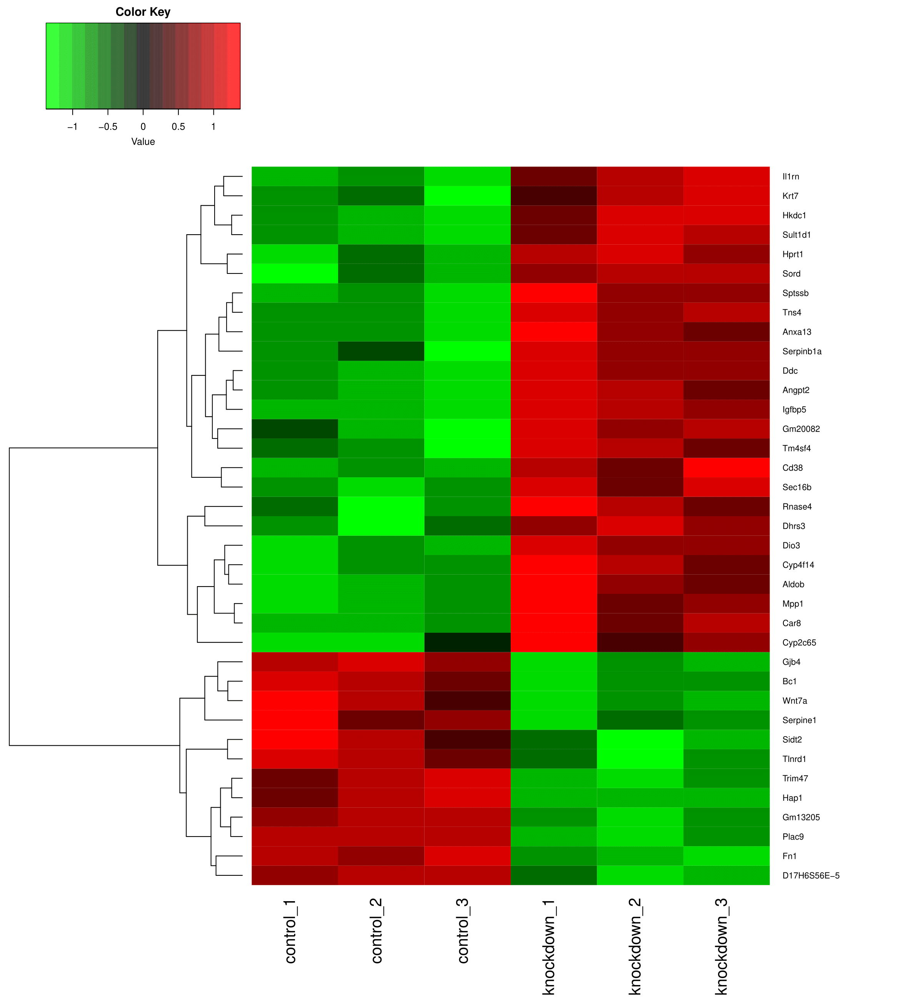
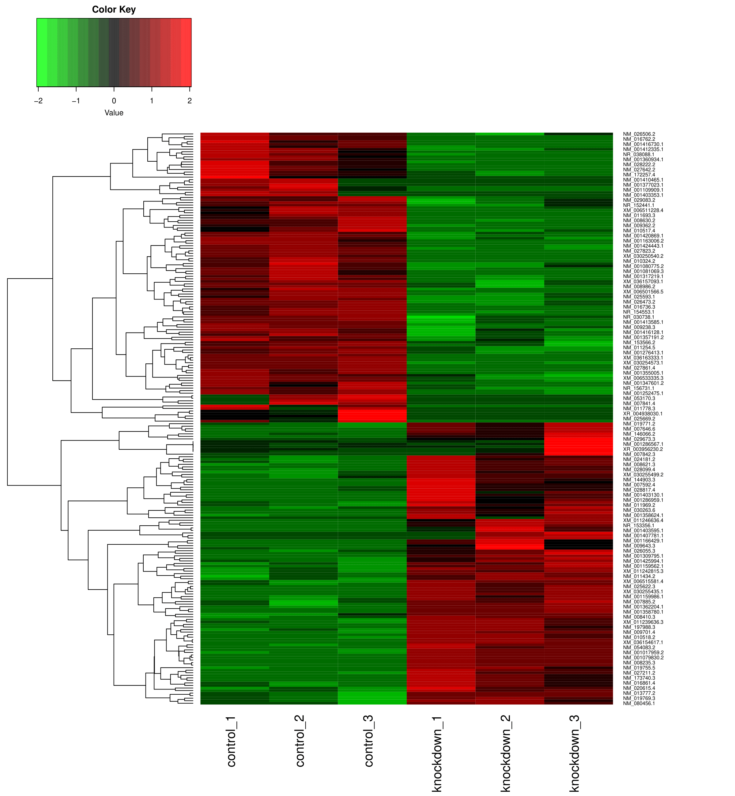
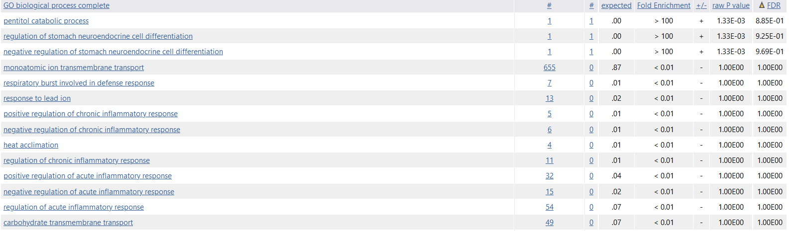
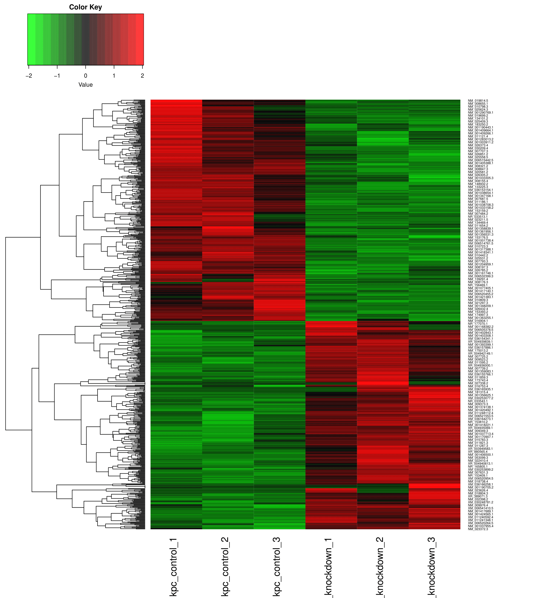
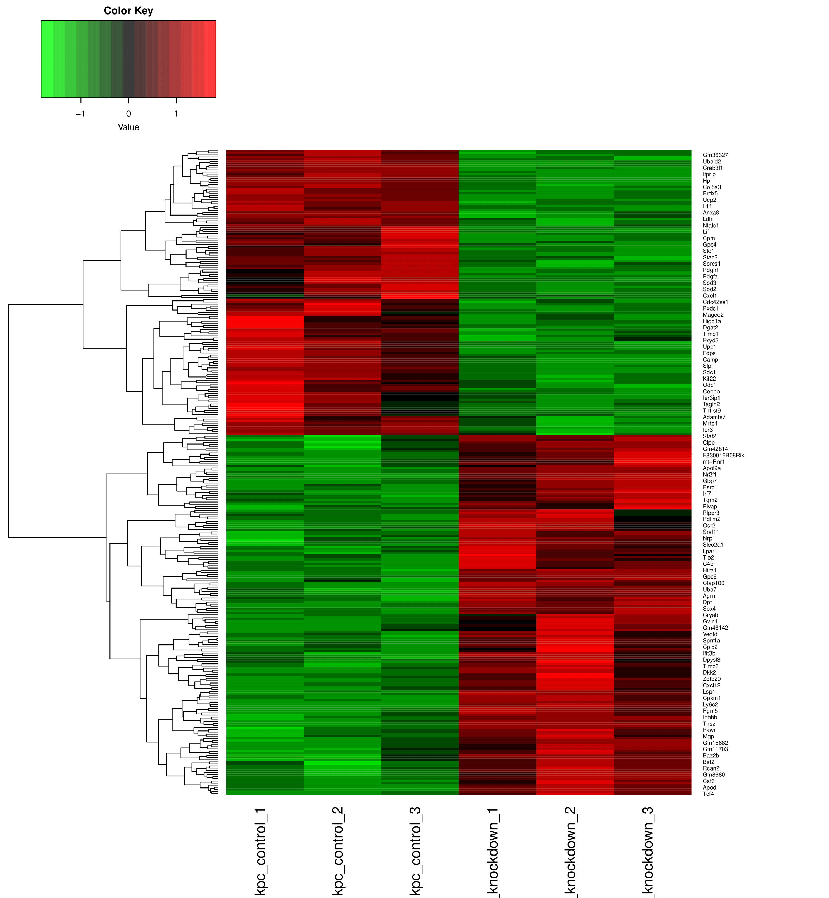
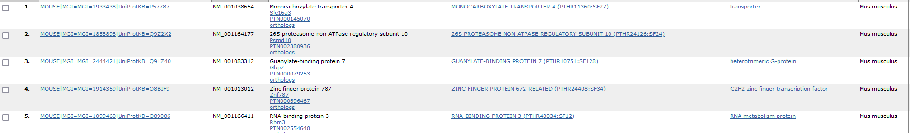
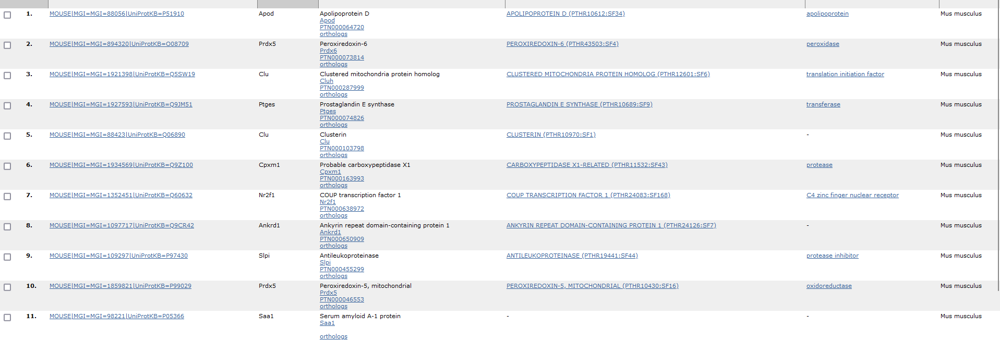
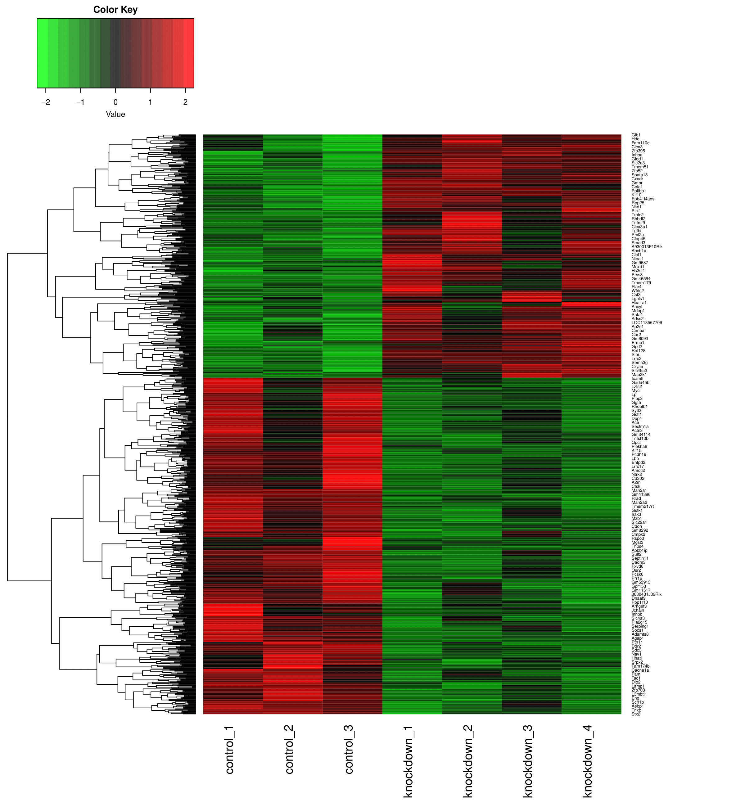
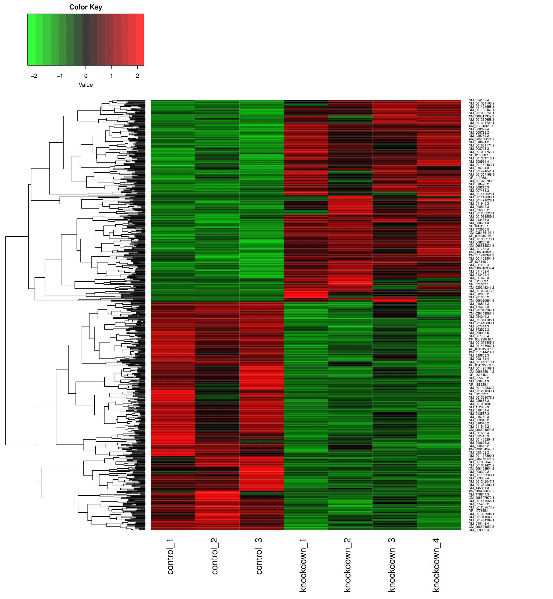

# Mouse-analysis

RNA sequencing analysis of **"[BRCA mutational status shapes the stromal microenvironment of pancreatic cancer linking CLU+ CAF expression with HSF1 signaling (KPC) (house mouse)](https://pmc.ncbi.nlm.nih.gov/articles/PMC9622893/)"** from the Weizmann Institute of Science. Sequencing runs were sourced from **PRJNA825537**, **PRJNA825538**, and **PRJNA825539**, using the GRCm39 RefSeq assembly as the reference genome. Reference files were downloaded via the NCBI datasets command-line tool and reads were downloaded from the SRA.

## Motivation

This project stems from my experience working as a scribe for a breast surgeon. Inspired by the skills I acquired from the **Biostars Handbook**, I explored the Sequence Read Archive (SRA) and searched for "BRCA". Among the results, this mouse study stood out. While working with the human genome might have been computationally intensive for my system, I found this mouse study to be a manageable and meaningful entry point into RNA sequencing analysis. Moreover, cancer research commonly employs mouse models, making this project a great way to integrate my background with new skills.

---

## Workflow Overview

The general workflow for this project included the following steps:

1. **Build Genome Index:**
   - Use `hisat2` to build the genome index.
   - Index the reference genome using `samtools`.

2. **Alignment and Indexing:**
   - Generate alignments with `hisat2`.
   - Index the resulting BAM files.

3. **BigWig File Generation:**
   - Convert BAM files to BigWig format for easier visualization in IGV.

4. **Feature Counts Analysis:**
   - Use `featureCounts` from the `subread` R package to analyze read counts.

5. **Classification-Based Quantification:**
   - Perform quantification using `salmon` in a Bash environment.

6. **Differential Expression Analysis:**
   - Conduct differential expression analysis using:
     - Feature counts output. The normalized counts are in a seperate file. 
     - Salmon classification output. The DESeq2 output file has the normalized counts in the same file. 
   - Generate heatmaps for both analyses to compare results. Differential expression done using DESeq2. 

---

## Current Progress

For **PRJNA825538**, the design matrix was as follows:

| Sample         | Condition    |
|----------------|--------------|
| `control_1`    | `control`    |
| `control_2`    | `control`    |
| `control_3`    | `control`    |
| `knockdown_1`  | `knockdown`  |
| `knockdown_2`  | `knockdown`  |
| `knockdown_3`  | `knockdown`  |

---
## Heatmaps for PRJNA825538
### Feature counts differential expression heatmap

### Classification based differential expression heatmap

### Analysis of heatmaps
So, what is going on here? From both heatmaps, it looks like there are a few spots of overlapping expression and intersample variability between biological replicates of the same condition. Filtering through the [classification deseq output](classificationresultsPRJNA825538/classification_method.csv) for transcripts with the highest variance, we find that that these transcripts are: 
| Transcript        | Control Variance   |
|-------------|--------------------|
| NM_009076.3 | 997,537            |
| NM_011664.5 | 984,432            |
| NR_102727.1 | 984,164            |
| NM_024277.2 | 978,717            |
| NM_013765.2 | 928,688            |
| NM_001368637.1 | 926,174         |
| NM_019883.4 | 909,616            |
| NM_018796.3 | 894,188            |
| NM_016738.5 | 885,135            |
| NM_018853.3 | 882,073            |

| Transcript          | Knockdown Variance   |
|---------------|----------------------|
| NM_001407444.1 | 983,226              |
| NM_011029.4    | 926,273              |
| NM_001355384.1 | 862,754              |
| NR_110342.1    | 846,139              |
| NM_009076.3    | 796,498              |
| NM_024175.3    | 783,252              |
| NM_025587.2    | 778,767              |
| NM_172086.2    | 742,409              |
| NM_009084.5    | 719,561              |
| NM_001424562.1 | 693,605              |

Filtering through the [feature counts deseq output](featureresultsPRJNA825538/normalized_counts.csv), we find that the genes with the highest variance are: 
| Gene    | Control Variance    |  
|---------|---------------------|
| Hsdl1   | 9.67926e-05         |
| Rnf6    | 8.89335e-05         |
| Lonrf3  | 7.61594e-05         |
| St7     | 7.44192e-05         |
| Dnajc13 | 7.2517e-05          |
| Rilpl2  | 7.24769e-05         |
| Cdk16   | 6.60855e-05         |
| Ndufb9  | 6.1521e-05          |
| Pola2   | 5.63509e-05         |
| Mlph    | 5.46395e-06         |

| Gene    | Knockdown Variance   |
|---------|----------------------|
| Ldah    | 9.82739e-05          |
| Stk24   | 9.62228e-05          |
| Rnf7    | 9.42757e-05          |
| Ccdc25  | 8.80526e-05          |
| Rab11a  | 8.51672e-07          |
| Gnai1   | 7.80612e-05          |
| Stambpl1| 7.47716e-05          |
| Vopp1   | 7.29683e-06          |
| Rpl36al | 7.2966e-05           |
| Rab17   | 7.27788e-05          |

Looking at IGV with some of these transcripts and genes, they mostly fall into two situations: 
The transcripts or genes are located near low coverage, high expression areas. 
THe transcripts or genes are located in an adequate coverage, high expression area. 

The genes and transcripts in the first situations show intersample variability in biological replicates due to low coverage. The genes and transcripts in the second situation are most likely biological differences. 

### Analysis of differentially expressed genes - which genes are the most up or down regulated across all samples? 

Both files were filtered so that FDR was <= 0.05. 

Classification based DESeq2: 

| name           | baseMean | baseMeanA | baseMeanB | foldChange  | log2FoldChange | lfcSE | stat  | PValue  | PAdj    | FDR   | falsePos | control_1 | control_2 | control_3 | knockdown_1 | knockdown_2 | knockdown_3 |
|----------------|----------|-----------|-----------|-------------|----------------|-------|-------|---------|---------|-------|----------|-----------|-----------|-----------|-------------|-------------|-------------|
| NM_001309795.1 | 919.4    | 300.7     | 1538.1    | 5.11        | 2.4            | 0.21  | 11.39 | 4.8e-30 | 1.5e-25 | 0     | 0        | 324.9     | 322.5     | 254.8     | 1216.3      | 1718.2      | 1679.8      |
| NM_025622.3    | 1922     | 1449.3    | 2394.8    | 1.652       | 0.7            | 0.07  | 10.78 | 4.1e-27 | 1.3e-22 | 0     | 0        | 1473.9    | 1439.1    | 1434.8    | 2489.3      | 2273.1      | 2421.9      |
| NM_010518.2    | 170      | 61.6      | 278.5     | 4.529       | 2.2            | 0.24  | 9.22  | 3.1e-20 | 9.6e-16 | 0     | 0        | 68.3      | 63.2      | 53.2      | 293.6       | 307.5       | 234.4       |
| NM_001407779.1 | 133.8    | 267.6     | 0         | 0.001       | -10.5          | 1.2   | -8.72 | 2.8e-18 | 8.6e-14 | 0     | 0        | 260.5     | 261       | 281.4     | 0           | 0           | 0           |
| NM_001079830.2 | 124.9    | 0         | 249.8     | 1433.18     | 10.5           | 1.21  | 8.67  | 4.2e-18 | 1.3e-13 | 0     | 0        | 0         | 0         | 0         | 277.1       | 244.7       | 227.7       |
| NM_001403594.1 | 127.2    | 254.4     | 0         | 0.001       | -10.4          | 1.21  | -8.56 | 1.1e-17 | 3.4e-13 | 0     | 0        | 270.4     | 216.4     | 276.3     | 0           | 0           | 0           |
| NM_016736.3    | 123.5    | 247       | 0         | 0.001       | -10.4          | 1.22  | -8.52 | 1.6e-17 | 5.0e-13 | 0     | 0        | 211       | 252.6     | 277.3     | 0           | 0           | 0           |
| NM_001305264.1 | 109.7    | 0         | 219.3     | 1258.457    | 10.3           | 1.21  | 8.48  | 2.3e-17 | 7.1e-13 | 0     | 0        | 0         | 0         | 0         | 247.4       | 212.4       | 198.2       |
| NM_178939.3    | 91.3     | 0         | 182.6     | 1047.057    | 10             | 1.21  | 8.28  | 1.3e-16 | 3.9e-12 | 0     | 0        | 0         | 0         | 0         | 194.3       | 175.4       | 178.2       |
| NM_001159562.1 | 1488.8   | 877.7     | 2099.8    | 2.39        | 1.3            | 0.16  | 8.02  | 1.1e-15 | 3.4e-11 | 0     | 0        | 942       | 934.7     | 756.3     | 1886.3      | 2012.8      | 2400.4      |
| NM_001277123.1 | 61.8     | 0         | 123.6     | 709.503     | 9.5            | 1.23  | 7.68  | 1.6e-14 | 4.9e-10 | 0     | 0        | 0         | 0         | 0         | 127.2       | 133.9       | 109.8       |
| NM_001418641.1 | 64.3     | 128.6     | 0         | 0.001       | -9.4           | 1.27  | -7.43 | 1.1e-13 | 3.3e-09 | 0     | 0        | 163.4     | 122.1     | 100.3     | 0           | 0           | 0           |
| NM_133741.2    | 54.2     | 0         | 108.4     | 622.474     | 9.3            | 1.26  | 7.38  | 1.6e-13 | 4.9e-09 | 0     | 0        | 0         | 0         | 0         | 124.6       | 113.6       | 87.1        |
| NM_001420970.1 | 83.6     | 167.1     | 0         | 0.001       | -9.8           | 1.35  | -7.25 | 4.2e-13 | 1.3e-08 | 0     | 0        | 85.2      | 177.7     | 238.4     | 0           | 0           | 0           |
| NM_001372564.1 | 44.1     | 0         | 88.2      | 506.37      | 9              | 1.26  | 7.15  | 8.9e-13 | 2.8e-08 | 0     | 0        | 0         | 0         | 0         | 100.2       | 86.8        | 77.7        |
| NM_001166429.1 | 74.4     | 0         | 148.7     | 853.61      | 9.7            | 1.39  | 7.01  | 2.5e-12 | 7.7e-08 | 0     | 0        | 0         | 0         | 0         | 138.5       | 235.4       | 72.3        |
| NM_054083.2    | 41.5     | 0         | 83        | 476.265     | 8.9            | 1.28  | 6.97  | 3.1e-12 | 9.6e-08 | 0     | 0        | 0         | 0         | 0         | 101.1       | 72.9        | 75          |
| NM_001403595.1 | 105.9    | 0         | 211.8     | 1213.954    | 10.2           | 1.48  | 6.92  | 4.4e-12 | 1.4e-07 | 0     | 0        | 0         | 0         | 0         | 65.3        | 366.5       | 203.6       |
| NR_156449.1    | 61.1     | 122.2     | 0         | 0.002       | -9.3           | 1.35  | -6.9  | 5.0e-12 | 1.6e-07 | 0     | 0        | 182.3     | 112.8     | 71.6      | 0           | 0           | 0           |
| NM_001164572.1 | 38.9     | 77.8      | 0         | 0.002       | -8.7           | 1.26  | -6.88 | 5.9e-12 | 1.9e-07 | 0     | 0        | 77.3      | 69.1      | 87        | 0           | 0           | 0           |
| NM_001347601.2 | 49.2     | 98.4      | 0         | 0.002       | -9             | 1.32  | -6.82 | 9.0e-12 | 2.8e-07 | 0     | 0        | 112.9     | 61.5      | 120.8     | 0           | 0           | 0           |
| XM_030248314.1 | 33       | 0         | 66        | 378.019     | 8.6            | 1.27  | 6.72  | 1.8e-11 | 5.5e-07 | 0     | 0        | 0         | 0         | 0         | 68          | 59.1        | 71          |
| XR_001785575.2 | 40.9     | 0         | 81.8      | 468.051     | 8.9            | 1.32  | 6.71  | 1.9e-11 | 6.0e-07 | 0     | 0        | 0         | 0         | 0         | 77.5        | 58.2        | 109.8       |
| NM_027823.2    | 34.6     | 69.2      | 0         | 0.003       | -8.5           | 1.27  | -6.71 | 2.0e-11 | 6.2e-07 | 0     | 0        | 70.3      | 75.8      | 61.4      | 0           | 0           | 0           |
| NM_001420869.1 | 302.1    | 391.9     | 212.3     | 0.542       | -0.9           | 0.13  | -6.65 | 2.9e-11 | 9.0e-07 | 0     | 0        | 395.2     | 405.9     | 374.6     | 202.1       | 227.1       | 207.6       |
| NM_013556.2    | 580.5    | 430.9     | 730       | 1.693       | 0.8            | 0.12  | 6.52  | 7.3e-11 | 2.3e-06 | 0     | 0        | 400.2     | 469.9     | 422.7     | 717.9       | 766.3       | 705.9       |
| NM_207229.3    | 122.2    | 174.2     | 70.2      | 0.4         | -1.3           | 0.21  | -6.44 | 1.2e-10 | 3.8e-06 | 0     | 0        | 169.4     | 180.2     | 173       | 67.1        | 64.6        | 79          |
| NM_172570.5    | 196.9    | 274.8     | 118.9     | 0.431       | -1.2           | 0.19  | -6.4  | 1.6e-10 | 4.8e-06 | 0     | 0        | 240.7     | 288       | 295.8     | 112.4       | 114.5       | 129.9       |
| NM_008621.3    | 852.6    | 593.2     | 1112      | 1.876       | 0.9            | 0.14  | 6.36  | 2.0e-10 | 6.1e-06 | 0     | 0        | 545.8     | 586.9     | 646.8     | 1256.4      | 1014.7      | 1064.9      |
| XM_017317209.3 | 1470.3   | 1880.7    | 1059.9    | 0.564       | -0.8           | 0.13  | -6.31 | 2.7e-10 | 8.5e-06 | 0     | 0        | 1726.5    | 1910.7    | 2004.8    | 1203.2      | 975.9       | 1000.6      |
| NM_001358042.1 | 31.4     | 0         | 62.8      | 359.555     | 8.5            | 1.35  | 6.3   | 2.9e-10 | 9.2e-06 | 0     | 0        | 0         | 0         | 0         | 70.6        | 41.5        | 76.4        |
| NM_001413585.1 | 1587.8   | 1989      | 1186.5    | 0.596       | -0.7           | 0.12  | -6.26 | 4.0e-10 | 1.2e-05 | 0     | 0        | 1970.2    | 1998.2    | 1998.7    | 1030.7      | 1316.6      | 1212.3      |
| XM_006497568.5 | 33.3     | 66.7      | 0         | 0.003       | -8.5           | 1.36  | -6.21 | 5.2e-10 | 1.6e-05 | 0     | 0        | 94.1      | 45.5      | 60.4      | 0           | 0           | 0           |
| NM_008410.3    | 4106.5   | 3278.4    | 4934.6    | 1.505       | 0.6            | 0.1   | 6.19  | 6.2e-10 | 1.9e-05 | 0     | 0        | 2968.6    | 3252.9    | 3613.6    | 5016.9      | 4791.9      | 4995.1      |
| NM_001360934.1 | 32.3     | 64.6      | 0         | 0.003       | -8.4           | 1.36  | -6.18 | 6.3e-10 | 2.0e-05 | 0     | 0        | 77.3      | 76.6      | 39.9      | 0           | 0           | 0           |
| NM_001417457.1 | 113.3    | 64.2      | 162.4     | 2.535       | 1.3            | 0.22  | 6.03  | 1.7e-09 | 5.2e-05 | 0     | 0        | 68.3      | 58.9      | 65.5      | 180.4       | 151.4       | 155.4       |
| NM_027211.2    | 316.5    | 179.9     | 453.1     | 2.52        | 1.3            | 0.22  | 6.02  | 1.7e-09 | 5.4e-05 | 0     | 0        | 183.2     | 197.9     | 158.6     | 549.8       | 423.8       | 385.8       |
| XM_006519542.5 | 22       | 0         | 44.1      | 252.475     | 8              | 1.33  | 6.02  | 1.8e-09 | 5.6e-05 | 0     | 0        | 0         | 0         | 0         | 48.8        | 37.9        | 45.5        |
| NM_009362.2    | 3756.6   | 4864.3    | 2648.9    | 0.545       | -0.9           | 0.15  | -6    | 2.0e-09 | 6.2e-05 | 0     | 0        | 4236.5    | 4640.7    | 5715.6    | 2421.3      | 2790.2      | 2735.3      |
| NM_145539.2    | 280      | 154.1     | 405.9     | 2.636       | 1.4            | 0.23  | 5.99  | 2.1e-09 | 6.4e-05 | 0     | 0        | 179.3     | 164.2     | 118.7     | 440.9       | 421.9       | 355         |
| NM_172119.2    | 31.9     | 5.9       | 57.9      | 9.745       | 3.3            | 0.55  | 5.92  | 3.2e-09 | 9.9e-05 | 0     | 0        | 5         | 6.7       | 6.1       | 76.7        | 48.9        | 48.2        |
| XM_030244688.2 | 22.4     | 44.8      | 0         | 0.004       | -7.9           | 1.35  | -5.86 | 4.6e-09 | 1.4e-04 | 0     | 0        | 38.6      | 39.6      | 56.3      | 0           | 0           | 0           |
| XM_006522100.5 | 18.8     | 0         | 37.7      | 215.466     | 7.8            | 1.34  | 5.79  | 7.2e-09 | 2.3e-04 | 0     | 0        | 0         | 0         | 0         | 34.9        | 37.9        | 40.2        |
| NM_028071.3    | 444.6    | 326.3     | 562.8     | 1.722       | 0.8            | 0.14  | 5.7   | 1.2e-08 | 3.7e-04 | 0     | 0        | 311       | 368       | 299.9     | 575.9       | 542         | 570.6       |
| NM_009701.4    | 118.8    | 67.8      | 169.7     | 2.499       | 1.3            | 0.23  | 5.67  | 1.4e-08 | 4.5e-04 | 0     | 0        | 73.3      | 74.9      | 55.3      | 180.4       | 168         | 160.7       |
| NM_027492.2    | 17.6     | 35.2      | 0         | 0.005       | -7.5           | 1.35  | -5.61 | 2.0e-08 | 6.3e-04 | 0     | 0        | 33.7      | 36.2      | 35.8      | 0           | 0           | 0           |
| NM_001163006.2 | 20.2     | 40.4      | 0         | 0.005       | -7.7           | 1.38  | -5.6  | 2.1e-08 | 6.6e-04 | 0     | 0        | 44.6      | 48        | 28.7      | 0           | 0           | 0           |
| NM_178267.4    | 21.8     | 0         | 43.5      | 248.823     | 8              | 1.45  | 5.5   | 3.8e-08 | 1.2e-03 | 0     | 0        | 0         | 0         | 0         | 26.1        | 41.5        | 63          |
| NM_025669.2    | 48.2     | 96.3      | 0         | 0.002       | -9             | 1.64  | -5.48 | 4.2e-08 | 1.3e-03 | 0     | 0        | 52.5      | 32.8      | 203.7     | 0           | 0           | 0           |
| NM_001163468.1 | 22.5     | 0         | 45        | 257.292     | 8              | 1.48  | 5.42  | 5.8e-08 | 1.8e-03 | 0     | 0        | 0         | 0         | 0         | 30.5        | 32.3        | 72.3        |
| NM_001286567.1 | 17       | 0         | 33.9      | 2024413.66  | 20.9           | 3.91  | 5.36  | 8.4e-08 | 2.6e-03 | 0     | 0        | 0         | 0         | 0         | 0           | 0           | 101.8       |
| NM_001271542.1 | 16.5     | 0         | 33        | 1972786.542 | 20.9           | 3.91  | 5.35  | 8.9e-08 | 2.8e-03 | 0     | 0        | 0         | 0         | 0         | 0           | 0           | 99.1        |
| NM_001408582.1 | 15.6     | 0         | 31.3      | 1851961.428 | 20.8           | 3.91  | 5.33  | 1.0e-07 | 3.1e-03 | 0     | 0        | 0         | 0         | 0         | 0           | 0           | 93.8        |
| NM_001166667.1 | 14.7     | 0         | 29.5      | 1767831.101 | 20.8           | 3.91  | 5.31  | 1.1e-07 | 3.5e-03 | 0     | 0        | 0         | 0         | 0         | 0           | 0           | 88.4        |
| XR_003956230.2 | 14.7     | 0         | 29.5      | 1767831.101 | 20.8           | 3.91  | 5.31  | 1.1e-07 | 3.5e-03 | 0     | 0        | 0         | 0         | 0         | 0           | 0           | 88.4        |
| NM_007592.4    | 201.1    | 91.6      | 310.6     | 3.392       | 1.8            | 0.33  | 5.27  | 1.4e-07 | 4.3e-03 | 0     | 0        | 87.2      | 102.7     | 84.9      | 434.8       | 255.8       | 241.1       |
| NM_001403130.1 | 18.4     | 0         | 36.9      | 211.364     | 7.7            | 1.49  | 5.19  | 2.1e-07 | 6.6e-03 | 1e-04 | 0        | 0         | 0         | 0         | 54.9        | 22.2        | 33.5        |
| NR_028101.1    | 4226.9   | 3720.4    | 4733.3    | 1.273       | 0.3            | 0.07  | 5.18  | 2.2e-07 | 6.8e-03 | 1e-04 | 0        | 3751.1    | 3532.5    | 3877.6    | 4892.3      | 4526.9      | 4780.8      |
| NM_030263.6    | 15.4     | 0         | 30.9      | 176.848     | 7.5            | 1.44  | 5.18  | 2.2e-07 | 6.9e-03 | 1e-04 | 0        | 0         | 0         | 0         | 36.6        | 21.2        | 34.8        |
| NM_009643.3    | 24.3     | 0         | 48.5      | 278.357     | 8.1            | 1.57  | 5.17  | 2.4e-07 | 7.4e-03 | 1e-04 | 0        | 0         | 0         | 0         | 28.8        | 88.6        | 28.1        |
| NM_007426.4    | 50.7     | 21.9      | 79.3      | 3.626       | 1.9            | 0.36  | 5.14  | 2.7e-07 | 8.3e-03 | 1e-04 | 0        | 22.8      | 23.6      | 19.4      | 95.8        | 76.6        | 65.6        |
| NR_166766.1    | 14.2     | 28.4      | 0         | 0.007       | -7.2           | 1.41  | -5.13 | 2.9e-07 | 9.1e-03 | 1e-04 | 0        | 24.8      | 33.7      | 26.6      | 0           | 0           | 0           |
| NM_001358780.1 | 13       | 0         | 26        | 148.774     | 7.2            | 1.41  | 5.12  | 3.1e-07 | 9.7e-03 | 1e-04 | 0        | 0         | 0         | 0         | 25.3        | 25.9        | 26.8        |
| NM_001355005.1 | 1646.2   | 1813.2    | 1479.2    | 0.817       | -0.3           | 0.06  | -5.09 | 3.6e-07 | 1.1e-02 | 1e-04 | 0        | 1823.6    | 1765.8    | 1850.3    | 1485.5      | 1494.8      | 1457.4      |
| NM_001276413.1 | 275.7    | 360.3     | 191.1     | 0.53        | -0.9           | 0.18  | -5.08 | 3.7e-07 | 1.2e-02 | 1e-04 | 0        | 333.8     | 356.2     | 390.9     | 213.5       | 164.3       | 195.6       |
| NM_029673.3    | 25.4     | 0         | 50.8      | 290.43      | 8.2            | 1.61  | 5.08  | 3.8e-07 | 1.2e-02 | 1e-04 | 0        | 0         | 0         | 0         | 27          | 27.7        | 97.8        |
| NM_008235.3    | 12.5     | 0         | 25        | 143.595     | 7.2            | 1.42  | 5.03  | 4.8e-07 | 1.5e-02 | 1e-04 | 0        | 0         | 0         | 0         | 27          | 24          | 24.1        |
| NM_016762.2    | 12.9     | 25.9      | 0         | 0.007       | -7.1           | 1.43  | -4.96 | 6.9e-07 | 2.1e-02 | 2e-04 | 0        | 30.7      | 24.4      | 22.5      | 0           | 0           | 0           |
| NM_001109909.1 | 27.9     | 55.8      | 0         | 0.003       | -8.2           | 1.67  | -4.92 | 8.9e-07 | 2.8e-02 | 2e-04 | 0        | 73.3      | 80.8      | 13.3      | 0           | 0           | 0           |
| XM_017322385.3 | 644.9    | 749.7     | 540.1     | 0.72        | -0.5           | 0.1   | -4.91 | 9.2e-07 | 2.9e-02 | 2e-04 | 0        | 748.8     | 779.8     | 720.5     | 515.8       | 566         | 538.5       |
| NM_011693.3    | 266      | 337.2     | 194.7     | 0.578       | -0.8           | 0.16  | -4.88 | 1.0e-06 | 3.3e-02 | 2e-04 | 0        | 294.2     | 352       | 365.4     | 194.3       | 195.7       | 194.2       |

Feature based DESeq2

| Gene        | Chr         | Start     | End       | Strand | Length | logFC              | logCPM           | F                | PValue               | FDR                  | control_1         | control_2           | control_3          | knockdown_1       | knockdown_2       | knockdown_3       |
|-------------|-------------|-----------|-----------|--------|--------|--------------------|------------------|------------------|----------------------|----------------------|-------------------|---------------------|--------------------|-------------------|-------------------|-------------------|
| Aldob       | NC_000070.7 | 49535993  | 49549546  | -      | 2018   | 2.41665481809119   | 3.24011090149378 | 49.941813007993  | 2.47451088185298e-05 | 0.0225922843513177   | 1.52493092590977  | 1.7764917174018     | 1.90063815606268   | 4.48182990591731  | 3.69463043161127  | 3.48661959579657  |
| Angpt2      | NC_000074.7 | 18740279  | 18791578  | -      | 3560   | 1.82730489599433   | 3.85448208357427 | 65.8220861661918 | 7.00088816308163e-06 | 0.013317033307366    | 2.92596702447778  | 2.71346479097889    | 2.5554527502089    | 4.71653861120056  | 4.47314598267567  | 4.1967371023182   |
| Anxa13      | NC_000081.7 | 58204860  | 58261123  | -      | 1408   | 1.33859891781677   | 6.40296348890081 | 61.2867280947579 | 9.72401117733918e-06 | 0.013317033307366    | 5.63151326081465  | 5.71247048099289    | 5.4130226582958    | 7.2023400610873   | 6.81245188082852  | 6.69379229135356  |
| Bc1         | NC_000073.7 | 144468207 | 144468360 | +      | 154    | -0.956071063603026 | 4.90962503920596 | 33.4601301339169 | 0.000138097044950847 | 0.0439479404001973   | 5.42678735790173  | 5.3345291362591     | 5.1223601810901    | 4.25499542773589  | 4.42484759024282  | 4.40524419928827  |
| Car8        | NC_000070.7 | 8141491   | 8239226   | -      | 6909   | 1.60901716086599   | 6.58596171271678 | 78.01772213814   | 3.14925717249679e-06 | 0.0115010871939583   | 5.47863575728871  | 5.52886469514026    | 5.71497421537173   | 7.49196038069641  | 6.84340423614192  | 7.11694103602427  |
| Cd38        | NC_000071.7 | 44026153  | 44069714  | +      | 3009   | 2.15904806884926   | 2.6307452146583  | 45.5215117782145 | 3.75772597300505e-05 | 0.0250652693982863   | 1.38702636238591  | 1.46182044596844    | 1.25901527761821   | 3.32728543452318  | 2.92321234329378  | 3.65934707737434  |
| Cyp2c65     | NC_000085.7 | 39049450  | 39082392  | +      | 1941   | 1.35441596370692   | 6.31721663491058 | 32.6175476311315 | 0.000153407871833727 | 0.0454253146975759   | 5.21894091122713  | 5.21792383008467    | 5.9332295713029    | 7.1747816784805   | 6.46377727687891  | 6.78986350887316  |
| Cyp4f14     | NC_000083.7 | 33122331  | 33136353  | -      | 4156   | 1.90760170393109   | 2.38844167422469 | 33.9191888867938 | 0.000132068863812326 | 0.0438468627856921   | 1.06399483295059  | 1.46182044596844    | 1.41219362814258   | 3.29351695090213  | 2.96884255183585  | 2.63677331011049  |
| D17H6S56E-5 | NC_000083.7 | 35215654  | 35219605  | -      | 3372   | -0.771274245458774 | 8.4907508057435  | 35.8284367967002 | 0.000103816962557284 | 0.0379139547259199   | 8.72858034646617  | 8.86901322084768    | 8.87222940718536   | 8.18376713697245  | 7.95514579468291  | 8.01437972145288  |
| Ddc         | NC_000077.7 | 11764101  | 11848144  | -      | 2449   | 1.24731542159481   | 5.01079239678706 | 55.1551902361016 | 1.57391772589753e-05 | 0.0172438426049334   | 4.4265190758366   | 4.2031778368529     | 4.18671845829105   | 5.6697579556875   | 5.4320354605146   | 5.37521041795049  |
| Dhrs3       | NC_000070.7 | 144618712 | 144654214 | +      | 4261   | 1.52149856249194   | 3.58416032049347 | 39.606796338654  | 6.79246784846796e-05 | 0.0311312040935839   | 2.76825054209731  | 2.31974367503865    | 2.95515709324725   | 4.00671171178923  | 4.35782674245895  | 4.01784498138544  |
| Dio3        | NC_000078.7 | 110245664 | 110247531 | +      | 1868   | 3.20955605550737   | 3.17753049250414 | 93.3149643123823 | 1.38476940598265e-06 | 0.00758576680597294  | 0.870561070447464 | 1.33957609166922    | 1.08761985720896   | 4.40484744517765  | 3.74795142969877  | 3.73852795430435  |
| Fn1         | NC_000067.7 | 71624632  | 71692393  | -      | 8471   | -0.913395500195529 | 6.31294409771812 | 43.4873146947904 | 4.52965670378798e-05 | 0.0254876845982412   | 6.65810396720432  | 6.58271068421537    | 6.83526319740883   | 5.84317021135756  | 5.79710174551054  | 5.71572654242011  |
| Gjb4        | NC_000070.7 | 127234892 | 127247874 | -      | 4086   | -0.899691849976688 | 6.37148365410836 | 45.0296043802448 | 3.88928057476148e-05 | 0.0250652693982863   | 6.77675748407243  | 6.80687819750879    | 6.65894226085679   | 5.78360164625171  | 5.94713047534177  | 5.82860508381148  |
| Gm13205     | NC_000070.7 | 149031946 | 149036779 | -      | 1487   | -1.24424949017519  | 3.55449551892048 | 36.4095183421285 | 9.71299235618339e-05 | 0.0379139547259199   | 3.95140091689552  | 4.07494959637726    | 4.02981562624209   | 2.90360065398042  | 2.67052286793163  | 2.93452949507855  |
| Gm20082     | NC_000082.7 | 15689589  | 15690074  | +      | 486    | 1.4368088950717    | 3.4579287624929  | 36.4962164363447 | 9.61701602075065e-05 | 0.0379139547259199   | 2.97492723588929  | 2.50176993069097    | 2.34319264003948   | 4.10732364978212  | 3.87322111800584  | 3.98574784785792  |
| Hap1        | NC_000077.7 | 100238153 | 100247808 | -      | 4402   | -2.17824875762902  | 2.1924418159425  | 41.0098766928016 | 5.99942347859588e-05 | 0.0298771289234075   | 2.52693445426876  | 2.89803431912138    | 3.0041876367345    | 0.933517335889103 | 0.984887705496488 | 0.957808596739451 |
| Hkdc1       | NC_000076.7 | 62218916  | 62259490  | -      | 6027   | 2.04821445696068   | 2.19501184480892 | 33.4849060921354 | 0.000140395939577118 | 0.0439479404001973   | 1.23453295777507  | 1.05879712119898    | 0.893082035783609  | 2.43110014787153  | 3.05598899153694  | 3.00026837539876  |
| Hprt1       | NC_000086.8 | 52076955  | 52110537  | +      | 1349   | 0.790117478347299  | 7.25182886902463 | 35.9653104433892 | 0.000102167173516781 | 0.0379139547259199   | 6.6951010673006   | 6.9495344856621     | 6.75875164046892   | 7.59431890244888  | 7.6571498402353   | 7.52413192891255  |
| Igfbp5      | NC_000067.7 | 72897224  | 72914024  | -      | 5854   | 2.27947313015116   | 5.54374655416717 | 171.90361677183  | 6.53306415238516e-08 | 0.000715762508535318 | 4.11323109646361  | 4.07494959637726    | 3.88025005640863   | 6.40613095793948  | 6.36057155966839  | 6.00710051011473  |
| Il1rn       | NC_000068.8 | 24226872  | 24241497  | +      | 2805   | 0.92688093479933   | 8.90452887553979 | 51.2490558850714 | 2.19105978024982e-05 | 0.0218229554112882   | 8.38235196015836  | 8.43854308921321    | 8.28061858887471   | 9.14687855699457  | 9.33584038206784  | 9.39080980966312  |
| Krt7        | NC_000081.7 | 101310284 | 101325687 | +      | 1586   | 1.23622094796388   | 5.93877075218516 | 43.2208130623357 | 4.65273541406374e-05 | 0.0254876845982412   | 5.26887667485399  | 5.38947801006117    | 4.89426994831505   | 6.11374670246668  | 6.49139934618593  | 6.6380925658129   |
| Mpp1        | NC_000086.8 | 74153339  | 74174622  | -      | 2525   | 0.928307379823287  | 7.84378070529316 | 42.103218032022  | 5.21330086576409e-05 | 0.0271985353739578   | 7.18576829049455  | 7.31858614834273    | 7.41124746470515   | 8.42898312751873  | 8.05636959148565  | 8.19191903692903  |
| Plac9       | NC_000080.7 | 25888356  | 25903339  | -      | 944    | -1.31701550097555  | 5.05641270924115 | 70.0187201721228 | 5.24238886017509e-06 | 0.013317033307366    | 5.51219426612598  | 5.62358646194353    | 5.53482137512699   | 4.21947024084645  | 4.17524017094674  | 4.40524419928827  |
| Rnase4      | NC_000080.7 | 51328534  | 51343608  | +      | 1996   | 1.02060098042899   | 6.10254668713299 | 38.4245729322534 | 7.7227697372161e-05  | 0.0338442660963758   | 5.66918967793449  | 5.30216381016865    | 5.54314013164132   | 6.72709088327858  | 6.49530253577995  | 6.30898301109742  |
| Sec16b      | NC_000067.7 | 157334303 | 157395995 | +      | 5960   | 1.48100036273966   | 4.02838547748896 | 48.6665606587125 | 2.76192995141279e-05 | 0.0232766958059065   | 3.23820623619466  | 2.98215875046476    | 3.22708099968714   | 4.69082718691206  | 4.26942003612973  | 4.74909015047519  |
| Serpinb1a   | NC_000079.7 | 33026075  | 33037189  | -      | 2428   | 1.44645653781003   | 5.31568195421286 | 45.9665802676885 | 3.5532098896449e-05  | 0.0250652693982863   | 4.47837694655036  | 4.75080146621246    | 3.95697017462864   | 6.08442511354544  | 5.69897467924995  | 5.7732695041296   |
| Serpine1    | NC_000071.7 | 137090358 | 137101126 | -      | 3024   | -1.17587427541512  | 4.76410472441423 | 32.711493950831  | 0.000151630522271371 | 0.0454253146975759   | 5.52868526206332  | 4.9414833955552     | 5.1443987274169    | 3.85291305811892  | 4.2324825384064   | 4.11006206315437  |
| Sidt2       | NC_000075.7 | 45849155  | 45869299  | -      | 7374   | -1.46843798748156  | 4.7569147001202  | 39.562215530325  | 6.8195408748267e-05  | 0.0311312040935839   | 5.60842589337978  | 5.27740423537403    | 4.93276899626685   | 4.16448637276372  | 3.52171392314169  | 3.81358824190298  |
| Sord        | NC_000068.8 | 122065320 | 122095818 | +      | 2259   | 0.941271678680125  | 5.79067549168408 | 37.2039418802652 | 8.85753455287852e-05 | 0.0373242879082066   | 5.05784188428917  | 5.46451463441328    | 5.19806572709237   | 6.12338961374032  | 6.2166859722389   | 6.21520312726253  |
| Sptssb      | NC_000069.7 | 69726871  | 69768697  | -      | 2192   | 1.12557774778382   | 4.97425738419202 | 43.7287043446433 | 4.42233614831804e-05 | 0.0254876845982412   | 4.29773567686957  | 4.45945174018806    | 4.18671845829105   | 5.60927989130877  | 5.28646162882721  | 5.36276791271975  |
| Sult1d1     | NC_000071.7 | 87702509  | 87716865  | -      | 2394   | 3.82546297783957   | 2.15239454714021 | 62.1969320549276 | 7.34043457817777e-06 | 0.013317033307366    | 0.382607551416998 | -0.0525134349751261 | -0.349655684443282 | 2.49191803128121  | 3.39373082213398  | 3.00026837539876  |
| Tlnrd1      | NC_000073.7 | 83529703  | 83533549  | -      | 3847   | -1.60627476401406  | 2.93355629438245 | 35.1716082699318 | 0.000112653850595817 | 0.0396928474902715   | 3.65354942025939  | 3.49294183855429    | 3.26780645754561   | 2.23156192092153  | 1.67712143312687  | 2.02887820960346  |
| Tm4sf4      | NC_000069.7 | 57332831  | 57349098  | +      | 1400   | 1.38923545331776   | 6.23467677898247 | 56.0439402146782 | 1.46353010561779e-05 | 0.0172438426049334   | 5.63912767001691  | 5.46451463441328    | 4.98255326153693   | 6.87712411266347  | 6.84033871325227  | 6.55849726032932  |
| Tns4        | NC_000077.7 | 98956504  | 98980132  | -      | 4755   | 1.27975118291974   | 4.04813656643459 | 45.7792653506383 | 3.61923047466953e-05 | 0.0250652693982863   | 3.35377751737055  | 3.40423961258943    | 3.14200996163758   | 4.67779757387064  | 4.44112737574097  | 4.4991881064479   |
| Trim47      | NC_000077.7 | 115996576 | 116001061 | -      | 2195   | -1.20468629823791  | 5.72321942800064 | 62.456627415247  | 8.91330205999607e-06 | 0.013317033307366    | 6.00596197864957  | 6.25513697013937    | 6.30989870977953   | 4.98333740699404  | 4.93061986913542  | 5.10335199306567  |
| Wnt7a       | NC_000072.7 | 91340963  | 91388335  | -      | 3227   | -1.4914075355291   | 3.64486221550404 | 34.9061499768287 | 0.000115933837138435 | 0.0396928474902715   | 4.46129727046505  | 4.23781438138332    | 3.74255542933025   | 2.60636380966635  | 2.92321234329378  | 2.71716870995527  |
| NM_146126.4    | 210      | 144.9     | 275.1     | 1.893       | 0.9            | 0.19  | 4.87  | 1.1e-06 | 3.5e-02 | 3e-04 | 0        | 126.8     | 167.6     | 140.2     | 257.9       | 280.7       | 286.7       |
| NM_011254.5    | 1109.6   | 1256.2    | 962.9     | 0.767       | -0.4           | 0.08  | -4.85 | 1.2e-06 | 3.8e-02 | 3e-04 | 0        | 1226.3    | 1281.6    | 1260.8    | 1019.4      | 937.1       | 932.3       |
| NM_011434.2    | 3737     | 3018.9    | 4455.2    | 1.475       | 0.6            | 0.12  | 4.83  | 1.4e-06 | 4.3e-02 | 3e-04 | 0        | 2661.5    | 3384.3    | 3010.8    | 4212.7      | 4638.6      | 4514.2      |
| NM_001018042.3 | 23.3     | 46.6      | 0         | 0.004       | -7.9           | 1.65  | -4.82 | 1.4e-06 | 4.4e-02 | 3e-04 | 0        | 26.7      | 21.9      | 91.1      | 0           | 0           | 0           |
| NM_001081069.3 | 14       | 27.9      | 0         | 0.007       | -7.2           | 1.5   | -4.82 | 1.4e-06 | 4.5e-02 | 3e-04 | 0        | 26.7      | 38.7      | 18.4      | 0           | 0           | 0           |
| NM_033073.3    | 222.9    | 130.5     | 315.2     | 2.409       | 1.3            | 0.26  | 4.81  | 1.5e-06 | 4.6e-02 | 3e-04 | 0        | 135.7     | 148.2     | 107.5     | 247.4       | 325.9       | 372.4       |

### Gene ontology analysis
Finally, we can do a gene ontology analysis. Panther was used here to determine the pathway, and the genes from the classification file were used here. Based on this dataset, the classification method had a better assignment rate. The classification method would often have assignment rates of ~70%, whereas the feature counting method had assignment rates of ~50%. 

## PRJNA825537 

The design matrix for PRJNA825537 was the same as 825538: 3 control replicates and 3 knockdown replicates. 
### Classification heatmap
### 
### Featurecounts heatmap
### 
### Most differentially expressed genes from feature counts
| GeneID        | Chr         | Start     | End       | Strand | Length | logFC              | logCPM           | F                | PValue               | FDR                  | kpc_control_1     | kpc_control_2     | kpc_control_3    | kpc_knockdown_1   | kpc_knockdown_2  | kpc_knockdown_3  |
|---------------|-------------|-----------|-----------|--------|--------|--------------------|------------------|------------------|----------------------|----------------------|-------------------|-------------------|------------------|-------------------|------------------|------------------|
| Clu           | NC_000080.7 | 66206093  | 66218992  | +      | 2013   | 2.44483928024227   | 8.5129241158035  | 166.878991899277 | 7.25521469317113e-08 | 0.000104640925060365 | 137.111336145549  | 121.541208527173  | 82.7350411806653 | 704.283558897397  | 547.984158835152 | 601.631859848899 |
| Nr2f1         | NC_000079.7 | 78337090  | 78346794  | -      | 3189   | 1.61244540859424   | 6.95604918039175 | 134.136377711397 | 2.17255497297836e-07 | 0.000243712388968772 | 63.5180311217399  | 61.4102948347821  | 58.6743404291453 | 166.412992819638  | 194.711012959417 | 202.140640809104 |
| Saa1          | NC_000073.7 | 46389921  | 46392404  | -      | 828    | -3.11519507829122  | 5.54840912181016 | 136.958501911782 | 1.98347729405465e-07 | 0.000243712388968772 | 91.1155205056682  | 82.5200836842385  | 63.7397511136758 | 11.8866423442599  | 5.75095818867476 | 8.62211264114664 |
| Slpi          | NC_000068.8 | 164195990 | 164231086 | -      | 1358   | -2.09619123304603  | 7.09284251399491 | 118.297372546512 | 4.05472052230725e-07 | 0.00040936458393214  | 238.740185940333  | 232.20767734402   | 180.244196857878 | 57.0558832524474  | 36.9704454986234 | 57.4807509409776 |
| Apod          | NC_000082.7 | 31115010  | 31133626  | -      | 2074   | 3.46362223582009   | 4.05218416623483 | 115.197935231893 | 4.859691356394e-07   | 0.000446031308492308 | 3.50444309637185  | 1.91907171358694  | 2.53270534226526 | 27.3392773917977  | 37.7920109541484 | 27.7823629548058 |
| Ptges         | NC_000068.8 | 30779483  | 30793309  | -      | 3647   | -1.47946392431394  | 7.5063877982866  | 107.57344632694  | 6.47204471705289e-07 | 0.00054451469552805  | 276.41294922633   | 248.199941623911  | 268.044648723074 | 108.762777449978  | 82.1565455524965 | 91.9692015055641 |
| Gm8292        | NC_000067.7 | 55374547  | 55375037  | +      | 491    | 1.25242478853034   | 8.07666269566258 | 103.695699490345 | 7.74587321224597e-07 | 0.000601556430391041 | 149.814942369897  | 157.363880514129  | 171.37972815995  | 383.938547719594  | 355.73784224231  | 401.40724407116  |
| Ankrd1        | NC_000085.7 | 36089365  | 36097244  | -      | 1765   | 1.74085075236599   | 7.41788361988948 | 98.4520866992398 | 9.97788038084445e-07 | 0.000675723589077206 | 66.5844188310652  | 86.997917682608   | 83.5792762947537 | 247.242160760605  | 322.875224021311 | 220.342878607081 |
| Cpxm1         | NC_000068.8 | 130232695 | 130239549 | -      | 2421   | 2.20770201884525   | 5.49995943408515 | 97.0549139825462 | 1.07087732024914e-06 | 0.000675723589077206 | 19.7124924170917  | 17.2716454222825  | 11.8192915972379 | 78.4518394721151  | 83.7996764635464 | 61.3128010037094 |
| Prdx5         | NC_000085.7 | 6884065   | 6887474   | -      | 1271   | -1.17181258878404  | 9.54629064803801 | 97.4950203804291 | 1.04624345262385e-06 | 0.000675723589077206 | 1116.16512619444  | 985.123479641297  | 996.197434624337 | 480.220350708099  | 417.355251406682 | 477.090232810114 |
| Lmo4          | NC_000069.7 | 143894291 | 143911016 | -      | 2049   | -1.17001032102612  | 10.1045108506461 | 94.3241594742202 | 1.22843935866377e-06 | 0.000689017986948304 | 1493.7688698285   | 1581.95478256684  | 1487.96438858084 | 675.755617271174  | 598.9212170777   | 753.955849842489 |
| Penk          | NC_000070.7 | 4133536   | 4138815   | -      | 1593   | -2.54077412093215  | 6.90615685663726 | 95.313283285905  | 1.16857936371214e-06 | 0.000689017986948304 | 150.252997756943  | 178.473669363586  | 268.466766280118 | 26.1506131573717  | 44.3645345983481 | 33.5304380489036 |
| Syt7          | NC_000085.7 | 10366142  | 10430544  | +      | 11521  | -1.64089056642295  | 5.8944396269325  | 92.952665450956  | 1.32009040663726e-06 | 0.000701454355021566 | 91.5535758927147  | 86.997917682608   | 81.0465709524885 | 27.9336095090107  | 23.825398210224  | 31.6144130175377 |
| Zc3h12a       | NC_000070.7 | 125012207 | 125021674 | -      | 2805   | -2.28092412249528  | 5.21528043167936 | 90.6157927770083 | 1.49932121588014e-06 | 0.000756857349776296 | 64.8321972828793  | 59.4912231211952  | 48.9656366171285 | 14.8583029303248  | 9.03722001077462 | 10.5381376725126 |
| Ltbp1         | NC_000083.7 | 75312475  | 75698770  | +      | 7812   | 1.65527754250887   | 5.35064171667165 | 88.5305886738966 | 1.67045428429788e-06 | 0.000803090783536733 | 17.9602708689058  | 19.1907171358694  | 21.5279954092547 | 58.8388796040864  | 64.0821055309473 | 63.2288260350753 |
| Cdo1          | NC_000084.7 | 46846260  | 46861569  | -      | 1751   | 2.1980511454815    | 5.67814349053441 | 84.0919017995552 | 2.13887763026923e-06 | 0.000953221186638226 | 14.4558277725339  | 17.2716454222825  | 23.2164656374316 | 87.961153347523   | 102.695681940621 | 62.2708135193924 |
| Lsp1          | NC_000073.7 | 142014583 | 142048605 | +      | 3040   | 1.7349661019631    | 5.19010246041607 | 83.8307702567308 | 2.17156173659659e-06 | 0.000953221186638226 | 16.6461047077663  | 18.5510265646738  | 15.6183496106358 | 59.4332117212994  | 59.1527127977975 | 48.858638299831  |
| Ramp3         | NC_000077.7 | 6608507   | 6627478   | +      | 1397   | -2.27709913979066  | 4.70520664488487 | 82.6821008642837 | 2.34907340647506e-06 | 0.000988176879657174 | 33.7302648025791  | 40.9401965565214  | 43.9002259325979 | 8.9149817581949   | 8.21565455524965 | 6.70608760978072 |
| Crispld2      | NC_000074.7 | 120719177 | 120779533 | +      | 4307   | -1.43053224160377  | 7.68008172420702 | 80.9576061688435 | 2.56299458527454e-06 | 0.00103503973331727  | 353.948752733557  | 260.354062476628  | 272.265824293516 | 109.357109567191  | 121.591687417695 | 97.7172765996619 |
| C4b           | NC_000083.7 | 34947249  | 34962876  | -      | 5481   | 1.27941935368279   | 7.31363849325513 | 75.7011189523389 | 3.52729314092097e-06 | 0.00116778781082753  | 99.0005174725049  | 95.3138951081514  | 84.4235114088422 | 261.506131573717  | 202.926667514666 | 209.804740934568 |
| Inhba         | NC_000079.7 | 16178841  | 16206194  | +      | 14541  | -1.10290885385016  | 8.5540385016411  | 78.0020994202511 | 3.05968699434891e-06 | 0.00116778781082753  | 478.794538041805  | 541.178223231518  | 510.762244023495 | 260.317467339291  | 215.250149347541 | 235.671078858008 |
| Mt2           | NC_000074.7 | 94899246  | 94900195  | +      | 556    | -1.31359363191603  | 13.2713203991989 | 76.0702541173843 | 3.44656678491488e-06 | 0.00116778781082753  | 15991.2119041318  | 14277.8935490868  | 12025.2849650755 | 6771.22581140763  | 4876.81254399619 | 5364.87008782457 |
| Oas2          | NC_000071.7 | 120868398 | 120887949 | -      | 4293   | 1.25884054028021   | 6.85173762002142 | 76.5582057393632 | 3.34407434230593e-06 | 0.00116778781082753  | 64.3941418958328  | 79.3216308282603  | 61.2070457714106 | 161.658335881934  | 165.134656560518 | 160.946102634737 |
| Sprr1a        | NC_000069.7 | 92391261  | 92393188  | -      | 790    | 2.93980978607285   | 5.43606062645275 | 75.5113803430144 | 3.5780803975044e-06  | 0.00116778781082753  | 10.0752739020691  | 15.9922642798912  | 5.48752824157474 | 62.4048723073643  | 106.803509218245 | 63.2288260350753 |
| Stc2          | NC_000077.7 | 31309441  | 31320061  | -      | 1793   | -1.97250302050649  | 5.10638698789079 | 75.4968173737032 | 3.58571930820656e-06 | 0.00116778781082753  | 53.4427572196708  | 53.7340079804344  | 47.2771663889516 | 16.6412992819638  | 10.6803509218245 | 10.5381376725126 |
| Rps15-ps3     | NC_000084.7 | 64421414  | 64421905  | +      | 492    | 1.54291264867669   | 7.32784257872238 | 71.6300124604153 | 4.58001594892415e-06 | 0.00144499503188557  | 66.5844188310652  | 81.2407025418472  | 98.3533907913011 | 249.025157112244  | 193.889447503892 | 275.907604516692 |
| ND3           | NC_005089.1 | 9459      | 9806      | +      | 348    | 2.49242349569361   | 4.84011349092288 | 69.818268842288  | 5.18324528599787e-06 | 0.00153911895315984  | 5.25666464455778  | 7.67628685434777  | 12.6635267113263 | 40.4145839704836  | 50.1154927870229 | 58.4387634566605 |
| Tbx3          | NC_000071.7 | 119808600 | 119822789 | +      | 5164   | -2.33248745252449  | 4.48361561642479 | 70.370385046908  | 5.08282704310817e-06 | 0.00153911895315984  | 38.5488740600904  | 31.9845285597824  | 29.970346550139  | 6.53765328934293  | 4.92939273314979 | 8.62211264114664 |
| Setbp1        | NC_000084.7 | 78793593  | 79153659  | -      | 11008  | 1.81943535705177   | 4.7247807576813  | 69.0076505346601 | 5.46775642322039e-06 | 0.00157721339568095  | 10.951384676162   | 11.5144302815216  | 12.2414091542821 | 36.8485912672056  | 48.472361875973  | 38.3205006273184 |
| C4a           | NC_000083.7 | 35028069  | 35042436  | -      | 5367   | 1.40161132279301   | 5.58872044824587 | 67.4121182877557 | 6.09150717506674e-06 | 0.00170370921831013  | 27.5974893839284  | 22.3891699918477  | 28.2818763219621 | 65.3765328934293  | 70.654629175147  | 73.7669637075879 |
| Slc16a3       | NC_000077.7 | 120839310 | 120849826 | +      | 3673   | -1.56239574819819  | 7.07534113656032 | 67.0517382027637 | 6.24378378342659e-06 | 0.00170370921831013  | 227.788801264171  | 205.340673353803  | 161.671024347933 | 73.1028504171982  | 76.4055873638218 | 49.8166508155139 |
| Ism1          | NC_000068.8 | 139515169 | 139600500 | +      | 10332  | -2.39432666237219  | 4.4599650838684  | 66.4105670034291 | 6.6774348956179e-06  | 0.00172859955656816  | 30.6638770932537  | 33.9036002733693  | 35.4578747917137 | 8.9149817581949   | 4.10782727762483 | 4.7900625784148  |
| Prelp         | NC_000067.7 | 133838042 | 133857820 | -      | 3783   | 1.79783131560627   | 5.6099871023537  | 66.3140013362249 | 6.57780283730873e-06 | 0.00172859955656816  | 20.5886031911846  | 24.3082417054346  | 21.1058778522105 | 86.1781569958841  | 87.0859382856463 | 52.6906883625628 |
| Pcdh9         | NC_000080.7 | 93251136  | 94132619  | -      | 155391 | 1.68877506476396   | 4.9074042000542  | 65.5393018813719 | 6.95339489927391e-06 | 0.00175503687257673  | 15.3319385466269  | 12.7938114239129  | 13.929879382459  | 41.0089160876965  | 53.4017546091227 | 43.1105632057332 |
| Ier3          | NC_000083.7 | 36132605  | 36133803  | +      | 1090   | -1.02387338468838  | 10.6391017447757 | 64.3109970136177 | 7.582430337695e-06   | 0.00186712723632607  | 2153.91833810755  | 2015.02529926629  | 2236.80093477727 | 1192.82455924648  | 900.435739255362 | 1055.72979228262 |
| Cxcl12        | NC_000072.7 | 117145496 | 117158329 | +      | 7161   | 1.46677856726657   | 9.17600595935479 | 63.7606793265962 | 7.89116856435911e-06 | 0.00189688661489927  | 241.368518262612  | 355.66795758478   | 326.296871595175 | 783.329730486725  | 1053.24691398301 | 711.803299152439 |
| Sod2          | NC_000083.7 | 13226726  | 13237006  | +      | 3824   | -1.26397784109796  | 8.88427798832551 | 62.974854402001  | 8.35831388403422e-06 | 0.00196245434821417  | 526.104519842825  | 685.748292321734  | 780.495362974746 | 297.76039072371   | 246.46963665749  | 284.529717157839 |
| Osr2          | NC_000081.7 | 35296244  | 35303451  | +      | 2162   | 3.36301349620374   | 3.88413597168912 | 62.6896727146921 | 8.84791784725771e-06 | 0.00198507952413142  | 1.75222154818593  | 3.19845285597824  | 2.95482289930948 | 35.6599270327796  | 28.7547909433738 | 14.3701877352444 |
| Slc7a2        | NC_000074.7 | 41315404  | 41375107  | +      | 9067   | -1.22291796153039  | 6.85034850813224 | 62.2413199827467 | 8.82592512148918e-06 | 0.00198507952413142  | 145.872443886478  | 143.930378519021  | 185.309607542409 | 69.5368577139202  | 71.476194630672  | 62.2708135193924 |
| Ly6c2         | NC_000081.7 | 74980010  | 74983820  | -      | 925    | 2.27591000334362   | 3.66152031956453 | 61.4378459025899 | 9.55618531534057e-06 | 0.00209737493355823  | 4.38055387046482  | 4.47783399836953  | 3.7990580133979  | 19.6129598680288  | 23.003832754699  | 19.1602503136592 |
| Inhbb         | NC_000067.7 | 119343193 | 119349978 | -      | 4257   | 1.84321633596401   | 4.9836772498896  | 60.6382167566842 | 9.96792650408305e-06 | 0.00209782701163967  | 9.19916312797612  | 15.3525737086955  | 16.8847022817684 | 46.9522372598265  | 50.9370582425478 | 50.7746633311969 |
| Ttc39c        | NC_000084.7 | 12716168  | 12872251  | +      | 5915   | -1.27284135411898  | 6.3886105315975  | 60.6166501358757 | 9.97382097451506e-06 | 0.00209782701163967  | 113.894400632085  | 100.431419677717  | 130.856442683705 | 45.1692409081875  | 45.1861000538731 | 53.6487008782457 |
| Fbln7         | NC_000068.8 | 128705791 | 128738954 | +      | 2970   | 1.94928718768658   | 4.30587731618379 | 60.3848257257588 | 1.01883442196957e-05 | 0.00209921476004179  | 8.76110774092964  | 7.03659628315212  | 8.02023358384    | 26.7449452745847  | 36.9704454986234 | 30.6564005018547 |
| Abi3bp        | NC_000082.7 | 56298179  | 56510498  | +      | 6281   | 3.75510943257144   | 3.30939066102078 | 58.61236268672   | 1.04564935117385e-05 | 0.00211137516989023  | 1.31416616113945  | 1.27938114239129  | 1.26635267113263 | 15.4526350475378  | 27.9332254878488 | 11.4961501881955 |
| Gsto1         | NC_000085.7 | 47843412  | 47853229  | +      | 1179   | -0.96071731736406  | 8.5920989254168  | 58.0308439878236 | 1.2182657588472e-05  | 0.00236530982717718  | 466.090931817457  | 521.347815524452  | 534.822944775015 | 285.87374837945   | 258.793118490364 | 235.671078858008 |
| Pdgfa         | NC_000071.7 | 138961761 | 138983374 | -      | 6891   | -1.22603253500058  | 6.83684844286277 | 58.1450921829566 | 1.20755513990332e-05 | 0.00236530982717718  | 127.912173017573  | 172.716454222825  | 170.957610602905 | 63.5935365417903  | 68.1899328085721 | 69.9349136448561 |
| Timp1         | NC_000086.8 | 20736524  | 20740972  | +      | 885    | -1.03352729707312  | 10.0853798478968 | 56.8389845547079 | 1.33959601337535e-05 | 0.00255180402849765  | 1685.63712935486  | 1354.22493922119  | 1329.67030468926 | 684.076266912155  | 648.215144409198 | 803.772500658003 |
| Fam162a       | NC_000082.7 | 35864214  | 35891931  | -      | 681    | -1.10512363594611  | 8.12081652627412 | 56.0990203309287 | 1.42221142748968e-05 | 0.00265900862443256  | 382.422352891579  | 394.689082427714  | 355.000865474181 | 175.922306695046  | 206.212929336766 | 142.743864836761 |
| Camp          | NC_000075.7 | 109676445 | 109678524 | -      | 599    | -2.82510799627141  | 4.30420619376827 | 55.5389106029869 | 1.54015028616755e-05 | 0.00278631145106542  | 37.234707898951   | 31.9845285597824  | 23.2164656374316 | 6.53765328934293  | 3.28626182209986 | 1.91602503136592 |
| Lif           | NC_000077.7 | 4207587   | 4222514   | +      | 5579   | -1.85374963073064  | 5.48055358379739 | 55.1016472598429 | 1.54549763529778e-05 | 0.00278631145106542  | 55.6330341549032  | 55.6530796940213  | 86.9562167511074 | 21.3959562196678  | 16.4313091104993 | 16.2862127666103 |
| H1f10         | NC_000072.7 | 87957403  | 87958464  | -      | 1062   | -1.1414023152313   | 6.99796780682951 | 54.5006140405222 | 1.62226405619807e-05 | 0.00287339963357468  | 161.204382433105  | 188.06902793152   | 170.957610602905 | 87.36682123031    | 82.9781110080215 | 63.2288260350753 |
| Rnf149        | NC_000067.7 | 39590375  | 39616885  | -      | 7490   | -1.13862875841235  | 8.68140834265559 | 53.9824187275396 | 1.69394383615942e-05 | 0.00289016360590928  | 637.808643539678  | 594.272540640756  | 453.354256265482 | 271.015445449125  | 222.644238447266 | 271.117541938278 |
| Stc1          | NC_000080.7 | 69266738  | 69278850  | +      | 3743   | -2.62909451847217  | 4.07862964752267 | 54.5218421817064 | 1.67488381468103e-05 | 0.00289016360590928  | 19.7124924170917  | 28.1463851326085  | 28.7039938790063 | 4.75465693770395  | 4.92939273314979 | 1.91602503136592 |
| Tpm1          | NC_000075.7 | 66929872  | 66956954  | -      | 5518   | 0.984781227385767  | 8.49762705470283 | 53.8172592907513 | 1.71760911603166e-05 | 0.00289016360590928  | 215.961305813916  | 227.72984334565   | 283.240880776665 | 486.163671880229  | 493.760838770504 | 459.846007527821 |
| Rasl12        | NC_000075.7 | 65305766  | 65323420  | +      | 5670   | -2.40801762145865  | 3.65259253180088 | 53.3333242011594 | 1.83438251374032e-05 | 0.00303605341946266  | 19.2744370300452  | 17.2716454222825  | 16.8847022817684 | 2.97166058606497  | 3.28626182209986 | 3.83205006273184 |
| Sox4          | NC_000079.7 | 29132902  | 29137682  | -      | 4781   | 0.848027207269589  | 8.89264982344125 | 52.2313059109314 | 1.96633799476262e-05 | 0.0032019594185683   | 353.510697346511  | 350.550433015215  | 313.633344883849 | 577.69081793103   | 601.385913444274 | 653.364535695778 |
| Nbl1          | NC_000070.7 | 138809602 | 138820437 | -      | 3393   | -0.923519454833965 | 8.00812007194919 | 51.7343906901044 | 2.05298886298059e-05 | 0.00328999612073842  | 357.453195829929  | 314.088070457063  | 330.940164722661 | 158.092343178656  | 182.387531126542 | 189.686478105226 |
| Csf3          | NC_000077.7 | 98591287  | 98594457  | +      | 1939   | -2.56656751444794  | 4.98712065735734 | 51.1900458986173 | 2.17234430577963e-05 | 0.0033192595971794   | 60.889698799461   | 49.2561739820648  | 40.9454030332884 | 14.2639708131118  | 4.92939273314979 | 3.83205006273184 |
| Dcn           | NC_000076.7 | 97315362  | 97354025  | +      | 2104   | -0.96374703789518  | 10.1534833090862 | 50.4596306621107 | 2.29656878094986e-05 | 0.0033192595971794   | 1364.98058603684  | 1549.33056343586  | 1594.76013051303 | 789.273051658855  | 647.393578953673 | 875.623439334225 |
| Gvin1         | NC_000073.7 | 105755742 | 105814547 | -      | 9040   | 2.69456920005819   | 4.27023776026811 | 50.551500646933  | 2.30138838948651e-05 | 0.0033192595971794   | 3.94249848341834  | 3.83814342717388  | 7.17599846975158 | 20.8016241024548  | 45.1861000538731 | 37.3624881116354 |
| Inmt          | NC_000072.7 | 55147612  | 55151975  | -      | 1023   | 3.86721745209686   | 2.82062301658583 | 46.2827306899476 | 2.257399251184e-05   | 0.0033192595971794   | 0.438055387046482 | 0                 | 1.68847022817684 | 12.4809744614729  | 11.5019163773495 | 14.3701877352444 |
| Irf7          | NC_000073.7 | 140843096 | 140846412 | -      | 1934   | 1.29767262469646   | 8.62372498125358 | 50.6054572645978 | 2.26702584282426e-05 | 0.0033192595971794   | 278.603226161562  | 204.061292211411  | 200.505839596    | 435.051109799911  | 598.9212170777   | 651.448510664413 |
| Ptprn         | NC_000067.7 | 75223679  | 75241437  | -      | 4076   | -1.34067920189872  | 6.87273082603049 | 50.7670775378029 | 2.23518618088004e-05 | 0.0033192595971794   | 148.500776208757  | 183.591193933151  | 163.35949457611  | 75.4801788860502  | 46.0076655093981 | 72.8089511919049 |
| Sod3          | NC_000071.7 | 52521146  | 52527080  | +      | 2045   | -1.65173394158779  | 9.13210903832524 | 50.6199842397694 | 2.26410934112008e-05 | 0.0033192595971794   | 571.224224708612  | 995.998219351623  | 977.202144557348 | 331.63732140485   | 202.105102059141 | 273.033566969644 |
| Gbp7          | NC_000069.7 | 142236097 | 142255912 | +      | 5622   | 1.24809577570876   | 5.71776162368511 | 48.7995229416031 | 2.66834928082468e-05 | 0.00367045594740865  | 31.1019324803002  | 29.4257662749998  | 32.08093433536   | 60.6218759557253  | 78.0487182748717 | 84.3051013801005 |
| Gvin2         | NC_000073.7 | 105544325 | 105603174 | -      | 9037   | 2.62704157616621   | 4.26101284927234 | 48.8185542523387 | 2.68745477238896e-05 | 0.00367045594740865  | 3.94249848341834  | 4.47783399836953  | 7.17599846975158 | 20.2072919852418  | 44.3645345983481 | 37.3624881116354 |
| Pamr1         | NC_000068.8 | 102380325 | 102473386 | +      | 3536   | 2.86676521102406   | 3.54092129575737 | 49.1663781151605 | 2.65997434026686e-05 | 0.00367045594740865  | 1.31416616113945  | 1.91907171358694  | 4.64329312748632 | 23.1789525713067  | 21.3607018436491 | 15.3282002509274 |
| Rasl11a       | NC_000071.7 | 146781881 | 146784536 | +      | 1126   | 1.19958967476005   | 6.79598891167979 | 48.7073342123773 | 2.69031042104042e-05 | 0.00367045594740865  | 53.8808126067173  | 79.9613213994559  | 69.2272793552506 | 169.384653405703  | 158.562132916318 | 134.121752195614 |
| Angptl4       | NC_000083.7 | 33993874  | 34000549  | -      | 1903   | -0.991909157503624 | 7.3666981191523  | 48.400333843867  | 2.76709992145173e-05 | 0.00369922352287423  | 221.65602584552   | 206.620054496194  | 222.878070119343 | 125.998408849155  | 93.658461929846  | 106.339389240809 |
| Socs5         | NC_000083.7 | 87414707  | 87445153  | +      | 9926   | 1.1111800234625    | 6.33269643793254 | 48.3328460581739 | 2.78467697839185e-05 | 0.00369922352287423  | 42.4913725435087  | 51.1752456956518  | 58.6743404291453 | 104.602452629487  | 114.19759831797  | 111.129451819223 |
| F830016B08Rik | NC_000084.7 | 60421811  | 60438162  | +      | 6500   | 2.16830092927251   | 4.29529717606945 | 47.7144151777694 | 2.9615248091026e-05  | 0.00386525410365988  | 7.00888619274371  | 5.75721514076082  | 8.02023358384    | 23.1789525713067  | 30.3979218544237 | 45.0265882370991 |
| Slc11a1       | NC_000067.7 | 74414318  | 74429974  | +      | 4302   | -3.00203115153917  | 3.17759072179229 | 44.9477980104259 | 2.98623038911916e-05 | 0.00386525410365988  | 15.3319385466269  | 12.7938114239129  | 10.1308213690611 | 1.18866423442599  | 1.64313091104993 | 1.91602503136592 |
| Cemip         | NC_000073.7 | 83582065  | 83735893  | -      | 8729   | 2.16930993525      | 3.67444794040653 | 47.5254792331885 | 3.04329771120079e-05 | 0.00388925742940293  | 4.8186092575113   | 4.47783399836953  | 4.22117557044211 | 25.5562810401587  | 16.4313091104993 | 18.2022377979762 |
| Chst11        | NC_000076.7 | 82820274  | 83031734  | +      | 6915   | -1.04359565910757  | 6.22879102028338 | 47.1139432173715 | 3.11984868481095e-05 | 0.00393724904023142  | 104.257182117063  | 90.1963705385863  | 100.041861019478 | 46.3579051426135  | 52.5801891535978 | 44.0685757214161 |
| Tcf4          | NC_000084.7 | 69476500  | 69820996  | +      | 44311  | 0.932148736564882  | 6.92757525701401 | 45.2521392539778 | 3.72794077192943e-05 | 0.00464657901646908  | 83.668578925878   | 79.3216308282603  | 86.9562167511074 | 146.205700834396  | 179.922834759967 | 152.323989993591 |
| Gpc6          | NC_000080.7 | 117162332 | 118216941 | +      | 31860  | 2.18557323750045   | 3.54832963077238 | 44.6876227304158 | 4.00775903006617e-05 | 0.00493443111799367  | 2.62833232227889  | 5.11752456956518  | 4.64329312748632 | 16.6412992819638  | 19.7175709325992 | 20.1182628293422 |
| Dhrs3         | NC_000070.7 | 144618712 | 144654214 | +      | 4261   | 0.960120017456138  | 7.69769481085703 | 44.0318629898211 | 4.20356038449181e-05 | 0.00508520101818375  | 136.235225371456  | 120.261827384782  | 164.625847247242 | 273.98710603519   | 256.328422123789 | 292.193817283303 |
| Uba7          | NC_000075.7 | 107852766 | 107861255 | +      | 3162   | 1.21060031348476   | 5.80546439516028 | 43.9694580256877 | 4.23095171877412e-05 | 0.00508520101818375  | 41.1772063823693  | 28.1463851326085  | 30.8145816642274 | 84.3951606442451  | 73.9408909972469 | 74.7249762232709 |
| Dlk1          | NC_000078.7 | 109418411 | 109426551 | +      | 4908   | 1.25343346579787   | 6.10784365284911 | 43.7196469114838 | 4.33752206385311e-05 | 0.0051519556184307   | 47.30998180102    | 41.5798871277171  | 32.9251694494484 | 80.8291679409671  | 99.4094201185208 | 112.087464334906 |
| Crlf1         | NC_000074.7 | 70945798  | 70956728  | +      | 1842   | -1.45775695120134  | 8.4249285431053  | 43.2803248102199 | 4.53266848914075e-05 | 0.00522214386093507  | 618.534206509632  | 552.052962941844  | 332.206517393794 | 212.770897962252  | 152.811174727644 | 179.148340432713 |
| Fgf23         | NC_000072.7 | 127049865 | 127059257 | +      | 2700   | 2.13646821263399   | 6.07621517701362 | 43.3533010350622 | 4.50087631157722e-05 | 0.00522214386093507  | 25.8452678357424  | 33.9036002733693  | 17.3068198388126 | 160.469671647508  | 99.4094201185208 | 66.1028635821242 |
| Tns2          | NC_000081.7 | 102006910 | 102024836 | +      | 5180   | 0.799835110545135  | 7.62326656485849 | 43.2386720353553 | 4.55178941919855e-05 | 0.00522214386093507  | 137.987446919642  | 136.893782235869  | 155.33926099227  | 248.430824995031  | 250.577463935114 | 250.999279108935 |
| Dpt           | NC_000067.7 | 164624232 | 164651843 | +      | 1713   | 1.14461720672627   | 5.30132663437132 | 42.9775672873267 | 4.67593343336783e-05 | 0.00530429482508782  | 25.8452678357424  | 21.749479420652   | 24.9049358656084 | 53.4898905491694  | 50.9370582425478 | 57.4807509409776 |
| Ddit4         | NC_000076.7 | 59785497  | 59787592  | -      | 1685   | -0.964615544011016 | 7.05670744727698 | 42.5744276717508 | 4.87022424734538e-05 | 0.00546330933346655  | 172.155767109267  | 186.149956217933  | 162.937377019065 | 101.630792043422  | 75.5840219082968 | 88.1371514428323 |
| Dtx4          | NC_000085.7 | 12443700  | 12479509  | -      | 5812   | 1.91864329080427   | 4.70740312046907 | 42.3877898526759 | 4.97196376840172e-05 | 0.00551614793470151  | 14.8938831595804  | 11.5144302815216  | 6.33176335566316 | 35.6599270327796  | 39.4351418651983 | 49.8166508155139 |
| Slco2a1       | NC_000075.7 | 102885686 | 102973201 | +      | 4710   | 1.09616205481659   | 5.97900310443338 | 42.2120890909183 | 5.05557173744892e-05 | 0.00554794046318308  | 34.1683201896256  | 46.0577211260866  | 40.5232854762442 | 93.904474519653   | 83.7996764635464 | 77.5990137703197 |
| Scara3        | NC_000080.7 | 66156844  | 66191193  | -      | 4531   | 1.0440557831699    | 6.44069967585744 | 41.9841454807681 | 5.17565125699194e-05 | 0.00561864248285921  | 54.3188679937638  | 54.37369855163    | 60.3628106573221 | 96.2818029885049  | 131.450472883994 | 123.583614523102 |
| Gas6          | NC_000074.7 | 13515374  | 13544535  | -      | 2593   | 1.41306274390144   | 5.28211638404439 | 41.8551135475226 | 5.24749082364856e-05 | 0.00563602844208041  | 25.4072124486959  | 16.6319548510868  | 20.6837602951663 | 62.4048723073643  | 61.6174091643724 | 44.0685757214161 |
| Col23a1       | NC_000077.7 | 51180508  | 51474091  | +      | 6873   | -1.8279563287207   | 5.30921889982586 | 41.3429675248916 | 5.5406590659418e-05  | 0.00576685504430396  | 55.1949787678567  | 51.8149362668474  | 67.9609266841179 | 23.1789525713067  | 8.21565455524965 | 16.2862127666103 |
| Id3           | NC_000070.7 | 135871133 | 135872703 | +      | 953    | -0.8248029540326   | 7.18771366252893 | 41.3610982282317 | 5.52234638644504e-05 | 0.00576685504430396  | 191.430204139313  | 175.275216507607  | 184.46537242832  | 96.2818029885049  | 107.62507467377  | 108.255414272174 |
| Ifit3         | NC_000085.7 | 34560519  | 34566135  | +      | 2678   | 1.40453194065116   | 6.05461098058134 | 41.4576434805776 | 5.46766226198491e-05 | 0.00576685504430396  | 39.4249848341834  | 23.6685511342389  | 44.3223434896421 | 87.961153347523   | 112.55446740692  | 90.0531764741982 |
| Nt5e          | NC_000075.7 | 88209662  | 88254142  | +      | 3580   | -1.9258194500526   | 4.39397737415735 | 41.3107896669314 | 5.60390337688512e-05 | 0.00577316413194206  | 22.7788801264171  | 31.9845285597824  | 35.4578747917137 | 8.9149817581949   | 5.75095818867476 | 8.62211264114664 |
| Cfap100       | NC_000072.7 | 90380713  | 90412379  | -      | 11055  | 2.58050273739026   | 3.46386811275774 | 40.9072440263606 | 5.93876154009543e-05 | 0.00605633702109126  | 5.25666464455778  | 1.91907171358694  | 1.68847022817684 | 21.3959562196678  | 18.0744400215492 | 15.3282002509274 |
| Pgm5          | NC_000085.7 | 24655625  | 24839206  | -      | 7981   | 2.86642620810514   | 2.60800910183311 | 39.6601872893078 | 6.12616741889197e-05 | 0.00618497862611334  | 0.876110774092964 | 1.27938114239129  | 1.68847022817684 | 10.6979781098339  | 10.6803509218245 | 7.66410012546368 |
| Ccn2          | NC_000076.7 | 24471340  | 24474581  | +      | 2403   | 2.07282532552185   | 3.84328234483136 | 40.2321648064008 | 6.27503559382772e-05 | 0.0062725504312163   | 5.25666464455778  | 7.03659628315212  | 4.22117557044211 | 19.0186277508158  | 30.3979218544237 | 19.1602503136592 |
| Sdc1          | NC_000078.7 | 8821396   | 8843688   | +      | 3300   | -0.750083186020368 | 9.152065763807   | 39.7008306224211 | 6.59059596993181e-05 | 0.0065233977365129   | 752.141099558809  | 732.445704019016  | 649.63892029104  | 454.069737550727  | 395.994549563033 | 417.69345683777  |
| Dkk2          | NC_000069.7 | 131791027 | 131886059 | +      | 3770   | 3.06581518889329   | 2.88786937268885 | 39.0128203824418 | 6.8188490744106e-05  | 0.00668379614128635  | 0.876110774092964 | 0.639690571195647 | 2.53270534226526 | 13.0753065786859  | 15.6097436549743 | 8.62211264114664 |
| Thbs3         | NC_000069.7 | 89122470  | 89134148  | +      | 4101   | 1.19184789199983   | 5.05676309523431 | 38.718953703884  | 7.34281160810755e-05 | 0.00712817557648595  | 21.4647139652776  | 18.5510265646738  | 19.8395251810779 | 47.5465693770395  | 50.1154927870229 | 39.2785131430013 |
| Antxr1        | NC_000072.7 | 87110835  | 87312757  | -      | 5264   | -0.962513238045295 | 6.85825721943228 | 38.4541038199907 | 7.55773642318735e-05 | 0.00722935122015265  | 131.854671500991  | 150.327284230977  | 170.113375488817 | 77.2631752376892  | 86.2643728301213 | 68.0188886134901 |
| Nfat5         | NC_000074.7 | 108020072 | 108106149 | +      | 20917  | 0.892400213703624  | 6.88001257220035 | 38.4153571215396 | 7.59024593241066e-05 | 0.00722935122015265  | 78.8499696683667  | 77.4025591146733  | 89.9110396504169 | 147.394365068822  | 172.528745660243 | 137.953802258346 |
| Itprip        | NC_000085.7 | 47883029  | 47907738  | -      | 4066   | -0.803484628094097 | 7.0060139402624  | 38.1756424612024 | 7.79586838711526e-05 | 0.00725637592541254  | 148.500776208757  | 169.518001366847  | 165.470082361331 | 93.31014240244    | 90.3722001077462 | 92.9272140212471 |
| Nos2          | NC_000077.7 | 78811613  | 78851052  | +      | 4296   | -2.10886729506014  | 3.42795488789824 | 38.3970409136918 | 7.7571334561152e-05  | 0.00725637592541254  | 14.0177723854874  | 14.7128831374999  | 14.7741144965474 | 2.97166058606497  | 3.28626182209986 | 3.83205006273184 |
| Tubb6         | NC_000084.7 | 67523801  | 67535819  | +      | 1744   | -0.825137903889064 | 8.40420524227024 | 38.1311028519509 | 7.83424104467083e-05 | 0.00725637592541254  | 419.65706079053   | 491.282358678257  | 381.594271567967 | 235.355518416345  | 232.503023913565 | 261.537416781448 |
| Htra1         | NC_000073.7 | 130537933 | 130587388 | +      | 2039   | 1.61751255676882   | 4.13930219387364 | 37.4817286731393 | 8.45167902861392e-05 | 0.00775710467935328  | 9.19916312797612  | 10.2350491391304  | 6.33176335566316 | 23.7732846885197  | 28.7547909433738 | 25.8663379234399 |
| Slc2a1        | NC_000070.7 | 118966001 | 118994527 | +      | 2628   | -0.783316141461842 | 7.98014957584225 | 37.3743570819789 | 8.53257818989491e-05 | 0.00776080264911523  | 330.731817220094  | 328.161263023367  | 292.949584588682 | 203.261584086844  | 170.064049293668 | 178.190327917031 |
| Gm15682       | NC_000071.7 | 88887082  | 88887692  | -      | 611    | 1.24966819648685   | 8.54924488470608 | 36.9280272937329 | 8.97882488213286e-05 | 0.00804782490515984  | 178.726597914965  | 179.113359934781  | 305.613111300009 | 457.635730254005  | 569.344860678801 | 557.563284127483 |
| Klf4          | NC_000070.7 | 55527137  | 55532475  | -      | 7553   | 1.07509209682861   | 5.59070971634124 | 36.9029276702955 | 9.00756947586234e-05 | 0.00804782490515984  | 30.2258217062072  | 28.1463851326085  | 33.3472870064926 | 55.2728869008084  | 69.833063719622  | 70.892926160539  |
| Hdac7         | NC_000081.7 | 97690542  | 97742383  | -      | 16014  | 0.711816173247972  | 7.88825816789492 | 36.7419815982349 | 9.17311408294055e-05 | 0.00812383857731296  | 176.098265592686  | 178.473669363586  | 183.199019757187 | 306.081040364692  | 298.228260355562 | 275.907604516692 |
| Sorcs1        | NC_000085.7 | 50131733  | 50668030  | -      | 9302   | -1.42304520488295  | 5.08182935006378 | 36.551140126143  | 9.38937684263729e-05 | 0.00824305640028401  | 44.2435940916947  | 42.8592682701084  | 51.4983419593937 | 18.4242956336028  | 11.5019163773495 | 22.0342878607081 |
| Cst6          | NC_000085.7 | 5394733   | 5399602   | -      | 3951   | 1.40652007404356   | 4.67639608766629 | 36.2122568843808 | 9.76437658377793e-05 | 0.008498374654295    | 15.7699939336733  | 12.1541208527173  | 13.0856442683705 | 30.3109379778627  | 44.3645345983481 | 36.4044755959525 |
| Zbp1          | NC_000068.8 | 173048405 | 173060715 | -      | 2162   | 0.829441523508328  | 6.88672805263736 | 36.0486383182403 | 9.94320976363901e-05 | 0.00858005519433329  | 94.6199636020401  | 79.3216308282603  | 80.2023358384    | 140.856711779479  | 153.632740183168 | 159.030077603371 |
| Mt1           | NC_000074.7 | 94905214  | 94906955  | +      | 1258   | -1.02231746373788  | 12.8322727571155 | 35.8655805400326 | 0.000101581508029218 | 0.00869124495816089  | 11876.9957089913  | 9960.62188408742  | 7476.96828792411 | 5547.49598206608  | 4724.00136926855 | 4157.77431806405 |
| Col8a1        | NC_000082.7 | 57444619  | 57575100  | -      | 5110   | 1.2564324849489    | 5.46563925252115 | 35.4600668060208 | 0.000106601218415638 | 0.00904408320272506  | 24.531101674603   | 32.624219130978   | 21.5279954092547 | 57.6502153696604  | 73.9408909972469 | 53.6487008782457 |
| Zbtb20        | NC_000082.7 | 42728008  | 43439491  | +      | 27203  | 0.796188074166239  | 7.58212963473948 | 35.2244023477456 | 0.000109593135703506 | 0.00922043581718829  | 132.292726888038  | 136.254091664673  | 150.273850307739 | 224.063208189299  | 274.402862145338 | 229.92300376391  |
| Creb3l1       | NC_000068.8 | 91812673  | 91854515  | -      | 2271   | -0.895258750878851 | 5.85244117768009 | 34.7688288187495 | 0.000115774088429676 | 0.00958078030152464  | 69.6508065403906  | 74.8437968298907  | 73.8705724827369 | 38.6315876188446  | 40.2567073207233 | 38.3205006273184 |
| Psrc1         | NC_000069.7 | 108291120 | 108295547 | +      | 1773   | 1.88264720435144   | 3.66475014485452 | 34.8823510614273 | 0.000115105308437642 | 0.00958078030152464  | 5.25666464455778  | 6.39690571195647  | 4.22117557044211 | 14.8583029303248  | 21.3607018436491 | 22.992300376391  |
| Mark1         | NC_000067.7 | 184628621 | 184731746 | -      | 4974   | 0.861882461990571  | 7.27656217494047 | 34.3446423470275 | 0.000121841533094973 | 0.0100009115294866   | 108.199680600481  | 118.98244624239   | 102.996683918787 | 231.195193595854  | 193.889447503892 | 171.48424030725  |
| Gm5424        | NC_000076.7 | 61906801  | 61908350  | +      | 1550   | -1.3206849708144   | 4.65986925980155 | 34.2648584889568 | 0.000123280409962307 | 0.0100374114433827   | 32.4160986414397  | 31.3448379885867  | 36.3021099058021 | 14.8583029303248  | 13.9666127439244 | 10.5381376725126 |
| Cck           | NC_000075.7 | 121318890 | 121324728 | -      | 949    | -1.18847036122938  | 9.56311451214662 | 33.8182169314183 | 0.000129938533661386 | 0.0104948754867628   | 1094.26235684211  | 929.470399947275  | 1122.8327017376  | 624.048723073643  | 325.339920387886 | 427.2735819946   |
| Acsbg1        | NC_000075.7 | 54512163  | 54569113  | -      | 3375   | -1.72321016450449  | 4.2468381258076  | 33.5062850907695 | 0.000136134141251273 | 0.0105823679628153   | 19.2744370300452  | 30.0654568461954  | 29.5482289930948 | 8.32064964098191  | 7.39408909972469 | 7.66410012546368 |
| Cfb           | NC_000083.7 | 35075350  | 35081192  | -      | 2769   | -1.15729546690731  | 7.25784979386829 | 33.6561859278161 | 0.000132569586316147 | 0.0105823679628153   | 264.147398389029  | 208.539126209781  | 152.806555650004 | 94.498806636866   | 102.695681940621 | 82.3890763487345 |
| Cnn2          | NC_000076.7 | 79824434  | 79831234  | +      | 1782   | 0.718049849976579  | 8.23053703292775 | 33.4661666712902 | 0.000135716777272597 | 0.0105823679628153   | 214.20908426573   | 242.44272648315   | 224.144422790476 | 383.344215602381  | 398.459245929608 | 336.262393004719 |
| Grem2         | NC_000067.7 | 174661352 | 174749386 | -      | 3937   | -1.76714805737886  | 5.18625047868189 | 33.3838418345184 | 0.000137310836284549 | 0.0105823679628153   | 32.8541540284861  | 66.5278194043473  | 60.3628106573221 | 15.4526350475378  | 18.0744400215492 | 12.4541627038785 |
| Snai1         | NC_000068.8 | 167380115 | 167384734 | +      | 1621   | -0.997087541021652 | 6.12760410234826 | 33.536040894621  | 0.000134577252894674 | 0.0105823679628153   | 91.5535758927147  | 104.26956310489   | 76.8253953820464 | 47.5465693770395  | 40.2567073207233 | 47.900625784148  |
| Tnfrsf9       | NC_000070.7 | 151004612 | 151030559 | +      | 2349   | -1.22203323221507  | 6.3615735224887  | 33.3831460476704 | 0.000137152177326198 | 0.0105823679628153   | 138.863557693735  | 118.342755671195  | 79.7802182813558 | 49.9238978458915  | 46.829230964923  | 46.942613268465  |
| Gm11703       | NC_000077.7 | 115615152 | 115615634 | -      | 483    | 1.14730331385658   | 8.67576848080774 | 33.2035455061995 | 0.00014022622889046  | 0.0107251818702885   | 218.151582749148  | 200.862839355433  | 341.915221205811 | 476.060025887608  | 623.568180743449 | 593.009747207752 |
| Upp1          | NC_000077.7 | 9068008   | 9086170   | +      | 1739   | -2.44183688831015  | 3.58581573371499 | 33.2109037127416 | 0.000141711034363226 | 0.0107572526536175   | 21.0266585782311  | 17.2716454222825  | 12.6635267113263 | 1.78299635163898  | 4.92939273314979 | 2.87403754704888 |
| Wnt4          | NC_000070.7 | 137004946 | 137026812 | +      | 3823   | 2.39237154811803   | 3.10273666932677 | 32.7356414790501 | 0.00015226397411104  | 0.011472067780784    | 3.94249848341834  | 1.91907171358694  | 1.68847022817684 | 17.2356313991768  | 10.6803509218245 | 12.4541627038785 |
| Gm13604       | NC_000068.8 | 67537594  | 67538154  | -      | 561    | 1.96057044940055   | 6.39070850238741 | 32.3545376646735 | 0.00015610230010388  | 0.011674139421102    | 21.0266585782311  | 21.749479420652   | 58.2522228721011 | 100.442127808996  | 157.740567460793 | 147.533927415176 |
| Svep1         | NC_000070.7 | 58042796  | 58206596  | -      | 11275  | 1.68559087625096   | 4.2557550533552  | 31.9865065962545 | 0.000163936236993892 | 0.0121698547697819   | 11.827495450255   | 9.59535856793471  | 5.48752824157474 | 32.0939343295016  | 23.825398210224  | 29.6983879861718 |
| Gm12411       | NC_000070.7 | 45550017  | 45550532  | +      | 516    | 0.816437343684802  | 8.53579042311017 | 31.5730329334054 | 0.000172574258890978 | 0.012534602286067    | 243.558795197844  | 243.082417054346  | 317.854520454291 | 421.975803221225  | 483.08048784868  | 515.410733437432 |
| Gm42814       | NC_000069.7 | 88336228  | 88336766  | +      | 539    | 1.06372465914173   | 7.91018262780079 | 31.598923235081  | 0.000171997488811946 | 0.012534602286067    | 134.921059210316  | 123.46028024076   | 206.415485394619 | 297.76039072371   | 319.588962199211 | 360.212705896793 |
| Ubald2        | NC_000077.7 | 116324920 | 116329903 | +      | 1482   | -0.62774740613291  | 8.56956741487569 | 31.6544652942871 | 0.000170761384937089 | 0.012534602286067    | 454.701491754248  | 477.209166111953  | 445.756140238687 | 295.977394372071  | 290.834171255838 | 304.647979987181 |
| Fhl2          | NC_000067.7 | 43162233  | 43237501  | -      | 1715   | 1.35449848421633   | 5.33442799614087 | 31.2219490894015 | 0.00018072874329087  | 0.012940690725281    | 18.8363816429987  | 18.5510265646738  | 29.5482289930948 | 58.8388796040864  | 69.833063719622  | 44.0685757214161 |
| Lpar1         | NC_000070.7 | 58435252  | 58554601  | -      | 6420   | 0.94459694571998   | 6.79980215539151 | 31.2569685336852 | 0.000179845598626913 | 0.012940690725281    | 70.5269173144836  | 67.8072005467386  | 89.0668045363285 | 173.544978226194  | 130.628907428469 | 133.163739679931 |
| Clpb          | NC_000073.7 | 101312958 | 101444667 | +      | 7571   | 0.912880801847257  | 7.01425420117553 | 30.915839977731  | 0.00018808534740985  | 0.0132790885835653   | 94.6199636020401  | 67.8072005467386  | 104.26303658992  | 166.412992819638  | 169.242483838143 | 170.526227791567 |
| Efemp1        | NC_000077.7 | 28803154  | 28876740  | +      | 2190   | 2.68550449269334   | 2.8640971964935  | 30.9684519279869 | 0.000187322167466465 | 0.0132790885835653   | 2.19027693523241  | 1.91907171358694  | 1.26635267113263 | 7.72631752376892  | 17.2528745660243 | 11.4961501881955 |
| Cplx2         | NC_000079.7 | 54455447  | 54531736  | +      | 6762   | 1.48560108399761   | 4.89754047557182 | 30.6501846047857 | 0.000194947412554951 | 0.013389041341189    | 15.7699939336733  | 19.8304077070651  | 11.8192915972379 | 39.2259197360576  | 57.5095818867476 | 33.5304380489036 |
| Gm11878       | NC_000070.7 | 22519613  | 22520097  | +      | 485    | 1.13197576769924   | 5.818616545381   | 30.7472267307762 | 0.000192355622530837 | 0.013389041341189    | 35.9205417378115  | 28.7860757038041  | 39.6790503621558 | 60.0275438385123  | 92.8368964743211 | 80.4730513173686 |
| Gm5857        | NC_000069.7 | 144132313 | 144134699 | -      | 2387   | 1.4828917934518    | 3.91044696684043 | 30.7173096200604 | 0.000193657268154975 | 0.013389041341189    | 6.57083080569723  | 9.59535856793471  | 7.17599846975158 | 19.6129598680288  | 23.003832754699  | 22.0342878607081 |
| Synpo         | NC_000084.7 | 60727053  | 60793241  | -      | 9015   | 0.958505307017554  | 5.32387546120156 | 30.6550014433239 | 0.000194746235628726 | 0.013389041341189    | 29.7877663191608  | 24.3082417054346  | 26.1712885367411 | 54.0842226663824  | 50.9370582425478 | 51.7326758468798 |
| Hmox1         | NC_000074.7 | 75820246  | 75827221  | +      | 1576   | -0.907599135926609 | 7.40906848606628 | 30.4610381095269 | 0.000199782666304526 | 0.0135369516712114   | 174.784099431546  | 254.596847335868  | 229.631951032051 | 127.187073083581  | 117.48386014007  | 104.423364209443 |
| Nr4a1         | NC_000081.7 | 101151783 | 101172676 | +      | 7155   | -0.878892992248658 | 7.12263663529471 | 30.502119640755  | 0.000198693652097342 | 0.0135369516712114   | 201.505478041382  | 161.841714512499  | 170.957610602905 | 114.111766504895  | 82.9781110080215 | 91.9692015055641 |
| Ly6e          | NC_000081.7 | 74826874  | 74831753  | +      | 3322   | 0.68489360693796   | 10.2708288246835 | 30.2682092957007 | 0.000204993221703911 | 0.0137974104421512   | 949.704079116773  | 908.360611097819  | 982.689672798923 | 1337.84159584645  | 1489.49817086676 | 1742.6247660273  |
| Gdnf          | NC_000081.7 | 7839529   | 7867061   | +      | 4867   | -1.41930718719277  | 4.31144315061623 | 30.1761456854958 | 0.000208416960251136 | 0.0139349511966587   | 26.2833232227889  | 28.7860757038041  | 23.6385831944758 | 7.72631752376892  | 11.5019163773495 | 10.5381376725126 |
| Anxa1         | NC_000085.7 | 20350798  | 20368035  | -      | 1395   | 1.28391953261218   | 6.01265187824231 | 30.0454560352582 | 0.000211264202624734 | 0.0140286858246699   | 38.9869294471369  | 44.1386494124997  | 29.970346550139  | 70.7255219483462  | 123.234818328745 | 80.4730513173686 |
| Deptor        | NC_000081.7 | 54975824  | 55122667  | +      | 8555   | 1.16689971016905   | 4.49832254500742 | 29.956694541543  | 0.000213987481873926 | 0.0140286858246699   | 13.1416616113945  | 12.1541208527173  | 15.1962320535916 | 30.9052700950757  | 30.3979218544237 | 30.6564005018547 |
| Sned1         | NC_000067.7 | 93163563  | 93228787  | +      | 9147   | 1.06986271151252   | 6.11533960406303 | 29.9623152773387 | 0.000213642657030006 | 0.0140286858246699   | 33.2922094155326  | 51.1752456956518  | 49.8098717312169 | 104.008120512274  | 79.6918491859216 | 95.801251568296  |
| Acta2         | NC_000085.7 | 34217736  | 34232773  | -      | 2834   | 1.46823830712552   | 4.3206984715176  | 29.8431845732295 | 0.000217409245999367 | 0.014161056436191    | 11.827495450255   | 12.1541208527173  | 7.59811602679579 | 29.1222737434367  | 33.6841836765236 | 22.992300376391  |
| Malat1        | NC_000085.7 | 5845718   | 5852700   | -      | 6983   | 0.65895220096392   | 10.9837355738876 | 29.5824456363125 | 0.000224918679441949 | 0.0144635604308657   | 1568.67634101345  | 1460.41357403966  | 1680.02787703596 | 2253.11305635446  | 2389.1123446666  | 2796.43853327856 |
| Plvap         | NC_000074.7 | 71950397  | 71964413  | -      | 2120   | 1.42650216322013   | 5.75255373839058 | 29.6149743881818 | 0.00022397908139479  | 0.0144635604308657   | 20.1505478041382  | 40.9401965565214  | 27.8597587649179 | 76.6688431204762  | 59.9742782533225 | 98.6752891153449 |
| Gm12854       | NC_000070.7 | 115924379 | 115926099 | +      | 1721   | 0.785475492282642  | 6.19874987956304 | 28.9637876536498 | 0.000244929581407852 | 0.0154550565868355   | 54.7569233808102  | 56.292770265217   | 49.8098717312169 | 94.498806636866   | 84.6212419190714 | 97.7172765996619 |
| Socs3         | NC_000077.7 | 117856905 | 117860192 | -      | 2732   | -0.909667786511681 | 6.43908417423126 | 29.0033144636554 | 0.000243593656158846 | 0.0154550565868355   | 126.159951469387  | 101.710800820108  | 104.685154146964 | 69.5368577139202  | 55.0448855201727 | 50.7746633311969 |
| Vegfd         | NC_000086.8 | 163156282 | 163185643 | +      | 2425   | 1.58226307407449   | 4.31609081764679 | 29.0520110161171 | 0.000242312305529771 | 0.0154550565868355   | 9.6372185150226   | 12.7938114239129  | 7.59811602679579 | 28.5279416262237  | 37.7920109541484 | 21.0762753450251 |
| Abcb1a        | NC_000071.7 | 8617091   | 8798575   | +      | 5177   | -1.92823394411671  | 3.64329001090757 | 29.0226122859931 | 0.000248034793528263 | 0.0155537843196357   | 17.0841600948128  | 17.2716454222825  | 16.04046716768   | 2.37732846885197  | 4.92939273314979 | 6.70608760978072 |
| Parp10        | NC_000081.7 | 76117195  | 76127640  | -      | 3395   | 0.782972310349741  | 7.19869955549206 | 28.7480336168707 | 0.000252368565080945 | 0.0156313683009645   | 114.332456019132  | 110.666468816847  | 98.3533907913011 | 213.365230079465  | 161.848394738418 | 179.148340432713 |
| Stat2         | NC_000076.7 | 128106367 | 128128722 | +      | 4476   | 0.813170449954946  | 8.20056473173639 | 28.7828973138261 | 0.00025113265236638  | 0.0156313683009645   | 222.094081232566  | 168.238620224455  | 247.360888427908 | 377.400894430251  | 353.273145875735 | 393.743143945696 |
| Gm43247       | NC_000071.7 | 113208352 | 113208825 | +      | 474    | 0.774908876149607  | 7.45604890007549 | 28.5594784439871 | 0.000259103892753934 | 0.0159506884222178   | 119.151065276643  | 117.703065099999  | 149.851732750695 | 201.478587735205  | 242.361809379865 | 220.342878607081 |
| S100a4        | NC_000069.7 | 90511077  | 90513349  | +      | 605    | 0.726964904873637  | 9.94605838370514 | 28.5125642624544 | 0.000260805500268993 | 0.0159581353376712   | 653.578637473351  | 698.542103745647  | 875.049695752649 | 1119.72170882928  | 1293.1440269963  | 1276.0726708897  |
| Ly6c1         | NC_000081.7 | 74915867  | 74920690  | -      | 1682   | 1.18937620676341   | 6.75217539985461 | 28.4497745931244 | 0.000263136367072512 | 0.0160037636262897   | 85.8588558611104  | 67.8072005467386  | 43.4781083755537 | 146.205700834396  | 170.064049293668 | 132.205727164248 |
| Slc24a3       | NC_000068.8 | 145009695 | 145484086 | +      | 4072   | -2.696890096035    | 2.73818749237066 | 26.2873877880852 | 0.000278898484877657 | 0.0168608329540409   | 8.76110774092964  | 7.03659628315212  | 9.70870381201685 | 0.594332117212994 | 2.4646963665749  | 0.95801251568296 |
| Gm8680        | NC_000079.7 | 104567439 | 104567875 | -      | 437    | 0.747740659682117  | 7.43179689732705 | 27.8919146631677 | 0.000284750896440849 | 0.0170109174583835   | 134.48300382327   | 113.22523110163   | 136.766088482324 | 188.997613273732  | 235.789285735665 | 224.174928669813 |
| Plpp3         | NC_000070.7 | 105014544 | 105089964 | +      | 3162   | -0.704628038501208 | 7.52522128050539 | 27.9005220032183 | 0.000284402183957864 | 0.0170109174583835   | 213.332973491637  | 210.458197923368  | 253.692651783571 | 134.319058490137  | 133.915169250569 | 148.491939930859 |
| Anxa3         | NC_000071.7 | 96941257  | 96993825  | +      | 2472   | 1.258242242266     | 4.44712293354953 | 27.8470261421086 | 0.000286873138942476 | 0.0170368894750779   | 13.5797169984409  | 10.2350491391304  | 13.5077618254147 | 35.0655949155666  | 29.5763563988987 | 24.908325407757  |
| Clec2d        | NC_000072.7 | 129157578 | 129163498 | +      | 1511   | 1.38200342698809   | 5.43623577375366 | 27.706592790087  | 0.00029248447546536  | 0.0172384994095773   | 19.2744370300452  | 26.2273134190215  | 26.5934060937853 | 67.1595292450683  | 79.6918491859216 | 38.3205006273184 |
| F3            | NC_000069.7 | 121517186 | 121528701 | +      | 1876   | 1.5974116675722    | 3.86694590285278 | 27.6760837889294 | 0.000294619652979797 | 0.0172384994095773   | 5.69472003160426  | 5.11752456956518  | 9.70870381201685 | 23.1789525713067  | 22.1822672991741 | 18.2022377979762 |
| Ifi27l2a      | NC_000078.7 | 103400132 | 103409939 | -      | 883    | 0.732650198430935  | 10.0351180221441 | 27.6354293825716 | 0.000295390292973146 | 0.0172384994095773   | 722.353333239649  | 754.195183439668  | 886.868987349887 | 1128.04235847026  | 1514.14513453251 | 1287.5688210779  |
| Agt           | NC_000074.7 | 125283326 | 125296445 | -      | 1931   | 1.16232345091527   | 4.7125880396463  | 27.5493357136382 | 0.000299284826859407 | 0.0172842847496081   | 16.6461047077663  | 17.2716454222825  | 13.929879382459  | 33.2825985639276  | 31.2194873099487 | 43.1105632057332 |
| Ndufb8        | NC_000085.7 | 44537010  | 44543881  | -      | 2332   | -0.679564330258534 | 7.68586169071042 | 27.537296532537  | 0.000299598834308778 | 0.0172842847496081   | 278.603226161562  | 248.199941623911  | 227.099245689785 | 153.932018358165  | 163.491525649468 | 153.282002509274 |
| COX3          | NC_005089.1 | 8607      | 9390      | +      | 784    | 1.58456115472644   | 7.09033945291655 | 27.4099717999645 | 0.000305163289864153 | 0.0175052759912982   | 36.358597124858   | 83.7994648266298  | 85.2677465229306 | 175.922306695046  | 161.848394738418 | 277.823629548058 |
| Maged2        | NC_000086.8 | 149589417 | 149597358 | -      | 2721   | -0.830902385865676 | 8.20041722439011 | 27.3214872819743 | 0.00030908184397086  | 0.0175308443636506   | 405.201233017996  | 422.195776989127  | 295.904407487992 | 202.072919852418  | 234.96772028014  | 193.518528167958 |
| Masp1         | NC_000082.7 | 23261778  | 23340127  | -      | 7381   | 0.902830967450427  | 5.75575933396666 | 27.343101010856  | 0.000308171209691072 | 0.0175308443636506   | 31.9780432543932  | 41.5798871277171  | 38.8348152480674 | 67.7538613622813  | 78.0487182748717 | 63.2288260350753 |
| Rps27rt       | NC_000075.7 | 114811434 | 114811807 | -      | 374    | 0.620949109525525  | 8.25226076437017 | 27.2701922710938 | 0.000311383395487827 | 0.0175627193343302   | 240.930462875565  | 252.038085051085  | 226.677128132741 | 357.787934562222  | 352.45158042021  | 396.617181492745 |
| Prg4          | NC_000067.7 | 150325163 | 150341916 | -      | 4297   | -2.01453054558296  | 3.52877091164416 | 27.2950593618759 | 0.000316391711841547 | 0.0177460595708459   | 11.3894400632085  | 15.3525737086955  | 19.8395251810779 | 4.16032482049095  | 3.28626182209986 | 3.83205006273184 |
| Nrp1          | NC_000074.7 | 129085553 | 129231957 | +      | 6204   | 1.13660995372638   | 5.1736405671112  | 26.9149425548244 | 0.000328063284477094 | 0.0182990437573522   | 17.0841600948128  | 29.4257662749998  | 21.5279954092547 | 51.1125620803174  | 50.1154927870229 | 45.0265882370991 |
| Cavin2        | NC_000067.7 | 51328285  | 51342119  | +      | 3055   | 1.63415127582758   | 3.56693013855738 | 26.6903108549995 | 0.000340926256271031 | 0.0189120411171007   | 5.25666464455778  | 6.39690571195647  | 5.06541068453053 | 17.2356313991768  | 21.3607018436491 | 12.4541627038785 |
| Rsad2         | NC_000078.7 | 26492742  | 26506451  | -      | 3785   | 0.892354731081657  | 5.75997542470607 | 26.4966782814604 | 0.000348848931199716 | 0.019245785843674    | 40.3010956082763  | 32.624219130978   | 39.2569328051116 | 67.7538613622813  | 80.5134146414466 | 61.3128010037094 |
| Col5a3        | NC_000075.7 | 20681353  | 20726363  | -      | 6112   | -0.888943132385516 | 5.48345496854518 | 26.4609064862567 | 0.000350770283835086 | 0.0192466129652121   | 53.8808126067173  | 60.7706042635865  | 53.1868121875706 | 32.0939343295016  | 27.1116600323239 | 30.6564005018547 |
| Slc11a2       | NC_000081.7 | 100285779 | 100322090 | -      | 6291   | -0.640339740163526 | 7.43901592345482 | 26.3129937353696 | 0.00035844478790752  | 0.0195613977227801   | 217.275471975055  | 210.458197923368  | 200.505839596    | 144.422704482757  | 127.34264560637  | 130.289702132883 |
| Gm46142       | NC_000075.7 | 20466625  | 20467083  | +      | 459    | 1.93218478845383   | 6.2911564660129  | 26.2097234722418 | 0.000364058244382885 | 0.0197609249209119   | 23.2169355134635  | 16.6319548510868  | 55.2973999727916 | 83.8008285270321  | 167.599352927093 | 126.457652070151 |
| Higd1a        | NC_000075.7 | 121677623 | 121686862 | -      | 1972   | -0.888681180290831 | 7.21691457406439 | 26.1703742482214 | 0.00036616413473396  | 0.0197689470816795   | 241.368518262612  | 166.319548510868  | 163.35949457611  | 97.4704672229309  | 108.446640129295 | 103.46535169376  |
| Cebpb         | NC_000068.8 | 167530835 | 167532352 | +      | 1518   | -0.660495828494298 | 8.56255519616328 | 25.9042691051527 | 0.000381071217553344 | 0.0204643351724392   | 526.104519842825  | 424.75453927391   | 431.826260856228 | 302.515047661414  | 300.692956722137 | 271.117541938278 |
| Ucp2          | NC_000073.7 | 100142565 | 100148832 | +      | 2179   | -1.01966484804067  | 4.85230420951849 | 25.6636120081364 | 0.000395561410645211 | 0.0211300952480109   | 37.6727632859974  | 36.4623625581519  | 34.6136396776253 | 16.0469671647508  | 19.7175709325992 | 18.2022377979762 |
| Dgat2         | NC_000073.7 | 98802870  | 98831920  | -      | 2251   | -1.13088102399703  | 5.80943945678919 | 25.55691440843   | 0.000401772889780576 | 0.0213489426064458   | 97.6863513113655  | 63.9690571195647  | 60.7849282143664 | 38.0372555016316  | 30.3979218544237 | 32.5724255332206 |
| Pdgfrl        | NC_000074.7 | 41379270  | 41443819  | +      | 1545   | -1.15989385596237  | 5.33749881556648 | 25.5204838410556 | 0.000404111155388374 | 0.0213607655748745   | 38.9869294471369  | 58.2118419788039  | 62.4733984425432 | 21.9902883368808  | 23.825398210224  | 25.8663379234399 |
| Anxa8         | NC_000080.7 | 33807936  | 33822528  | +      | 1882   | -1.04351935511397  | 5.19537642063243 | 25.2210422168199 | 0.000423078542393975 | 0.0222468800208832   | 46.4338710269271  | 48.6164834108692  | 45.1665786037306 | 19.0186277508158  | 20.5391363881241 | 29.6983879861718 |
| Stac2         | NC_000077.7 | 97927449  | 97944288  | -      | 3447   | -1.30527947971607  | 4.60087925949295 | 25.0322507511851 | 0.000436069872542666 | 0.0228111991357034   | 29.3497109321143  | 28.7860757038041  | 37.1463450198905 | 13.0753065786859  | 16.4313091104993 | 8.62211264114664 |
| Ank3          | NC_000076.7 | 69234608  | 69863106  | +      | 59479  | 0.918711679636994  | 5.59813374646481 | 24.9447627829182 | 0.00044133967507287  | 0.0228597740561276   | 35.9205417378115  | 27.5066945614128  | 35.4578747917137 | 71.3198540655592  | 54.2233200646477 | 62.2708135193924 |
| Junb          | NC_000074.7 | 85703538  | 85705377  | -      | 1840   | -0.62440896056268  | 7.50585691202025 | 24.9408360481176 | 0.000441526935513559 | 0.0228597740561276   | 206.762142685939  | 217.49479420652   | 230.476186146139 | 133.724726372924  | 140.487692894769 | 151.365977477908 |
| Vasn          | NC_000082.7 | 4457809   | 4469030   | +      | 3189   | -0.683941611171473 | 7.05676165315972 | 24.8331222992782 | 0.000448981775069894 | 0.0231271428627839   | 176.536320979732  | 150.966974802173  | 157.449848777491 | 91.527146050801   | 103.517247396146 | 108.255414272174 |
| Gm5915        | NC_000074.7 | 106386799 | 106390384 | -      | 3586   | 0.768826380892571  | 6.2872902169106  | 24.75829872657   | 0.000454257372003681 | 0.0232801138464425   | 60.889698799461   | 48.6164834108692  | 61.6291633284548 | 90.338481816375   | 104.338812851671 | 99.6333016310278 |
| Mgp           | NC_000072.7 | 136849433 | 136852821 | -      | 617    | 0.65589647826534   | 12.1667239174784 | 24.5582825898207 | 0.000468633034610825 | 0.0236052888554563   | 3047.55132768237  | 3959.68463570106  | 3703.23732794886 | 5567.10894193411  | 6272.65225293311 | 5033.39775739827 |
| Rcan2         | NC_000083.7 | 44112243  | 44350407  | +      | 4172   | 2.01824328987312   | 3.4998000726402  | 24.6000589391028 | 0.000469954740486005 | 0.0236052888554563   | 4.38055387046482  | 1.27938114239129  | 6.33176335566316 | 14.2639708131118  | 22.1822672991741 | 17.2442252822933 |
| Sfrp1         | NC_000074.7 | 23901401  | 23939648  | +      | 4489   | 1.62033930669228   | 5.64388230716296 | 24.5828428609091 | 0.000466957002077883 | 0.0236052888554563   | 31.9780432543932  | 27.5066945614128  | 14.7741144965474 | 80.8291679409671  | 100.230985574046 | 43.1105632057332 |
| Thbs2         | NC_000083.7 | 14885762  | 14914524  | -      | 5922   | 0.650477231782255  | 7.31152769743526 | 24.6072232201571 | 0.000465069412269639 | 0.0236052888554563   | 128.350228404619  | 115.144302815217  | 125.368914442131 | 174.139310343407  | 208.677625703341 | 198.308590746373 |
| Ccdc80        | NC_000082.7 | 44913770  | 44948028  | +      | 4139   | 0.903305217464594  | 5.37192518908927 | 24.4210897425539 | 0.000478964136365546 | 0.0239387223799334   | 27.1594339968819  | 31.9845285597824  | 26.5934060937853 | 46.9522372598265  | 53.4017546091227 | 60.3547884880265 |
| Phf11d        | NC_000080.7 | 59584646  | 59608004  | -      | 3119   | 0.855348855085071  | 6.68931371226131 | 24.3643432896584 | 0.000483169835151656 | 0.0240299638211385   | 66.1463634440188  | 60.1309136923908  | 92.021627435638  | 128.97006943522   | 140.487692894769 | 128.373677101517 |
| Pou2f2        | NC_000073.7 | 24790111  | 24879292  | -      | 5207   | -2.47471579017473  | 3.1197839375305  | 23.8577030899763 | 0.000496434698965437 | 0.0245686505919365   | 7.44694157979019  | 14.0731925663042  | 13.929879382459  | 1.18866423442599  | 3.28626182209986 | 1.91602503136592 |
| Tle2          | NC_000076.7 | 81410573  | 81435018  | +      | 7098   | 0.752473123565023  | 6.39312809649336 | 24.0359962548871 | 0.000508972135681384 | 0.0250662569845817   | 61.3277541865075  | 69.0865816891299  | 56.9858702009685 | 118.272091325386  | 96.1231582964209 | 98.6752891153449 |
| mt-Rnr1       | NC_005089.1 | 70        | 1024      | +      | 955    | 2.05357600596697   | 5.06798036787806 | 23.995929027544  | 0.000512538977535403 | 0.0251193860058128   | 7.88499696683667  | 5.75721514076082  | 23.6385831944758 | 45.7635730254005  | 42.7214036872982 | 77.5990137703197 |
| Loxl1         | NC_000075.7 | 58195006  | 58220495  | -      | 3338   | 0.712261342183363  | 7.94645115133551 | 23.8076511274837 | 0.000527832853716891 | 0.0257058506593186   | 178.726597914965  | 223.252009347281  | 159.138319005667 | 299.543387075349  | 323.696789476836 | 293.151829798986 |
| Serpinf1      | NC_000077.7 | 75300855  | 75313449  | -      | 1494   | -0.658259858691703 | 8.96155487012404 | 23.7868171051283 | 0.000529597557165042 | 0.0257058506593186   | 655.768914408583  | 648.006548621191  | 521.737300506644 | 412.466489345817  | 399.280811385133 | 342.9684806145   |
| Prune2        | NC_000085.7 | 16933033  | 17201322  | +      | 14873  | 2.10707143183849   | 2.84625949569714 | 23.8595459411124 | 0.000533383677781035 | 0.0257657493343413   | 2.19027693523241  | 3.83814342717388  | 1.68847022817684 | 8.9149817581949   | 13.9666127439244 | 9.5801251568296  |
| Igtp          | NC_000077.7 | 58090382  | 58098418  | +      | 2023   | 0.796643196510462  | 5.65336381709    | 23.6183448275398 | 0.000544242726557402 | 0.0261651169872549   | 38.5488740600904  | 33.2639097021737  | 36.7242274628463 | 57.0558832524474  | 68.1899328085721 | 65.1448510664413 |
| Isg15         | NC_000070.7 | 156283881 | 156285275 | -      | 756    | 0.721811735257646  | 8.07845023528342 | 23.5373444897879 | 0.000551299878439604 | 0.0263787847048637   | 212.018807330497  | 163.12109565489   | 234.275244159537 | 314.996022122887  | 341.771229498386 | 352.548605771329 |
| Atp5mk        | NC_000085.7 | 47071910  | 47079086  | -      | 363    | -1.05666261445133  | 7.29809004171397 | 23.4914596593549 | 0.000555430014252735 | 0.0264510444523378   | 239.616296714426  | 255.236537907063  | 135.921853368236 | 99.8477956917829  | 103.517247396146 | 98.6752891153449 |
| Slc48a1       | NC_000081.7 | 97682246  | 97690573  | +      | 2526   | -0.641435699807822 | 8.55194962797517 | 23.3837548237802 | 0.000565186190700998 | 0.0267892947479684   | 487.117590395688  | 478.488547254344  | 400.589561634956 | 307.864036716331  | 258.793118490364 | 308.480030049913 |
| Bbln          | NC_000068.8 | 32269120  | 32271877  | -      | 600    | -0.589685586088966 | 7.53017886935801 | 23.3493307336774 | 0.000568370712538047 | 0.0268121160927567   | 231.731299747589  | 207.899435638585  | 220.345364777078 | 149.771693537674  | 148.703347450019 | 139.869827289712 |
| Lrrc8d        | NC_000071.7 | 105847829 | 105963076 | +      | 8144   | -2.0339309836688   | 4.12660529649337 | 23.388940056447  | 0.000570979096666273 | 0.0268121160927567   | 16.2080493207198  | 25.5876228478259  | 32.9251694494484 | 8.9149817581949   | 2.4646963665749  | 5.74807509409776 |
| Cpm           | NC_000076.7 | 117465405 | 117523257 | +      | 5402   | -2.33697829539191  | 2.85910183095211 | 22.7042080915697 | 0.000579269603359464 | 0.0270754903496165   | 7.44694157979019  | 8.31597742554341  | 11.8192915972379 | 1.18866423442599  | 1.64313091104993 | 2.87403754704888 |
| Eno1b         | NC_000084.7 | 48178402  | 48181446  | +      | 1758   | -0.804228933088156 | 9.8639280819546  | 23.0802814402337 | 0.000593866139876099 | 0.0276298274110097   | 1462.6669373482   | 1198.78013042064  | 886.446869792843 | 688.236591732647  | 639.177924398423 | 704.139199026975 |
| Mpv17l2       | NC_000074.7 | 71211295  | 71213589  | -      | 1179   | 0.870842940876094  | 6.49809229926453 | 22.9457979413928 | 0.000607173708031563 | 0.0281193842031498   | 60.013588025368   | 54.37369855163    | 75.1369251538695 | 98.6591314573569  | 111.732901951395 | 140.827839805395 |
| Myl9          | NC_000068.8 | 156617373 | 156623578 | +      | 1127   | 1.20030339086968   | 5.113086858532   | 22.8319597405788 | 0.000618857962459538 | 0.0285296346529292   | 24.9691570616495  | 12.1541208527173  | 23.6385831944758 | 43.3862445565485  | 55.0448855201727 | 45.9846007527821 |
| Odc1          | NC_000078.7 | 17594906  | 17601503  | +      | 2871   | -0.744301516728637 | 6.57746513543922 | 22.7310812004978 | 0.000629097770840008 | 0.0287392357212702   | 134.044948436223  | 107.468015960869  | 110.594799945583 | 77.8575073549021  | 69.0114982640971 | 62.2708135193924 |
| Smoc1         | NC_000078.7 | 81073582  | 81233188  | +      | 3731   | -1.09532649313856  | 6.78139227254147 | 22.7525279227841 | 0.000626862978319474 | 0.0287392357212702   | 183.545207172476  | 161.202023941303  | 97.5091556772127 | 77.2631752376892  | 59.1527127977975 | 68.9769011291731 |
| Sp100         | NC_000067.7 | 85577683  | 85637719  | +      | 5034   | 1.40005273915077   | 3.84548341540766 | 22.70469578566   | 0.000633304457585227 | 0.0288010892062183   | 8.76110774092964  | 7.03659628315212  | 6.75388091270737 | 15.4526350475378  | 21.3607018436491 | 24.908325407757  |
| Cryab         | NC_000075.7 | 50657251  | 50667936  | +      | 2037   | 1.41854172459224   | 4.56632705320553 | 22.6231838004322 | 0.000640932123545653 | 0.0290172677996274   | 11.3894400632085  | 14.0731925663042  | 12.6635267113263 | 21.3959562196678  | 45.1861000538731 | 37.3624881116354 |
| Gm19810       | NC_000076.7 | 79724501  | 79724848  | +      | 348    | 0.839952514885135  | 5.99736914522577 | 22.472852423203  | 0.000656730657404586 | 0.0295997889158781   | 42.9294279305552  | 39.6608154141301  | 52.7646946305263 | 68.9425255967072  | 90.3722001077462 | 86.2211264114664 |
| Adcyap1r1     | NC_000072.7 | 55428486  | 55478436  | +      | 7212   | 1.27906880518947   | 4.3339393703167  | 22.3814980509109 | 0.000667434525769206 | 0.0299485287651818   | 10.5133292891156  | 8.95566799673906  | 14.3519969395032 | 24.9619489229457  | 35.3273145875735 | 23.950312892074  |
| Bdnf          | NC_000068.8 | 109505045 | 109557388 | +      | 6714   | 1.37755280372354   | 3.88257696407547 | 22.2383410722703 | 0.000684441219716233 | 0.030575745815288    | 6.57083080569723  | 8.31597742554341  | 8.86446869792843 | 22.5846204540938  | 23.825398210224  | 14.3701877352444 |
| Rgmb          | NC_000083.7 | 16024923  | 16051508  | -      | 6199   | 1.1901438597246    | 4.54985368328376 | 22.1586006982513 | 0.000692725533784813 | 0.030809502154588    | 13.1416616113945  | 19.1907171358694  | 10.5529389261053 | 31.4996022122887  | 29.5763563988987 | 34.4884505645866 |
| Fdps          | NC_000069.7 | 89000895  | 89009274  | -      | 1461   | -0.566101774941891 | 9.39841031630234 | 22.0334360790566 | 0.000707016827808659 | 0.0310553185384777   | 876.54882948001   | 830.958051983146  | 703.247850035655 | 534.304573374481  | 543.054766102002 | 550.857196517702 |
| Kif22         | NC_000073.7 | 126626901 | 126641639 | -      | 2276   | -0.742731832734633 | 6.54853902053999 | 22.0301149411912 | 0.000707480513455812 | 0.0310553185384777   | 123.531619147108  | 125.379351954347  | 96.6649205631243 | 73.1028504171982  | 62.4389746198974 | 69.9349136448561 |
| Sfi1          | NC_000077.7 | 3081850   | 3153344   | -      | 10248  | 0.74249742772875   | 5.70585353632025 | 22.0701534579239 | 0.000702748437621513 | 0.0310553185384777   | 42.4913725435087  | 37.7417437005432  | 35.4578747917137 | 65.3765328934293  | 63.2605400754223 | 65.1448510664413 |
| Ccne1         | NC_000073.7 | 37797409  | 37806915  | -      | 1956   | -0.970945062518193 | 5.4984796052058  | 21.846953342972  | 0.000730014940840639 | 0.031768236391065    | 53.4427572196708  | 71.6453439739125  | 48.12140150304   | 26.1506131573717  | 30.3979218544237 | 31.6144130175377 |
| Rpl31         | NC_000067.7 | 39406987  | 39410992  | +      | 1199   | 0.538184510653371  | 10.3632753723467 | 21.8544321478416 | 0.000728844225284653 | 0.031768236391065    | 1112.66068309806  | 983.844098498905  | 1124.09905440873 | 1453.73635870298  | 1687.49544564828 | 1537.61008767115 |
| Pxdc1         | NC_000079.7 | 34811823  | 34836664  | -      | 2027   | -1.25710424122021  | 4.11963604496964 | 21.7626708456188 | 0.0007431151677575   | 0.0321995310458357   | 21.9027693523241  | 26.2273134190215  | 18.5731725099453 | 8.9149817581949   | 9.03722001077462 | 9.5801251568296  |
| Ifit3b        | NC_000085.7 | 34584945  | 34590801  | +      | 2232   | 1.34592653543109   | 4.44630747513937 | 21.636326262562  | 0.000757192460603973 | 0.0326692952233235   | 16.6461047077663  | 8.31597742554341  | 10.5529389261053 | 33.2825985639276  | 35.3273145875735 | 22.992300376391  |
| Mif           | NC_000076.7 | 75695187  | 75696111  | -      | 581    | -0.962403141237061 | 11.1725211022862 | 21.5752999994813 | 0.000764503081464648 | 0.0328443536615621   | 4034.05205931105  | 2997.5900166228   | 2113.12049056332 | 1678.98823112671  | 1701.4620583922  | 1310.56112145429 |
| Nrp2          | NC_000067.7 | 62742476  | 62857851  | +      | 8122   | -0.607384629419715 | 7.46875506447799 | 21.5231186566955 | 0.000771418746044465 | 0.0330010324579022   | 191.430204139313  | 211.097888494564  | 233.008891488404 | 145.611368717183  | 133.093603795044 | 137.953802258346 |
| Gm7367        | NC_000073.7 | 59805177  | 59806577  | +      | 1401   | -0.600484992493382 | 8.11566188673754 | 21.4742500786669 | 0.00077793367402738  | 0.0331393180294533   | 294.811275482282  | 335.197859306519  | 366.820157071419 | 225.846204540938  | 226.75206572489  | 204.05666584047  |
| Osr1          | NC_000078.7 | 9624442   | 9631500   | +      | 2167   | 0.82424474851506   | 6.54819644164974 | 21.4253453471933 | 0.000784569944229973 | 0.0332815888947303   | 76.6596927331343  | 63.9690571195647  | 60.7849282143664 | 112.923102270469  | 146.238651083444 | 97.7172765996619 |
| Ldlr          | NC_000075.7 | 21634872  | 21661215  | +      | 4534   | -0.721179918773504 | 6.88818784944652 | 21.3620101459663 | 0.000793198516489349 | 0.0335068293827467   | 142.806056177153  | 155.444808800542  | 138.454558710501 | 103.413788395061  | 72.2977600861969 | 87.1791389271493 |
| Pdlim2        | NC_000080.7 | 70401667  | 70415121  | -      | 1887   | 0.692903483194754  | 7.15224371954953 | 21.2427320143387 | 0.000809767174453646 | 0.0340642058053501   | 111.704123696853  | 111.945849959238  | 101.730331247655 | 186.62028480488   | 195.532578414942 | 141.785852321078 |
| Fxyd5         | NC_000073.7 | 30732153  | 30741565  | -      | 1159   | -0.689040703370852 | 7.53208690746137 | 20.9907725670883 | 0.000846153823431706 | 0.0354471742795291   | 246.187127520123  | 227.090152774455  | 204.727015166442 | 124.215412497516  | 130.628907428469 | 167.652190244518 |
| Katnbl1       | NC_000068.8 | 112209556 | 112244582 | +      | 2883   | 2.28966318497653   | 2.6753792759188  | 20.8837812492864 | 0.000870282472923616 | 0.0363073216803175   | 1.31416616113945  | 0.639690571195647 | 3.37694045635369 | 8.9149817581949   | 8.21565455524965 | 12.4541627038785 |
| Dpysl3        | NC_000084.7 | 43454044  | 43571354  | -      | 5832   | 1.07242969643109   | 5.68083357881887 | 20.7495824548354 | 0.000882965460811667 | 0.0364537381558484   | 39.4249848341834  | 26.2273134190215  | 32.08093433536   | 70.7255219483462  | 87.9075037411713 | 47.900625784148  |
| Gpc4          | NC_000086.8 | 51139884  | 51253800  | -      | 5854   | -0.757306011811091 | 6.92962982599528 | 20.7314010026928 | 0.000885697005228408 | 0.0364537381558484   | 148.500776208757  | 126.019042525543  | 177.711491515613 | 101.630792043422  | 84.6212419190714 | 80.4730513173686 |
| Ift74         | NC_000070.7 | 94491503  | 94581470  | +      | 3797   | 1.28675904393266   | 4.07156083237008 | 20.7675815298265 | 0.000881233617420412 | 0.0364537381558484   | 7.44694157979019  | 8.31597742554341  | 12.2414091542821 | 20.8016241024548  | 27.9332254878488 | 21.0762753450251 |
| Rgl1          | NC_000067.7 | 152392513 | 152642056 | -      | 7418   | 0.931562492691308  | 5.24129105527211 | 20.7164301112234 | 0.000888234903559697 | 0.0364537381558484   | 24.0930462875565  | 30.0654568461954  | 23.2164656374316 | 39.8202518532706  | 52.5801891535978 | 55.5647259096117 |
| Psmb5         | NC_000080.7 | 54851577  | 54855452  | -      | 871    | -0.533634228969841 | 8.17724786895887 | 20.6544725568554 | 0.00089779911550232  | 0.0366970844943782   | 332.48403876828   | 362.704553867932  | 326.296871595175 | 224.657540306512  | 241.54024392434  | 239.50312892074  |
| Pkm           | NC_000075.7 | 59563859  | 59586655  | +      | 7687   | -0.620327824413613 | 11.9387402185856 | 20.6280355215026 | 0.000902008781468526 | 0.036720486523009    | 5604.48062187269  | 4615.3674711766   | 4044.73043159763 | 3331.82584909604  | 2817.96951245063 | 3128.86887622055 |
| Cxcl1         | NC_000071.7 | 91039104  | 91040980  | +      | 955    | -2.17406182708988  | 6.43606013073356 | 20.5659905903418 | 0.000912239980990273 | 0.0369878507954932   | 51.2524802844384  | 132.415948237499  | 227.52136324683  | 24.9619489229457  | 43.5429691428232 | 22.992300376391  |
| Myh9          | NC_000081.7 | 77644788  | 77726315  | -      | 7372   | 0.627059571076285  | 8.16751718887998 | 20.522931625627  | 0.000919014527518053 | 0.0370618167825922   | 221.217970458473  | 210.458197923368  | 244.406065528598 | 328.071328701572  | 405.853335029333 | 311.354067596962 |
| Tagln2        | NC_000067.7 | 172327813 | 172334942 | +      | 1382   | -0.782824587666591 | 9.70072808088607 | 20.5083239527858 | 0.000921406102657551 | 0.0370618167825922   | 1307.59533033375  | 1061.24665761358  | 781.339598088834 | 590.171792392503  | 577.560515234051 | 663.902673368291 |
| Dnase2a       | NC_000074.7 | 85635384  | 85638332  | +      | 1758   | 0.821585316730282  | 5.74851877372804 | 20.4199029766315 | 0.000936188178131533 | 0.0373587187605374   | 38.9869294471369  | 30.0654568461954  | 45.1665786037306 | 63.5935365417903  | 71.476194630672  | 69.9349136448561 |
| Prkar1a       | NC_000077.7 | 109539849 | 109560489 | +      | 4058   | -0.700116209186771 | 7.76033346970974 | 20.4288572436102 | 0.000934572896691167 | 0.0373587187605374   | 322.408764866211  | 234.766439628803  | 240.6070075152   | 157.498011061443  | 179.922834759967 | 154.240015024957 |
| Ciao2b        | NC_000074.7 | 105366471 | 105368360 | -      | 680    | -0.593027596043802 | 7.2019416664378  | 20.3428235440741 | 0.000949077877864854 | 0.0377239773815888   | 175.660210205639  | 168.878310795651  | 179.822079300834 | 106.385448981126  | 113.376032862445 | 129.3316896172   |
| Agrn          | NC_000070.7 | 156249747 | 156281997 | -      | 12783  | 0.562241491832305  | 7.14745354646907 | 20.2821971622374 | 0.000959448397313158 | 0.0377866557989907   | 117.398843728457  | 117.063374528803  | 107.639977046274 | 175.922306695046  | 162.669960193943 | 165.736165213152 |
| Igfbp5        | NC_000067.7 | 72897224  | 72914024  | -      | 5854   | -1.7891953125764   | 4.88323466191781 | 20.3074153148506 | 0.00095656831496208  | 0.0377866557989907   | 28.4736001580213  | 31.9845285597824  | 65.8503388988969 | 16.0469671647508  | 7.39408909972469 | 12.4541627038785 |
| Mrto4         | NC_000070.7 | 139074751 | 139079887 | -      | 1238   | -0.652145523645887 | 6.55616111269908 | 20.2360256049737 | 0.000967487062296321 | 0.0377866557989907   | 116.522732954364  | 108.74739710326   | 113.549622844893 | 79.6405037065411  | 62.4389746198974 | 72.8089511919049 |
| Pawr          | NC_000076.7 | 108168050 | 108250252 | +      | 2377   | 2.0930182074154    | 2.97863411303229 | 20.3138106377287 | 0.00096919282762057  | 0.0377866557989907   | 0.876110774092964 | 3.19845285597824  | 4.22117557044211 | 11.2923102270469  | 14.7881781994494 | 9.5801251568296  |
| Snrpb         | NC_000068.8 | 130013560 | 130031184 | -      | 1583   | -0.553204411492708 | 8.61277613316299 | 20.224759575945  | 0.000969368448092175 | 0.0377866557989907   | 505.51591665164   | 440.107112982605  | 444.489787567554 | 303.70371189584   | 299.049825811087 | 345.842518161548 |
| Baz2b         | NC_000068.8 | 59729707  | 60040198  | -      | 17168  | 0.905710390766844  | 5.45095063836192 | 20.1686786872454 | 0.000979398079408087 | 0.038030780806554    | 24.9691570616495  | 26.2273134190215  | 38.4126976910232 | 56.4615511352344  | 58.3311473422725 | 54.6067133939287 |
| Arl4c         | NC_000067.7 | 88625947  | 88629913  | -      | 3967   | -0.877809972205393 | 5.26182253617176 | 20.1242294762741 | 0.000987467515887507 | 0.0380514200015277   | 51.2524802844384  | 49.2561739820648  | 41.7896381473769 | 23.1789525713067  | 30.3979218544237 | 23.950312892074  |
| Nr2f2         | NC_000073.7 | 70001694  | 70016494  | -      | 6209   | 0.638796511490631  | 7.17334114714748 | 20.1227508258895 | 0.000987380640720541 | 0.0380514200015277   | 98.1244066984119  | 112.585540530434  | 126.635267113263 | 189.591945390945  | 163.491525649468 | 171.48424030725  |
| Eno1          | NC_000070.7 | 150321165 | 150333336 | +      | 2005   | -0.752632360282874 | 10.0808117666413 | 20.0786920664792 | 0.000995229446007358 | 0.0382047014710657   | 1710.16823102947  | 1324.79917294619  | 1035.45436742945 | 807.697347292458  | 755.840219082968 | 852.631138957834 |
| Tshz3         | NC_000073.7 | 36397543  | 36472978  | +      | 23320  | 0.922577607690741  | 5.4153111804994  | 19.9611335042091 | 0.00101685157326013  | 0.0388868692561904   | 28.9116555450678  | 23.6685511342389  | 34.1915221205811 | 65.9708650106423  | 52.5801891535978 | 45.9846007527821 |
| Ackr3         | NC_000067.7 | 90131702  | 90143446  | +      | 2332   | -1.22096310838354  | 5.21931823277792 | 19.9282214691072 | 0.00102326761749195  | 0.0389845655328256   | 60.889698799461   | 44.7783399836953  | 42.6338732614653 | 27.9336095090107  | 12.3234818328745 | 22.0342878607081 |
| Foxn3         | NC_000078.7 | 99156340  | 99529926  | -      | 9064   | 0.757941948973603  | 6.13732877425205 | 19.8285743089235 | 0.00104154922491257  | 0.0393838238753458   | 46.4338710269271  | 46.0577211260866  | 62.4733984425432 | 88.555485464736   | 80.5134146414466 | 94.843239052613  |
| Lpp           | NC_000082.7 | 24212100  | 24811328  | +      | 21262  | 0.8786914681148    | 5.5960548165934  | 19.8378834509234 | 0.00103986228038788  | 0.0393838238753458   | 28.4736001580213  | 30.7051474173911  | 41.3675205903327 | 55.8672190180214  | 71.476194630672  | 59.3967759723435 |
| Plppr3        | NC_000076.7 | 79696309  | 79710948  | -      | 4638   | 1.35727952498476   | 4.18868204222489 | 19.7487240221486 | 0.0010579596228916   | 0.0398550759429613   | 10.5133292891156  | 10.2350491391304  | 9.28658625497264 | 30.3109379778627  | 30.3979218544237 | 14.3701877352444 |
| Adamts5       | NC_000082.7 | 85655045  | 85698013  | -      | 8237   | 1.74988737225976   | 3.06555923162643 | 19.7253142292581 | 0.00107396394685215  | 0.0401582963237753   | 2.62833232227889  | 3.19845285597824  | 4.64329312748632 | 14.2639708131118  | 13.1450472883994 | 7.66410012546368 |
| Dnmt3l        | NC_000076.7 | 77878121  | 77899456  | +      | 2670   | -1.73245601146055  | 3.24477031257192 | 19.751083224321  | 0.00107066784965941  | 0.0401582963237753   | 11.3894400632085  | 13.4335019951086  | 11.3971740401937 | 4.16032482049095  | 1.64313091104993 | 4.7900625784148  |
| Gm36327       | NC_000072.7 | 47652516  | 47655731  | +      | 2184   | -0.875744954102451 | 4.88461153747979 | 19.5988201499873 | 0.00108684267280083  | 0.0402617951370039   | 33.2922094155326  | 39.6608154141301  | 35.4578747917137 | 19.0186277508158  | 19.7175709325992 | 20.1182628293422 |
| Mettl27       | NC_000071.7 | 134961158 | 134971491 | +      | 3127   | 0.808741204231045  | 5.6358986549633  | 19.5911716842275 | 0.00108787436975336  | 0.0402617951370039   | 29.3497109321143  | 36.4623625581519  | 41.3675205903327 | 61.2162080729383  | 69.0114982640971 | 57.4807509409776 |
| Slc16a2       | NC_000086.8 | 102741020 | 102865594 | -      | 7546   | -0.745267497981555 | 5.87436956357158 | 19.5870839297961 | 0.00108869553015076  | 0.0402617951370039   | 67.4605296051582  | 63.3293665483691  | 82.3129236236211 | 40.4145839704836  | 43.5429691428232 | 44.0685757214161 |
| Apol9a        | NC_000081.7 | 77287989  | 77295280  | -      | 2675   | 0.475841509141456  | 8.83649410055388 | 19.5193515925083 | 0.00110216749161155  | 0.0406112518077016   | 380.232075956346  | 384.454033288584  | 380.750036453878 | 521.229266795795  | 536.482242457802 | 535.528996266774 |
| Pdgfra        | NC_000071.7 | 75311988  | 75358862  | +      | 9282   | 0.783820666649553  | 6.09265491290615 | 19.4985080654346 | 0.0011065184285135   | 0.0406233092882628   | 46.4338710269271  | 48.6164834108692  | 54.031047301659  | 80.8291679409671  | 105.160378307196 | 70.892926160539  |
| ND6           | NC_005089.1 | 13552     | 14070     | -      | 519    | 1.36263100054875   | 7.97278275558906 | 19.4333553471336 | 0.00111980605567032  | 0.0408910230229218   | 78.4119142813203  | 112.585540530434  | 229.209833475006 | 326.882664467146  | 405.031769573808 | 355.422643318378 |
| Slc15a3       | NC_000085.7 | 10819908  | 10835279  | +      | 2345   | -1.99708516198805  | 3.82483640909493 | 19.4950474633903 | 0.00112191099220972  | 0.0408910230229218   | 29.3497109321143  | 16.6319548510868  | 12.2414091542821 | 3.56599270327796  | 5.75095818867476 | 5.74807509409776 |
| Plekha4       | NC_000073.7 | 45175754  | 45203653  | +      | 4188   | 0.642910155134725  | 6.66261682577206 | 19.3775962894238 | 0.00113147213003259  | 0.0409438803756597   | 78.8499696683667  | 85.0788459690211  | 72.6042198116043 | 132.536062138498  | 128.164211061895 | 106.339389240809 |
| Timp3         | NC_000076.7 | 86136276  | 86185369  | +      | 4681   | 0.620445967184703  | 6.64660798961619 | 19.3894920272815 | 0.00112898358229352  | 0.0409438803756597   | 80.6021912165527  | 69.7262722603255  | 84.4235114088422 | 120.055087677025  | 128.98577651742  | 113.045476850589 |
| Tgm2          | NC_000068.8 | 157958325 | 157988312 | -      | 3549   | 0.733985975347468  | 6.04646592349671 | 19.3430460550154 | 0.00113879145698884  | 0.0410615662491403   | 53.8808126067173  | 48.6164834108692  | 44.7444610466863 | 70.7255219483462  | 81.3349800969715 | 94.843239052613  |
| Ifit1         | NC_000085.7 | 34618289  | 34627409  | +      | 2638   | 1.73388077489869   | 4.36742514373008 | 18.8559972069623 | 0.00124864810985881  | 0.0447033734650162   | 5.25666464455778  | 6.39690571195647  | 15.6183496106358 | 20.8016241024548  | 39.4351418651983 | 36.4044755959525 |
| Slc39a4       | NC_000081.7 | 76496583  | 76501579  | -      | 2753   | -1.9235647382546   | 3.64097487659555 | 18.9430000395605 | 0.00124439963575508  | 0.0447033734650162   | 21.9027693523241  | 12.7938114239129  | 14.7741144965474 | 1.78299635163898  | 4.92939273314979 | 7.66410012546368 |
| C2            | NC_000083.7 | 35081578  | 35101076  | -      | 2644   | 1.08417955219308   | 4.91945028691389 | 18.8027840456815 | 0.00126031378987344  | 0.0448289859223741   | 24.531101674603   | 19.8304077070651  | 13.0856442683705 | 42.7919124393355  | 34.5057491320485 | 44.0685757214161 |
| Srsf11        | NC_000069.7 | 157716552 | 157742304 | -      | 7068   | 0.532563959913113  | 8.28139797203806 | 18.7977637250971 | 0.00126103724266583  | 0.0448289859223741   | 229.979078199403  | 268.030349330976  | 263.823473152632 | 387.504540422872  | 342.59279495391  | 370.750843569305 |
| Cdc42se1      | NC_000069.7 | 95135735  | 95143735  | +      | 3200   | -0.673723307474712 | 6.60101315755987 | 18.6983200642386 | 0.00128509723308781  | 0.0454085989407367   | 121.341342211875  | 124.739661383151  | 105.529389261053 | 63.5935365417903  | 84.6212419190714 | 72.8089511919049 |
| Gda           | NC_000085.7 | 21368671  | 21450025  | -      | 5417   | 0.851834493366546  | 5.71536630718496 | 18.6936170249728 | 0.00128633709360645  | 0.0454085989407367   | 28.0355447709748  | 45.418030554891   | 38.8348152480674 | 72.5085182999852  | 64.9036709864722 | 62.2708135193924 |
| Gm14541       | NC_000086.8 | 36102644  | 36103004  | -      | 361    | 1.69795647646043   | 6.17525563725839 | 18.61575505116   | 0.00130547779159081  | 0.0459237065641143   | 45.9958156398806  | 9.59535856793471  | 43.0559908185095 | 76.0745110032632  | 122.41325287322  | 138.911814774029 |
| Fmod          | NC_000067.7 | 133964992 | 133976018 | +      | 3123   | 1.57473316819384   | 3.22685875055453 | 18.6290477367007 | 0.00131188436549787  | 0.0459888352571754   | 4.8186092575113   | 5.11752456956518  | 3.37694045635369 | 13.6696386958989  | 16.4313091104993 | 8.62211264114664 |
| Bst2          | NC_000074.7 | 71986899  | 71990116  | -      | 808    | 0.551108158901606  | 9.69737334725117 | 18.4849564140645 | 0.00133829117591686  | 0.0467522066161128   | 749.950822623577  | 575.721514076082  | 692.272793552506 | 939.04474519653   | 1056.53317580511 | 963.760590777057 |
| Gngt2         | NC_000077.7 | 95733045  | 95736557  | +      | 914    | -0.727289598965395 | 6.24356235014532 | 18.4474791670048 | 0.00134805770913413  | 0.0469310021773039   | 100.314683633644  | 91.4757516809776  | 84.4235114088422 | 48.7352336114655  | 51.7586236980728 | 68.0188886134901 |
| Apol9b        | NC_000081.7 | 77613248  | 77620582  | +      | 2604   | 0.471776846929015  | 8.7403403371633  | 18.3313150441433 | 0.00137829527481161  | 0.0473588798470742   | 358.767361991069  | 356.947338727171  | 357.533570816447 | 493.889989403998  | 519.229367891778 | 475.174207778748 |
| Arhgap18      | NC_000076.7 | 26648363  | 26794644  | +      | 3924   | 1.59569990904959   | 2.85288542528778 | 18.3814316451931 | 0.00138380245194997  | 0.0473588798470742   | 3.94249848341834  | 2.55876228478259  | 2.95482289930948 | 10.6979781098339  | 9.85878546629958 | 8.62211264114664 |
| Ier2          | NC_000074.7 | 85387960  | 85389481  | -      | 1522   | -0.652991519719086 | 7.11319257131768 | 18.3141332968441 | 0.00138290831541734  | 0.0473588798470742   | 177.850487140872  | 163.12109565489   | 160.826789233844 | 124.215412497516  | 87.0859382856463 | 106.339389240809 |
| Nfatc1        | NC_000084.7 | 80649418  | 80756286  | -      | 7601   | -1.16137457346804  | 4.11777368860597 | 18.3564460684508 | 0.00137546700111784  | 0.0473588798470742   | 22.3408247393706  | 22.3891699918477  | 20.2616427381221 | 10.6979781098339  | 6.57252364419972 | 11.4961501881955 |
| Trir          | NC_000074.7 | 85753440  | 85756920  | +      | 1037   | -0.653765098518802 | 8.29404370242988 | 18.3652011034449 | 0.0013693610984334   | 0.0473588798470742   | 434.55094395011   | 402.365369282062  | 308.990051756362 | 269.826781214699  | 227.573631180415 | 228.964991248227 |
| Adamts7       | NC_000075.7 | 90041420  | 90082155  | +      | 9443   | -0.842353916712483 | 7.63522335844558 | 18.2150140218119 | 0.00140955611943601  | 0.0479154161004243   | 300.944050900933  | 210.458197923368  | 246.938770870863 | 177.110970929472  | 105.160378307196 | 138.911814774029 |
| Gfra1         | NC_000085.7 | 58224013  | 58444387  | -      | 5601   | 1.02351926105675   | 4.55020414881082 | 18.2316305256475 | 0.00140581221655883  | 0.0479154161004243   | 10.951384676162   | 17.2716454222825  | 17.3068198388126 | 30.9052700950757  | 32.0410527654736 | 28.7403754704888 |
| Gm34114       | NC_000076.7 | 97199214  | 97264445  | -      | 2884   | -1.37082225438602  | 3.85612643581356 | 18.2276617344628 | 0.0014147701802528   | 0.0479312742947392   | 23.65499090051    | 15.9922642798912  | 15.1962320535916 | 7.72631752376892  | 7.39408909972469 | 5.74807509409776 |
| Gm32999       | NC_000067.7 | 165660147 | 165676714 | -      | 4937   | -0.763013785461815 | 5.85075354583673 | 18.1003649722268 | 0.00144136691973128  | 0.0486690315103912   | 78.8499696683667  | 60.7706042635865  | 71.3378671404716 | 48.1409014942525  | 36.1488800430985 | 39.2785131430013 |
| Bach2         | NC_000070.7 | 32238413  | 32586109  | +      | 57622  | 1.43093152802062   | 3.17830949030018 | 18.0890490138068 | 0.0014545790447751   | 0.0487120159179837   | 4.8186092575113   | 3.83814342717388  | 4.64329312748632 | 10.1036459926209  | 14.7881781994494 | 12.4541627038785 |
| Ldha          | NC_000073.7 | 46491698  | 46505051  | +      | 5342   | -0.689003295476432 | 8.01025159008947 | 18.0436297654736 | 0.00145711458074793  | 0.0487120159179837   | 385.488740600904  | 272.508183329346  | 289.150526575284 | 184.837288453241  | 224.287369358316 | 179.148340432713 |
| Rere          | NC_000070.7 | 150365372 | 150706423 | +      | 36093  | 0.587313663121875  | 7.0845494604996  | 18.0634733494024 | 0.00145154059031094  | 0.0487120159179837   | 95.4960743761331  | 108.107706532064  | 120.3035037576   | 168.79032128849   | 165.956222016043 | 151.365977477908 |
| Ier3ip1       | NC_000084.7 | 77017723  | 77029310  | +      | 1394   | -0.776969142320639 | 6.79078714071299 | 18.0081132200754 | 0.00146727049230634  | 0.048889646502722    | 163.832714755384  | 140.731925663042  | 108.906329717406 | 93.31014240244    | 73.1193255417219 | 72.8089511919049 |
| H19           | NC_000073.7 | 142129267 | 142131883 | -      | 2288   | 4.43288829572518   | 7.46600660812401 | 528.65988859098  | 1.87162717170747e-10 | 1.88959479255586e-06 | 18.8363816429987  | 17.2716454222825  | 11.3971740401937 | 343.52396374911   | 370.526020441759 | 306.564005018547 |
| Hp            | NC_000074.7 | 110301760 | 110305804 | -      | 1345   | -2.55408238750613  | 13.0211071512343 | 271.82375095818  | 5.98759142210252e-09 | 2.25661019026701e-05 | 14647.6960320603  | 15092.2196462189  | 12865.7210211505 | 2934.21766268055  | 1969.29239689334 | 2348.08867593893 |
| Lcn2          | NC_000068.8 | 32274649  | 32277751  | -      | 853    | -2.56800507360351  | 10.4878973834778 | 265.926366556784 | 6.7054581723465e-09  | 2.25661019026701e-05 | 2440.40656123595  | 2591.38650391357  | 2327.97832709882 | 506.965295982683  | 396.816115018558 | 333.38835545767  |
| Saa3          | NC_000073.7 | 46361422  | 46365100  | -      | 531    | -2.11517226378731  | 14.272346362031  | 203.562198916757 | 2.64387274549336e-08 | 6.67313480962525e-05 | 36691.9572744004  | 31433.1152874117  | 28325.7765478947 | 8859.70887129409  | 6615.24504788702 | 6784.64463606672 |
| Il11          | NC_000073.7 | 4775372   | 4785858   | -      | 2413   | -3.11423441197537  | 6.24070341119406 | 181.910771493641 | 4.70603924303748e-08 | 9.50243443954129e-05 | 147.186610047618  | 112.585540530434  | 130.856442683705 | 18.4242956336028  | 16.4313091104993 | 8.62211264114664 |
| Ass1          | NC_000068.8 | 31360282  | 31410682  | +      | 1631   | -1.82274634948344  | 6.91589319282285 | 175.049922353828 | 5.69820807908128e-08 | 9.58818479440077e-05 | 184.421317946569  | 181.032431648368  | 187.42019532763  | 52.8955584319564  | 55.8664509756976 | 46.942613268465  |

### Classification most differentially expressed gene

| name           | psc_1     | psc_2     | baseMean | baseMeanA | baseMeanB | foldChange  | log2FoldChange | lfcSE | stat   | PValue  | PAdj    | FDR    | falsePos | kpc_control_1 | kpc_control_2 | kpc_control_3 | kpc_knockdown_1 | kpc_knockdown_2 | kpc_knockdown_3 |
|----------------|-----------|-----------|----------|-----------|-----------|-------------|----------------|-------|--------|---------|---------|--------|----------|---------------|---------------|---------------|-----------------|-----------------|-----------------|
| NM_001001738.4 | 469       | 0         | 201.7    | 261.8     | 141.7     | 0.542       | -0.9           | 0.13  | -6.65  | 3.0e-11 | 9.2e-07 | 0      | 0        | 243.8         | 273.3         | 268.2         | 143.4           | 138.9           | 142.7           |
| NM_001013012.2 | 128.679   | 155.746   | 18.7     | 37.4      | 0         | 0.006       | -7.4           | 1.27  | -5.83  | 5.5e-09 | 1.7e-04 | 0      | 0        | 33.2          | 40.4          | 38.5          | 0               | 0               | 0               |
| NM_001025313.1 | 476.706   | 2836.367  | 252.7    | 505.3     | 0         | 0           | -11.1          | 1.79  | -6.21  | 5.3e-10 | 1.6e-05 | 0      | 0        | 639.8         | 792.9         | 83.2          | 0               | 0               | 0               |
| NM_001038654.1 | 157       | 64        | 207.2    | 318.7     | 95.7      | 0.302       | -1.7           | 0.23  | -7.6   | 3.0e-14 | 9.1e-10 | 0      | 0        | 371.5         | 330.2         | 254.5         | 96.2            | 115.8           | 75.1            |
| NM_001083312.2 | 538.237   | 752.349   | 85.6     | 49.8      | 121.5     | 2.411       | 1.3            | 0.24  | 5.26   | 1.5e-07 | 4.4e-03 | 0      | 0        | 51.9          | 46.6          | 50.9          | 93.5            | 131.2           | 139.7           |
| NM_001128096.1 | 0         | 0         | 20.8     | 41.5      | 0         | 0.005       | -7.5           | 1.32  | -5.73  | 1.0e-08 | 3.1e-04 | 0      | 0        | 37.5          | 27.9          | 59.1          | 0               | 0               | 0               |
| NM_001161422.1 | 65.706    | 62.337    | 9.8      | 0         | 19.6      | 133.363     | 7.1            | 1.41  | 5.01   | 5.4e-07 | 1.6e-02 | 0      | 0        | 0             | 0             | 0             | 22.2            | 14.1            | 22.5            |
| NM_001164177.1 | 32        | 63.766    | 18.8     | 37.7      | 0         | 0.006       | -7.4           | 1.33  | -5.55  | 2.8e-08 | 8.4e-04 | 0      | 0        | 55.5          | 27.9          | 29.6          | 0               | 0               | 0               |
| NM_001166409.2 | 0         | 171.423   | 66.7     | 0         | 133.4     | 903.701     | 9.8            | 1.23  | 7.95   | 1.8e-15 | 5.5e-11 | 0      | 0        | 0             | 0             | 0             | 94.4            | 182.6           | 123.2           |
| NM_001166411.2 | 311.617   | 1085.608  | 84.2     | 168.4     | 0         | 0.001       | -9.6           | 1.24  | -7.69  | 1.5e-14 | 4.5e-10 | 0      | 0        | 110.4         | 150.1         | 244.8         | 0               | 0               | 0               |
| NM_001190705.2 | 0         | 0         | 14.8     | 0         | 29.5      | 2093269.985 | 21             | 3.45  | 6.09   | 1.1e-09 | 3.5e-05 | 0      | 0        | 0             | 0             | 0             | 0               | 0               | 88.6            |
| NM_001205313.1 | 600.418   | 624.604   | 24.9     | 49.8      | 0         | 0.004       | -7.8           | 1.29  | -6.04  | 1.5e-09 | 4.6e-05 | 0      | 0        | 58.4          | 31.1          | 59.8          | 0               | 0               | 0               |
| NM_001243049.3 | 358.882   | 0         | 14.4     | 0         | 28.7      | 830260.957  | 19.7           | 3.45  | 5.71   | 1.2e-08 | 3.5e-04 | 0      | 0        | 0             | 0             | 0             | 0               | 86.2            | 0               |
| NM_001252601.1 | 3185.35   | 3276.331  | 622.6    | 369.6     | 875.6     | 2.364       | 1.2            | 0.21  | 5.98   | 2.2e-09 | 6.7e-05 | 0      | 0        | 450.1         | 331.3         | 327.4         | 673.7           | 929.9           | 1023.1          |
| NM_001271348.2 | 0         | 0         | 14.1     | 0         | 28.3      | 2012747.206 | 20.9           | 3.45  | 6.06   | 1.3e-09 | 4.1e-05 | 0      | 0        | 0             | 0             | 0             | 0               | 84.9            | 0               |
| NM_001277322.1 | 0         | 0         | 16       | 0         | 32        | 2265787.571 | 21.1           | 3.41  | 6.2    | 5.8e-10 | 1.8e-05 | 0      | 0        | 0             | 0             | 0             | 0               | 0               | 96.1            |
| NM_001285513.1 | 0         | 0         | 26.2     | 52.4      | 0         | 0.004       | -7.9           | 1.28  | -6.16  | 7.4e-10 | 2.2e-05 | 0      | 0        | 49            | 37.3          | 70.8          | 0               | 0               | 0               |
| NM_001287738.1 | 1357      | 1645      | 634.7    | 795.5     | 473.9     | 0.596       | -0.7           | 0.14  | -5.48  | 4.3e-08 | 1.3e-03 | 0      | 0        | 921.1         | 720.5         | 744.9         | 501.6           | 487.5           | 432.7           |
| NM_001290423.2 | 122.778   | 219.265   | 191.9    | 289.2     | 94.5      | 0.33        | -1.6           | 0.18  | -8.83  | 1.0e-18 | 3.1e-14 | 0      | 0        | 321.7         | 257.8         | 288.2         | 111.1           | 91.3            | 81.1            |
| NM_001301354.1 | 776.515   | 798.13    | 25.9     | 4.3       | 47.5      | 10.719      | 3.4            | 0.52  | 6.62   | 3.6e-11 | 1.1e-06 | 0      | 0        | 5.8           | 3.1           | 4.1           | 42.6            | 57.9            | 42.1            |
| NM_001331236.1 | 317       | 341.797   | 63.3     | 31.6      | 95.1      | 3.013       | 1.6            | 0.24  | 6.77   | 1.3e-11 | 4.0e-07 | 0      | 0        | 28.9          | 32.1          | 33.7          | 90.7            | 101.6           | 93.1            |
| NM_001347064.1 | 3067.196  | 4054.238  | 510.7    | 637.1     | 384.2     | 0.605       | -0.7           | 0.14  | -5.18  | 2.2e-07 | 6.6e-03 | 0      | 0        | 662.1         | 706           | 543.3         | 414.6           | 355             | 383.1           |
| NM_001347168.1 | 97.102    | 97.975    | 317.2    | 526.5     | 107.9     | 0.206       | -2.3           | 0.28  | -8.24  | 1.8e-16 | 5.4e-12 | 0      | 0        | 680.2         | 532.1         | 367.3         | 120.3           | 122.2           | 81.1            |
| NM_001347538.2 | 978       | 1179.181  | 197.6    | 100       | 295.3     | 2.941       | 1.6            | 0.15  | 10.08  | 7.0e-24 | 2.1e-19 | 0      | 0        | 104.6         | 100.4         | 94.9          | 257.3           | 310             | 318.5           |
| NM_001347624.1 | 305       | 0         | 32.1     | 0         | 64.1      | 435.41      | 8.8            | 1.22  | 7.16   | 8.3e-13 | 2.5e-08 | 0      | 0        | 0             | 0             | 0             | 63.9            | 66.9            | 61.6            |
| NM_001348209.1 | 1061      | 1394      | 187.4    | 319.8     | 55        | 0.171       | -2.6           | 0.31  | -8.36  | 6.5e-17 | 2.0e-12 | 0      | 0        | 243.1         | 287.8         | 428.5         | 41.6            | 70.7            | 52.6            |
| NM_001356531.3 | 16541.667 | 19994.459 | 2493.3   | 2913.3    | 2073.3    | 0.712       | -0.5           | 0.08  | -6.13  | 9.1e-10 | 2.7e-05 | 0      | 0        | 2766.9        | 3155.2        | 2817.8        | 2133.2          | 2001.4          | 2085.2          |
| NM_001357627.1 | 0         | 0         | 27.1     | 0         | 54.1      | 365.399     | 8.5            | 1.34  | 6.36   | 2.1e-10 | 6.2e-06 | 0      | 0        | 0             | 0             | 0             | 25.9            | 64.3            | 72.1            |
| NM_001359908.1 | 141.639   | 240.139   | 14.4     | 28.8      | 0         | 0.008       | -7             | 1.3   | -5.4   | 6.6e-08 | 2.0e-03 | 0      | 0        | 26            | 30            | 30.3          | 0               | 0               | 0               |
| NM_001361467.1 | 1021.495  | 1635.63   | 305.8    | 239.7     | 371.9     | 1.545       | 0.6            | 0.11  | 5.69   | 1.3e-08 | 3.9e-04 | 0      | 0        | 228.7         | 233.9         | 256.5         | 355.4           | 374.3           | 386.1           |
| NM_001363255.1 | 168.801   | 197.119   | 14.7     | 29.4      | 0         | 0.008       | -7             | 1.32  | -5.35  | 9.0e-08 | 2.7e-03 | 0      | 0        | 27.4          | 23.8          | 37.1          | 0               | 0               | 0               |
| NM_001374138.1 | 8271.074  | 8156.688  | 1866.2   | 1456.3    | 2276.2    | 1.561       | 0.6            | 0.09  | 6.97   | 3.2e-12 | 9.7e-08 | 0      | 0        | 1474.3        | 1435.8        | 1458.8        | 2052.7          | 2280.5          | 2495.3          |
| NM_001381868.1 | 314.549   | 227.991   | 23.8     | 47.6      | 0         | 0.005       | -7.7           | 1.3   | -5.97  | 2.3e-09 | 7.1e-05 | 0      | 0        | 67.8          | 37.3          | 37.8          | 0               | 0               | 0               |
| NM_001393399.1 | 1679      | 3440      | 307      | 226.5     | 387.5     | 1.704       | 0.8            | 0.14  | 5.56   | 2.7e-08 | 8.2e-04 | 0      | 0        | 220.7         | 207           | 251.7         | 360.9           | 433.5           | 368.1           |
| NM_001411740.1 | 90.281    | 133.779   | 22.7     | 0         | 45.4      | 307.018     | 8.3            | 1.27  | 6.53   | 6.6e-11 | 2.0e-06 | 0      | 0        | 0             | 0             | 0             | 40.7            | 39.9            | 55.6            |
| NM_001411904.1 | 5647.298  | 4272.392  | 970.1    | 1221.1    | 719       | 0.589       | -0.8           | 0.13  | -5.8   | 6.6e-09 | 2.0e-04 | 0      | 0        | 1428.9        | 1169.7        | 1064.7        | 728.3           | 715.1           | 713.6           |
| NM_001412335.1 | 27        | 26        | 68.6     | 109.3     | 27.9      | 0.257       | -2             | 0.33  | -6.01  | 1.8e-09 | 5.6e-05 | 0      | 0        | 93            | 91.1          | 143.7         | 32.4            | 25.7            | 25.5            |
| NM_001417689.1 | 0         | 23.144    | 38.7     | 0         | 77.4      | 524.447     | 9              | 1.22  | 7.39   | 1.5e-13 | 4.4e-09 | 0      | 0        | 0             | 0             | 0             | 74              | 68.2            | 90.1            |
| NM_001418206.1 | 0         | 110.268   | 11.5     | 0         | 23        | 157.581     | 7.3            | 1.43  | 5.12   | 3.0e-07 | 9.1e-03 | 0      | 0        | 0             | 0             | 0             | 34.2            | 15.4            | 19.5            |
| NM_001418208.1 | 314.039   | 315.59    | 14.8     | 0         | 29.6      | 2096826.561 | 21             | 3.43  | 6.12   | 9.3e-10 | 2.8e-05 | 0      | 0        | 0             | 0             | 0             | 0               | 88.7            | 0               |
| NM_001421043.1 | 266       | 0         | 37.1     | 74.2      | 0         | 0.003       | -8.4           | 1.5   | -5.57  | 2.6e-08 | 7.8e-04 | 0      | 0        | 85.8          | 12.4          | 124.5         | 0               | 0               | 0               |
| NM_001421383.1 | 0         | 36.033    | 23       | 46        | 0         | 0.005       | -7.7           | 1.44  | -5.34  | 9.2e-08 | 2.8e-03 | 0      | 0        | 15.1          | 71.4          | 51.6          | 0               | 0               | 0               |
| NM_001424565.1 | 203.948   | 341.98    | 1083.9   | 770.3     | 1397.6    | 1.815       | 0.9            | 0.08  | 10.37  | 3.4e-25 | 1.0e-20 | 0      | 0        | 822.3         | 765           | 723.5         | 1436.3          | 1333.8          | 1422.7          |
| NM_001424852.1 | 272.863   | 217.665   | 310.9    | 217.9     | 403.9     | 1.846       | 0.9            | 0.16  | 5.62   | 1.9e-08 | 5.7e-04 | 0      | 0        | 208.5         | 189.4         | 255.8         | 411.8           | 362.7           | 437.2           |
| NM_001426018.1 | 3828.093  | 3875.011  | 1638.3   | 2262.1    | 1014.5    | 0.448       | -1.2           | 0.15  | -7.66  | 1.8e-14 | 5.5e-10 | 0      | 0        | 2684.7        | 2040.3        | 2061.2        | 924.6           | 971.1           | 1147.8          |
| NM_007494.3    | 653       | 1052      | 201.6    | 318.8     | 84.4      | 0.267       | -1.9           | 0.14  | -13.23 | 5.8e-40 | 1.8e-35 | 0      | 0        | 320.3         | 317.8         | 318.4         | 90.7            | 87.5            | 75.1            |
| NM_007514.3    | 468.802   | 708.926   | 194.5    | 270.8     | 118.2     | 0.435       | -1.2           | 0.15  | -7.8   | 6.1e-15 | 1.8e-10 | 0      | 0        | 261.1         | 249.5         | 301.9         | 115.7           | 126.1           | 112.7           |
| NM_007631.3    | 1369.696  | 1253.286  | 56.3     | 22.2      | 90.5      | 4.139       | 2              | 0.32  | 6.48   | 9.1e-11 | 2.7e-06 | 0      | 0        | 17.3          | 30            | 19.3          | 75.9            | 96.5            | 99.2            |
| NM_007725.2    | 8411      | 10301     | 483.8    | 374       | 593.6     | 1.594       | 0.7            | 0.11  | 6.09   | 1.1e-09 | 3.5e-05 | 0      | 0        | 349.8         | 401.6         | 370.7         | 611.7           | 632.8           | 536.3           |
| NM_007833.6    | 468       | 750       | 1841.2   | 2472.2    | 1210.1    | 0.489       | -1             | 0.15  | -7     | 2.5e-12 | 7.5e-08 | 0      | 0        | 2275          | 2514.4        | 2627.3        | 1255.9          | 978.8           | 1395.6          |
| NM_008198.3    | 215       | 152       | 211.2    | 287       | 135.3     | 0.473       | -1.1           | 0.2   | -5.39  | 7.0e-08 | 2.1e-03 | 0      | 0        | 322.4         | 313.7         | 224.9         | 137.9           | 147.9           | 120.2           |
| NM_008321.2    | 4670      | 7821      | 229.7    | 297.9     | 161.6     | 0.538       | -0.9           | 0.13  | -6.75  | 1.5e-11 | 4.6e-07 | 0      | 0        | 316.6         | 278.5         | 298.5         | 148.1           | 168.5           | 168.3           |
| NM_008380.2    | 612.111   | 909.513   | 628.9    | 868.5     | 389.4     | 0.45        | -1.2           | 0.11  | -10.2  | 2.0e-24 | 6.1e-20 | 0      | 0        | 808.6         | 917.2         | 879.7         | 431.3           | 352.4           | 384.6           |
| NM_008381.4    | 210       | 340       | 48.2     | 22        | 74.4      | 3.388       | 1.8            | 0.34  | 5.16   | 2.5e-07 | 7.6e-03 | 0      | 0        | 13.7          | 24.8          | 27.5          | 69.4            | 77.2            | 76.6            |
| NM_008416.3    | 773       | 1090      | 340.3    | 426.4     | 254.2     | 0.595       | -0.7           | 0.12  | -6.41  | 1.5e-10 | 4.5e-06 | 0      | 0        | 389.5         | 433.7         | 456           | 244.3           | 259.8           | 258.4           |
| NM_008491.1    | 30        | 39        | 2212.7   | 3809.6    | 615.9     | 0.162       | -2.6           | 0.17  | -15.4  | 1.8e-53 | 5.3e-49 | 0      | 0        | 3929.6        | 3968.8        | 3530.3        | 769.1           | 590.4           | 488.2           |
| NM_008597.4    | 31047     | 44344     | 6824.2   | 5289.1    | 8359.3    | 1.581       | 0.7            | 0.11  | 6      | 2.0e-09 | 6.1e-05 | 0      | 0        | 4882.4        | 5244.2        | 5740.8        | 8276.5          | 9213.2          | 7588.1          |
| NM_008630.2    | 8782      | 12250     | 16072.9  | 23207     | 8938.7    | 0.385       | -1.4           | 0.18  | -7.85  | 4.3e-15 | 1.3e-10 | 0      | 0        | 26558.8       | 23284.1       | 19778.1       | 10625.4         | 7687.8          | 8503            |
| NM_009091.2    | 15966.413 | 14455.67  | 3468.7   | 3078.6    | 3858.9    | 1.254       | 0.3            | 0.06  | 5.45   | 5.1e-08 | 1.6e-03 | 0      | 0        | 3148.5        | 2962.7        | 3124.5        | 4014.7          | 3813.7          | 3748.2          |
| NM_009238.3    | 1871.118  | 4124      | 810.2    | 586.5     | 1033.8    | 1.76        | 0.8            | 0.1   | 8.34   | 7.3e-17 | 2.2e-12 | 0      | 0        | 612.4         | 596.3         | 550.9         | 966.2           | 1007.1          | 1128.2          |
| NM_009264.2    | 1307      | 817       | 61.1     | 13.5      | 108.8     | 8.198       | 3              | 0.51  | 5.97   | 2.4e-09 | 7.3e-05 | 0      | 0        | 16.6          | 17.6          | 6.2           | 92.5            | 163.4           | 70.6            |
| NM_009285.3    | 43        | 80        | 24.1     | 41.6      | 6.5       | 0.161       | -2.6           | 0.53  | -5.02  | 5.2e-07 | 1.6e-02 | 0      | 0        | 31.7          | 47.6          | 45.4          | 7.4             | 7.7             | 4.5             |
| NM_009448.4    | 2784.178  | 2842.961  | 855.1    | 1069.3    | 641       | 0.599       | -0.7           | 0.13  | -5.59  | 2.3e-08 | 6.8e-04 | 0      | 0        | 1221.2        | 1050.7        | 936           | 626.5           | 599.4           | 697.1           |
| NM_009523.2    | 378.769   | 784.295   | 109.7    | 74.5      | 145       | 1.939       | 1              | 0.18  | 5.28   | 1.3e-07 | 3.9e-03 | 0      | 0        | 81.5          | 64.2          | 77.7          | 150.9           | 150.5           | 133.7           |
| NM_009780.2    | 518.026   | 551.71    | 227.5    | 134.9     | 320.1     | 2.38        | 1.3            | 0.16  | 7.66   | 1.9e-14 | 5.6e-10 | 0      | 0        | 151.5         | 131.5         | 121.7         | 365.6           | 288.1           | 306.5           |
| NM_009921.2    | 15        | 51        | 28.7     | 51.4      | 6.1       | 0.126       | -3             | 0.57  | -5.25  | 1.5e-07 | 4.6e-03 | 0      | 0        | 64.9          | 50.7          | 38.5          | 10.2            | 5.1             | 3               |
| NM_010235.2    | 707.103   | 877       | 222.2    | 283.6     | 160.8     | 0.561       | -0.8           | 0.15  | -5.6   | 2.1e-08 | 6.4e-04 | 0      | 0        | 282.7         | 286.7         | 281.3         | 139.7           | 151.8           | 190.8           |
| NM_010362.3    | 2249      | 2498      | 608      | 814.3     | 401.8     | 0.496       | -1             | 0.11  | -9.58  | 9.9e-22 | 3.0e-17 | 0      | 0        | 758.1         | 831.2         | 853.5         | 435.9           | 401.3           | 368.1           |
| NM_010442.2    | 1071      | 1053      | 267.6    | 357       | 178.3     | 0.502       | -1             | 0.18  | -5.39  | 7.0e-08 | 2.1e-03 | 0      | 0        | 285.6         | 407.9         | 377.6         | 195.3           | 178.8           | 160.7           |
| NM_010448.3    | 5484.525  | 6407.004  | 662.1    | 805.5     | 518.6     | 0.646       | -0.6           | 0.11  | -5.61  | 2.1e-08 | 6.2e-04 | 0      | 0        | 716.2         | 873.7         | 826.7         | 549.7           | 502.9           | 503.3           |
| NM_010501.2    | 1762.205  | 1137.351  | 101.3    | 56.6      | 146.1     | 2.551       | 1.4            | 0.27  | 5.04   | 4.7e-07 | 1.4e-02 | 0      | 0        | 61.3          | 38.3          | 70.2          | 133.3           | 169.8           | 135.2           |
| NM_010723.3    | 3562      | 4637.275  | 1767     | 2478.9    | 1055      | 0.425       | -1.2           | 0.09  | -13.32 | 1.7e-40 | 5.2e-36 | 0      | 0        | 2453.8        | 2549.6        | 2433.3        | 1059.7          | 944.1           | 1161.3          |
| NM_010729.3    | 2125      | 1736      | 369.4    | 282.6     | 456.2     | 1.622       | 0.7            | 0.13  | 5.41   | 6.4e-08 | 1.9e-03 | 0      | 0        | 283.5         | 314.7         | 249.7         | 456.3           | 488.8           | 423.6           |
| NM_010743.4    | 0         | 0         | 57.2     | 114.3     | 0         | 0.002       | -9             | 1.37  | -6.59  | 4.5e-11 | 1.4e-06 | 0      | 0        | 61.3          | 222.6         | 59.1          | 0               | 0               | 0               |
| NM_011127.2    | 199.536   | 130.855   | 33.6     | 67.3      | 0         | 0.003       | -8.2           | 1.33  | -6.21  | 5.4e-10 | 1.6e-05 | 0      | 0        | 31            | 80.7          | 90.1          | 0               | 0               | 0               |
| NM_011186.1    | 1887      | 2449      | 460.8    | 550.7     | 370.9     | 0.673       | -0.6           | 0.1   | -5.54  | 3.1e-08 | 9.4e-04 | 0      | 0        | 561.9         | 581.8         | 508.3         | 353.5           | 373             | 386.1           |
| NM_011315.3    | 817       | 1100      | 30621.3  | 50171.3   | 11071.3   | 0.221       | -2.2           | 0.18  | -12.27 | 1.3e-34 | 4.0e-30 | 0      | 0        | 57956.1       | 48261.7       | 44296.2       | 13171.4         | 9942.5          | 10100           |
| NM_011340.3    | 3663      | 4257      | 800.8    | 995.5     | 606.1     | 0.61        | -0.7           | 0.13  | -5.47  | 4.4e-08 | 1.3e-03 | 0      | 0        | 1084.1        | 1047.6        | 854.9         | 643.2           | 623.8           | 551.3           |
| NM_011400.4    | 941       | 922       | 397.2    | 512.9     | 281.4     | 0.552       | -0.9           | 0.13  | -6.83  | 8.7e-12 | 2.6e-07 | 0      | 0        | 542.4         | 525.9         | 470.4         | 313.7           | 257.2           | 273.4           |
| NM_011414.4    | 56        | 100       | 273.3    | 443.6     | 103       | 0.233       | -2.1           | 0.19  | -11.03 | 2.9e-28 | 8.7e-24 | 0      | 0        | 496.3         | 459.6         | 374.8         | 111.1           | 82.3            | 115.7           |
| NM_011435.3    | 1318      | 1863      | 902.2    | 1385.9    | 418.5     | 0.302       | -1.7           | 0.26  | -6.62  | 3.5e-11 | 1.1e-06 | 0      | 0        | 942           | 1618          | 1597.7        | 512.7           | 317.7           | 425.2           |
| NM_011491.3    | 87        | 96        | 51.8     | 83.8      | 19.7      | 0.242       | -2             | 0.32  | -6.44  | 1.2e-10 | 3.5e-06 | 0      | 0        | 89.4          | 87            | 75            | 25.9            | 16.7            | 16.5            |
| NM_011535.3    | 36        | 47        | 35.1     | 58.2      | 12        | 0.2         | -2.3           | 0.42  | -5.58  | 2.4e-08 | 7.1e-04 | 0      | 0        | 69.2          | 51.8          | 53.6          | 9.3             | 10.3            | 16.5            |
| NM_011660.3    | 5451      | 9534      | 1009.3   | 1207.4    | 811.2     | 0.671       | -0.6           | 0.1   | -5.97  | 2.4e-09 | 7.3e-05 | 0      | 0        | 1307.7        | 1097.3        | 1217.3        | 786.7           | 847.6           | 799.2           |
| NM_011957.2    | 530       | 452       | 91.4     | 121.4     | 61.5      | 0.505       | -1             | 0.19  | -5.14  | 2.8e-07 | 8.3e-03 | 0      | 0        | 115.4         | 124.2         | 124.5         | 57.4            | 66.9            | 60.1            |
| NM_012021.3    | 2842      | 3494      | 1058.8   | 1457.8    | 659.9     | 0.452       | -1.1           | 0.14  | -8.35  | 6.7e-17 | 2.0e-12 | 0      | 0        | 1687.1        | 1376.8        | 1309.5        | 672.8           | 591.7           | 715.1           |
| NM_013468.3    | 2828      | 4252      | 269.4    | 127.5     | 411.3     | 3.236       | 1.7            | 0.2   | 8.32   | 8.9e-17 | 2.7e-12 | 0      | 0        | 104.6         | 143.9         | 134.1         | 386.8           | 501.6           | 345.5           |
| NM_013602.3    | 22562.93  | 28501.628 | 11609.9  | 15784.3   | 7435.5    | 0.471       | -1.1           | 0.2   | -5.42  | 6.0e-08 | 1.8e-03 | 0      | 0        | 19321.3       | 15902.3       | 12129.4       | 8556            | 7253            | 6497.4          |
| NM_013671.3    | 849.02    | 1072.297  | 751.8    | 1075.5    | 428.1     | 0.398       | -1.3           | 0.17  | -7.82  | 5.3e-15 | 1.6e-10 | 0      | 0        | 860.5         | 1100.4        | 1265.5        | 458.1           | 385.9           | 440.2           |
| NM_013762.3    | 9103.404  | 9600.609  | 1788.4   | 1580.7    | 1996.1    | 1.261       | 0.3            | 0.06  | 5.59   | 2.3e-08 | 6.9e-04 | 0      | 0        | 1589.7        | 1563.1        | 1589.4        | 1957.4          | 1938.3          | 2092.7          |
| NM_017370.2    | 306       | 534       | 13748.4  | 23687.1   | 3809.6    | 0.161       | -2.6           | 0.17  | -15.33 | 5.1e-53 | 1.5e-48 | 0      | 0        | 24871.7       | 24729.2       | 21460.3       | 4628.3          | 3077.9          | 3722.7          |
| NM_019521.2    | 3268      | 5440      | 60.9     | 33.8      | 88.1      | 2.601       | 1.4            | 0.28  | 4.98   | 6.5e-07 | 2.0e-02 | 0      | 0        | 40.4          | 27.9          | 33            | 97.2            | 96.5            | 70.6            |
| NM_019647.7    | 15554.555 | 16957.166 | 5107.5   | 4368.6    | 5846.3    | 1.337       | 0.4            | 0.08  | 5.49   | 4.0e-08 | 1.2e-03 | 0      | 0        | 4410.7        | 4268          | 4427.1        | 5370.5          | 6019.5          | 6148.9          |
| NM_019696.2    | 118       | 185       | 64.2     | 26.3      | 102       | 3.905       | 2              | 0.3   | 6.46   | 1.1e-10 | 3.2e-06 | 0      | 0        | 32.5          | 27.9          | 18.6          | 107.4           | 114.5           | 84.1            |
| NM_020581.2    | 117       | 132       | 239.4    | 314.7     | 164.2     | 0.525       | -0.9           | 0.15  | -6.03  | 1.6e-09 | 5.0e-05 | 0      | 0        | 340.5         | 304.3         | 299.2         | 190.6           | 142.8           | 159.2           |
| NM_021704.3    | 14643.289 | 20176.451 | 503.3    | 241       | 765.7     | 3.177       | 1.7            | 0.29  | 5.7    | 1.2e-08 | 3.7e-04 | 0      | 0        | 153.6         | 261.9         | 307.4         | 608             | 990.4           | 698.6           |
| NM_022415.3    | 199       | 289       | 287.1    | 426.6     | 147.6     | 0.349       | -1.5           | 0.14  | -10.71 | 8.9e-27 | 2.7e-22 | 0      | 0        | 448.6         | 400.6         | 430.5         | 170.3           | 129.9           | 142.7           |
| NM_023053.4    | 0         | 0         | 15.8     | 0         | 31.5      | 2229805.163 | 21.1           | 3.42  | 6.17   | 6.7e-10 | 2.0e-05 | 0      | 0        | 0             | 0             | 0             | 0               | 0               | 94.6            |
| NM_024237.4    | 1059.399  | 1348.811  | 31.3     | 13        | 49.6      | 3.782       | 1.9            | 0.38  | 5.01   | 5.3e-07 | 1.6e-02 | 0      | 0        | 14.4          | 11.4          | 13.1          | 41.6            | 60.5            | 46.6            |
| NM_024427.4    | 0         | 775.375   | 20       | 0         | 40.1      | 270.547     | 8.1            | 1.55  | 5.2    | 2.0e-07 | 5.9e-03 | 0      | 0        | 0             | 0             | 0             | 9.3             | 37.3            | 73.6            |
| NM_025356.5    | 342.146   | 519.596   | 24.8     | 0         | 49.7      | 335.46      | 8.4            | 1.29  | 6.49   | 8.6e-11 | 2.6e-06 | 0      | 0        | 0             | 0             | 0             | 39.8            | 38.6            | 70.6            |
| NM_025587.2    | 11363.513 | 16643.852 | 1917.7   | 1679      | 2156.4    | 1.285       | 0.4            | 0.07  | 5.07   | 3.9e-07 | 1.2e-02 | 0      | 0        | 1594.1        | 1694.6        | 1748.3        | 2147.1          | 2254.8          | 2067.2          |
| NM_026353.4    | 1367      | 1346      | 632.2    | 780.4     | 484       | 0.621       | -0.7           | 0.13  | -5.26  | 1.5e-07 | 4.4e-03 | 0      | 0        | 826.6         | 828.1         | 686.4         | 508.1           | 425.7           | 518.3           |
| NM_026473.2    | 1653      | 1750      | 537.2    | 696.8     | 377.7     | 0.542       | -0.9           | 0.13  | -6.91  | 4.7e-12 | 1.4e-07 | 0      | 0        | 686           | 784.7         | 619.7         | 361.9           | 364             | 407.1           |
| NM_026603.5    | 618.053   | 605.171   | 42.2     | 84.4      | 0         | 0.003       | -8.6           | 1.22  | -7.05  | 1.8e-12 | 5.6e-08 | 0      | 0        | 94.5          | 71.4          | 87.3          | 0               | 0               | 0               |
| NM_026753.2    | 1111      | 1470      | 231.6    | 284.7     | 178.6     | 0.621       | -0.7           | 0.14  | -4.97  | 6.5e-07 | 2.0e-02 | 0      | 0        | 290           | 273.3         | 290.9         | 160.1           | 169.8           | 205.8           |
| NM_026864.1    | 823       | 1422      | 176.4    | 110.9     | 241.9     | 2.198       | 1.1            | 0.19  | 5.88   | 4.2e-09 | 1.3e-04 | 0      | 0        | 88            | 126.3         | 118.3         | 261.9           | 253.4           | 210.3           |
| NM_027338.2    | 0         | 175.851   | 13.9     | 0         | 27.9      | 1982360.328 | 20.9           | 3.46  | 6.04   | 1.5e-09 | 4.6e-05 | 0      | 0        | 0             | 0             | 0             | 0               | 83.6            | 0               |
| NM_027342.2    | 1309      | 1304      | 429.4    | 595       | 263.8     | 0.445       | -1.2           | 0.14  | -8.21  | 2.2e-16 | 6.6e-12 | 0      | 0        | 606.6         | 615.9         | 562.6         | 266.5           | 308.7           | 216.3           |
| NM_028149.1    | 89.911    | 0         | 17.7     | 35.5      | 0         | 0.006       | -7.3           | 1.28  | -5.73  | 1.0e-08 | 3.1e-04 | 0      | 0        | 38.9          | 37.3          | 30.3          | 0               | 0               | 0               |
| NM_029083.2    | 482       | 508       | 200.3    | 272.2     | 128.4     | 0.476       | -1.1           | 0.15  | -7.16  | 8.1e-13 | 2.5e-08 | 0      | 0        | 272.6         | 288.8         | 255.2         | 144.4           | 113.2           | 127.7           |
| NM_030046.3    | 115.9     | 49.713    | 18.8     | 37.7      | 0         | 0.006       | -7.4           | 1.42  | -5.2   | 2.0e-07 | 5.9e-03 | 0      | 0        | 15.1          | 55.9          | 42            | 0               | 0               | 0               |
| NM_030209.4    | 497       | 693       | 330.2    | 487.5     | 172.8     | 0.354       | -1.5           | 0.18  | -8.36  | 6.1e-17 | 1.9e-12 | 0      | 0        | 587.9         | 429.6         | 445           | 169.4           | 192.9           | 156.2           |
| NM_031161.5    | 734       | 1847      | 1199.8   | 1687.1    | 712.6     | 0.423       | -1.2           | 0.24  | -5.27  | 1.4e-07 | 4.1e-03 | 0      | 0        | 1773.7        | 1480.3        | 1807.4        | 969.9           | 506.8           | 661             |
| NM_033037.4    | 310       | 387       | 80.9     | 29.6      | 132.2     | 4.455       | 2.2            | 0.3   | 7.07   | 1.5e-12 | 4.6e-08 | 0      | 0        | 24.5          | 27.9          | 36.5          | 137             | 163.4           | 96.1            |
| NM_033314.4    | 458       | 477       | 98.4     | 64.6      | 132.1     | 2.068       | 1              | 0.21  | 5.06   | 4.2e-07 | 1.3e-02 | 0      | 0        | 54.1          | 74.5          | 65.3          | 146.2           | 129.9           | 120.2           |
| NM_033444.2    | 3668      | 3680      | 729.6    | 860.6     | 598.6     | 0.695       | -0.5           | 0.1   | -5.04  | 4.6e-07 | 1.4e-02 | 0      | 0        | 959.3         | 807.4         | 815           | 598.8           | 609.7           | 587.4           |
| NM_053099.3    | 210       | 491       | 42.6     | 19.1      | 66.1      | 3.441       | 1.8            | 0.3   | 5.85   | 5.0e-09 | 1.5e-04 | 0      | 0        | 18.8          | 18.6          | 19.9          | 59.2            | 75.9            | 63.1            |
| NM_053257.4    | 6587.4    | 6245.41   | 2369.2   | 1956.7    | 2781.7    | 1.42        | 0.5            | 0.1   | 5.11   | 3.3e-07 | 9.9e-03 | 0      | 0        | 2042          | 1807.4        | 2020.7        | 2559.9          | 3049.6          | 2735.7          |
| NM_054041.2    | 792       | 821       | 177.2    | 239.2     | 115.2     | 0.482       | -1.1           | 0.17  | -6.22  | 5.1e-10 | 1.5e-05 | 0      | 0        | 208.5         | 240.2         | 268.9         | 113.8           | 123.5           | 108.2           |
| NM_054049.3    | 505       | 568.327   | 23       | 3.9       | 41.9      | 10.736      | 3.4            | 0.62  | 5.5    | 3.7e-08 | 1.1e-03 | 0      | 0        | 2.9           | 4.1           | 4.8           | 55.5            | 46.3            | 24              |
| NM_054077.4    | 470       | 507       | 75.4     | 35        | 115.8     | 3.346       | 1.7            | 0.28  | 6.28   | 3.3e-10 | 1.0e-05 | 0      | 0        | 33.9          | 37.3          | 33.7          | 132.3           | 132.5           | 82.6            |
| NM_080555.2    | 776       | 1858      | 304.1    | 385.5     | 222.7     | 0.574       | -0.8           | 0.13  | -5.94  | 2.9e-09 | 8.9e-05 | 0      | 0        | 368.6         | 360.2         | 427.8         | 211.9           | 209.7           | 246.4           |
| NM_133662.2    | 1415      | 1961      | 2513.9   | 3419.4    | 1608.3    | 0.471       | -1.1           | 0.12  | -9.11  | 8.2e-20 | 2.5e-15 | 0      | 0        | 3481          | 3207          | 3570.2        | 1833.4          | 1400.7          | 1590.9          |
| NM_133774.5    | 0         | 433       | 42.7     | 85.4      | 0         | 0.003       | -8.6           | 1.22  | -7.01  | 2.4e-12 | 7.2e-08 | 0      | 0        | 67.1          | 96.3          | 92.8          | 0               | 0               | 0               |
| NM_134469.4    | 2622      | 2134.074  | 962.2    | 1171.9    | 752.5     | 0.642       | -0.6           | 0.12  | -5.13  | 2.9e-07 | 8.6e-03 | 0      | 0        | 1302.7        | 1216.3        | 996.6         | 730.2           | 753.7           | 773.7           |
| NM_139307.3    | 1382      | 1731      | 209.2    | 261.6     | 156.9     | 0.596       | -0.7           | 0.15  | -4.98  | 6.4e-07 | 1.9e-02 | 0      | 0        | 292.8         | 240.2         | 251.7         | 143.4           | 162.1           | 165.3           |
| NM_145227.3    | 644       | 651       | 178.9    | 109.6     | 248.1     | 2.279       | 1.2            | 0.14  | 8.2    | 2.4e-16 | 7.2e-12 | 0      | 0        | 106           | 123.2         | 99.7          | 242.5           | 258.5           | 243.4           |
| NM_145540.4    | 0         | 80.657    | 21.7     | 43.3      | 0         | 0.005       | -7.6           | 1.47  | -5.17  | 2.3e-07 | 7.0e-03 | 0      | 0        | 23.1          | 84.9          | 22            | 0               | 0               | 0               |
| NM_146116.2    | 3962      | 4184      | 1070.4   | 1260.1    | 880.6     | 0.7         | -0.5           | 0.08  | -6.71  | 2.0e-11 | 5.9e-07 | 0      | 0        | 1237.7        | 1330.2        | 1212.5        | 907             | 842.5           | 892.4           |
| NM_153159.2    | 89.454    | 126.244   | 58       | 96.5      | 19.5      | 0.206       | -2.3           | 0.34  | -6.79  | 1.1e-11 | 3.5e-07 | 0      | 0        | 111.1         | 99.4          | 79.1          | 25              | 14.1            | 19.5            |
| NM_153393.2    | 35        | 90        | 59.7     | 94.8      | 24.5      | 0.263       | -1.9           | 0.38  | -5.13  | 2.9e-07 | 8.7e-03 | 0      | 0        | 89.4          | 84.9          | 110           | 35.2            | 12.9            | 25.5            |
| NM_176902.3    | 1172      | 1520      | 606.6    | 749.1     | 464.2     | 0.62        | -0.7           | 0.08  | -8.57  | 1.0e-17 | 3.1e-13 | 0      | 0        | 749.4         | 770.2         | 727.7         | 461.8           | 451.5           | 479.2           |
| NM_177081.4    | 23.987    | 53.448    | 50.5     | 23.5      | 77.4      | 3.262       | 1.7            | 0.3   | 5.71   | 1.1e-08 | 3.3e-04 | 0      | 0        | 26            | 21.7          | 22.7          | 65.7            | 72              | 94.6            |
| NM_198001.3    | 912       | 970       | 286.6    | 346       | 227.2     | 0.657       | -0.6           | 0.11  | -5.56  | 2.8e-08 | 8.4e-04 | 0      | 0        | 362.1         | 331.3         | 344.6         | 230.4           | 228.9           | 222.3           |
| NR_102727.1    | 7701.803  | 7118.906  | 1021.2   | 1321.2    | 721.2     | 0.545       | -0.9           | 0.09  | -9.26  | 2.1e-20 | 6.4e-16 | 0      | 0        | 1444          | 1265          | 1254.5        | 686.7           | 742.2           | 734.6           |
| NR_130974.1    | 1418      | 1205      | 276.9    | 25.1      | 528.7     | 21.296      | 4.4            | 0.22  | 20.28  | 2.0e-91 | 6.0e-87 | 0      | 0        | 30.3          | 27.9          | 17.2          | 534             | 578.8           | 473.2           |
| NR_153409.1    | 20066.635 | 25683.752 | 4397.5   | 3863.8    | 4931.1    | 1.276       | 0.4            | 0.07  | 5.28   | 1.3e-07 | 3.9e-03 | 0      | 0        | 3892.8        | 3964.7        | 3733.9        | 4695.9          | 5201.5          | 4896            |
| NR_156469.1    | 478.954   | 593.631   | 176.3    | 250.6     | 101.9     | 0.407       | -1.3           | 0.19  | -7     | 2.5e-12 | 7.7e-08 | 0      | 0        | 205.6         | 277.4         | 268.9         | 99              | 101.6           | 105.2           |
| NR_185260.1    | 2053      | 2447      | 366.1    | 434.6     | 297.7     | 0.685       | -0.5           | 0.11  | -5.06  | 4.2e-07 | 1.3e-02 | 0      | 0        | 421.2         | 426.5         | 456           | 292.5           | 324.1           | 276.4           |
| XM_006510540.3 | 96.72     | 214.233   | 76       | 48.6      | 103.5     | 2.113       | 1.1            | 0.22  | 4.98   | 6.5e-07 | 2.0e-02 | 0      | 0        | 52.7          | 45.5          | 47.5          | 90.7            | 113.2           | 106.7           |
| XM_006511044.2 | 5004.776  | 3484.489  | 347.7    | 235.7     | 459.7     | 1.961       | 1              | 0.14  | 6.9    | 5.1e-12 | 1.5e-07 | 0      | 0        | 217.1         | 246.4         | 243.5         | 513.6           | 472             | 393.6           |
| XM_006511917.4 | 77.198    | 196.049   | 97.2     | 66.3      | 128.2     | 1.921       | 0.9            | 0.19  | 5.08   | 3.7e-07 | 1.1e-02 | 0      | 0        | 70.7          | 64.2          | 64            | 115.7           | 135.1           | 133.7           |
| XM_006513908.5 | 96        | 105       | 117.8    | 160.6     | 75        | 0.465       | -1.1           | 0.18  | -6.1   | 1.1e-09 | 3.3e-05 | 0      | 0        | 173.1         | 144.9         | 163.7         | 72.2            | 82.3            | 70.6            |
| XM_006514761.5 | 34        | 25        | 37.9     | 63.8      | 12.1      | 0.192       | -2.4           | 0.37  | -6.36  | 2.1e-10 | 6.2e-06 | 0      | 0        | 55.5          | 66.3          | 69.5          | 13              | 12.9            | 10.5            |
| XM_006515046.2 | 1307.11   | 1363.411  | 908.8    | 1163      | 654.7     | 0.564       | -0.8           | 0.1   | -7.97  | 1.6e-15 | 4.8e-11 | 0      | 0        | 1247.1        | 1178          | 1064          | 700.6           | 608.4           | 655             |
| XM_006517147.3 | 0         | 258.236   | 47.4     | 94.9      | 0         | 0.002       | -8.7           | 1.22  | -7.14  | 9.4e-13 | 2.9e-08 | 0      | 0        | 114           | 96.3          | 74.3          | 0               | 0               | 0               |
| XM_006520693.4 | 1925      | 2468.34   | 307.1    | 231       | 383.2     | 1.652       | 0.7            | 0.11  | 6.62   | 3.6e-11 | 1.1e-06 | 0      | 0        | 225           | 218.4         | 249.7         | 374.8           | 387.2           | 387.6           |
| XM_006524674.5 | 331.142   | 466.137   | 124.6    | 82.2      | 167       | 2.027       | 1              | 0.19  | 5.44   | 5.2e-08 | 1.6e-03 | 0      | 0        | 68.5          | 83.8          | 94.2          | 156.4           | 176.2           | 168.3           |
| XM_006538847.2 | 50.14     | 105.452   | 212.5    | 348.6     | 76.3      | 0.219       | -2.2           | 0.41  | -5.34  | 9.4e-08 | 2.8e-03 | 0      | 0        | 528           | 358.2         | 159.6         | 69.4            | 78.5            | 81.1            |
| XM_006539040.4 | 128.598   | 192.248   | 48.1     | 20.1      | 76.1      | 3.71        | 1.9            | 0.36  | 5.31   | 1.1e-07 | 3.3e-03 | 0      | 0        | 28.1          | 12.4          | 19.9          | 73.1            | 86.2            | 69.1            |
| XM_006540313.5 | 0         | 0         | 16.2     | 0         | 32.5      | 219.423     | 7.8            | 1.31  | 5.92   | 3.2e-09 | 9.8e-05 | 0      | 0        | 0             | 0             | 0             | 24.1            | 37.3            | 36.1            |
| XM_011243907.4 | 481.629   | 807.307   | 136.3    | 93        | 179.6     | 1.925       | 0.9            | 0.19  | 5.02   | 5.0e-07 | 1.5e-02 | 0      | 0        | 77.2          | 91.1          | 110.7         | 173.1           | 183.9           | 181.8           |
| XM_011249762.3 | 54.975    | 124.384   | 16.6     | 0         | 33.2      | 224.737     | 7.8            | 1.3   | 6.03   | 1.6e-09 | 4.9e-05 | 0      | 0        | 0             | 0             | 0             | 27.8            | 37.3            | 34.6            |
| XM_017312905.3 | 955.862   | 1625.765  | 247.4    | 154.4     | 340.4     | 2.188       | 1.1            | 0.14  | 8.29   | 1.1e-16 | 3.4e-12 | 0      | 0        | 152.9         | 141.8         | 168.5         | 308.2           | 360.1           | 353             |
| XM_017315048.3 | 0         | 0         | 15.8     | 0         | 31.5      | 2229805.163 | 21.1           | 3.42  | 6.17   | 6.7e-10 | 2.0e-05 | 0      | 0        | 0             | 0             | 0             | 0               | 0               | 94.6            |
| XM_017318049.3 | 265.168   | 671.413   | 185.4    | 107.6     | 263.2     | 2.43        | 1.3            | 0.21  | 6.18   | 6.6e-10 | 2.0e-05 | 0      | 0        | 92.3          | 96.3          | 134.1         | 237.8           | 248.2           | 303.5           |
| XM_017320381.3 | 78.45     | 0         | 35.6     | 0         | 71.2      | 485.648     | 8.9            | 1.25  | 7.12   | 1.1e-12 | 3.3e-08 | 0      | 0        | 0             | 0             | 0             | 83.3            | 82.3            | 48.1            |
| XM_030250615.2 | 160.517   | 181.336   | 124.7    | 174.3     | 75.1      | 0.427       | -1.2           | 0.21  | -5.85  | 4.8e-09 | 1.4e-04 | 0      | 0        | 185.4         | 142.9         | 194.6         | 70.3            | 69.5            | 85.6            |
| XM_030250729.2 | 182.593   | 102.409   | 26.4     | 52.7      | 0         | 0.004       | -7.9           | 1.28  | -6.18  | 6.3e-10 | 1.9e-05 | 0      | 0        | 72.1          | 41.4          | 44.7          | 0               | 0               | 0               |
| XM_030252922.2 | 0         | 0         | 10.9     | 0         | 21.8      | 147.498     | 7.2            | 1.42  | 5.08   | 3.8e-07 | 1.2e-02 | 0      | 0        | 0             | 0             | 0             | 18.5            | 15.4            | 31.5            |
| XM_036152259.1 | 58.068    | 105       | 99.4     | 36.9      | 162       | 4.436       | 2.1            | 0.4   | 5.33   | 9.8e-08 | 3.0e-03 | 0      | 0        | 41.1          | 45.5          | 24.1          | 239.7           | 144.1           | 102.2           |
| XM_036153154.1 | 1410.058  | 1319.62   | 667      | 932.7     | 401.2     | 0.43        | -1.2           | 0.18  | -6.92  | 4.6e-12 | 1.4e-07 | 0      | 0        | 1074.7        | 985.5         | 738           | 418.3           | 351.1           | 434.2           |
| XM_036154703.1 | 2232      | 2438      | 538.2    | 639       | 437.4     | 0.683       | -0.5           | 0.09  | -6.42  | 1.3e-10 | 4.1e-06 | 0      | 0        | 619.6         | 631.5         | 665.8         | 433.1           | 428.3           | 450.7           |
| XM_036155766.1 | 46.003    | 68.818    | 12.7     | 0         | 25.5      | 173.346     | 7.4            | 1.37  | 5.44   | 5.4e-08 | 1.6e-03 | 0      | 0        | 0             | 0             | 0             | 25              | 33.4            | 18              |
| XM_036157010.1 | 80.089    | 237       | 20.8     | 0         | 41.5      | 281.025     | 8.1            | 1.28  | 6.33   | 2.4e-10 | 7.4e-06 | 0      | 0        | 0             | 0             | 0             | 39.8            | 32.2            | 52.6            |
| XM_036159802.1 | 0         | 0         | 16.3     | 0         | 32.5      | 2301434.885 | 21.1           | 3.4   | 6.22   | 5.1e-10 | 1.5e-05 | 0      | 0        | 0             | 0             | 0             | 0               | 0               | 97.6            |
| XM_036162795.1 | 85        | 100       | 170      | 242.6     | 97.4      | 0.403       | -1.3           | 0.21  | -6.32  | 2.7e-10 | 8.1e-06 | 0      | 0        | 222.9         | 254.7         | 250.3         | 112.9           | 69.5            | 109.7           |
| XM_036163809.1 | 1311.722  | 1756.054  | 347.1    | 465.2     | 229       | 0.49        | -1             | 0.13  | -7.87  | 3.4e-15 | 1.0e-10 | 0      | 0        | 517.9         | 436.8         | 440.9         | 212.9           | 245.7           | 228.3           |
| XM_036165271.1 | 120.713   | 156.868   | 17       | 34        | 0         | 0.007       | -7.3           | 1.28  | -5.68  | 1.4e-08 | 4.2e-04 | 0      | 0        | 36.1          | 30            | 35.8          | 0               | 0               | 0               |
| XR_001784663.2 | 0         | 0         | 17.6     | 35.1      | 0         | 0.006       | -7.3           | 1.27  | -5.72  | 1.1e-08 | 3.2e-04 | 0      | 0        | 31            | 39.3          | 35.1          | 0               | 0               | 0               |
| XR_003947964.2 | 378.115   | 728.871   | 251.3    | 181       | 321.6     | 1.767       | 0.8            | 0.15  | 5.65   | 1.6e-08 | 4.9e-04 | 0      | 0        | 186.1         | 176           | 180.9         | 273             | 352.4           | 339.5           |
| XR_003950833.2 | 72.91     | 176.226   | 55.9     | 31        | 80.8      | 2.615       | 1.4            | 0.26  | 5.32   | 1.0e-07 | 3.2e-03 | 0      | 0        | 31.7          | 33.1          | 28.2          | 75              | 93.9            | 73.6            |
| XR_003951412.1 | 1587.865  | 2115.283  | 346.9    | 271.7     | 422.1     | 1.558       | 0.6            | 0.1   | 6.5    | 7.8e-11 | 2.4e-06 | 0      | 0        | 267.6         | 278.5         | 268.9         | 426.6           | 438.6           | 401.1           |
| XR_003951590.2 | 280.08    | 750.192   | 229.2    | 141.7     | 316.7     | 2.218       | 1.1            | 0.14  | 8.39   | 4.8e-17 | 1.4e-12 | 0      | 0        | 142.1         | 124.2         | 158.9         | 308.2           | 328             | 314             |
| XR_004934274.1 | 560.91    | 1370.962  | 369.5    | 277.8     | 461.2     | 1.653       | 0.7            | 0.13  | 5.51   | 3.6e-08 | 1.1e-03 | 0      | 0        | 298.6         | 272.2         | 262.7         | 426.6           | 429.6           | 527.3           |
| XR_004938202.1 | 106.65    | 318.174   | 78.2     | 34.4      | 121.9     | 3.502       | 1.8            | 0.29  | 6.32   | 2.6e-10 | 7.9e-06 | 0      | 0        | 38.9          | 30            | 34.4          | 110.1           | 96.5            | 159.2           |
| XR_881907.4    | 37.863    | 83.486    | 37.7     | 16.3      | 59.1      | 3.611       | 1.9            | 0.33  | 5.61   | 2.0e-08 | 6.0e-04 | 0      | 0        | 15.1          | 16.6          | 17.2          | 55.5            | 52.7            | 69.1            |
### Gene ontology analysis 

## PRJNA825539
For this last set of sequencing runs, the author most likely added a 4th knockdown due to data loss in the 2nd knockdown: 

| File                     | Format | Type | Num Seqs   | Sum Len       | Min Len | Avg Len | Max Len |
|--------------------------|--------|------|------------|---------------|---------|---------|---------|
| reads/control_1.fastq    | FASTQ  | DNA  | 9,635,753  | 722,681,475   | 75      | 75      | 75      |
| reads/control_2.fastq    | FASTQ  | DNA  | 10,532,329 | 789,924,675   | 75      | 75      | 75      |
| reads/control_3.fastq    | FASTQ  | DNA  | 10,728,587 | 804,644,025   | 75      | 75      | 75      |
| reads/knockdown_1.fastq  | FASTQ  | DNA  | 11,196,805 | 839,760,375   | 75      | 75      | 75      |
| reads/knockdown_2.fastq  | FASTQ  | DNA  | 5,556,190  | 416,714,250   | 75      | 75      | 75      |
| reads/knockdown_3.fastq  | FASTQ  | DNA  | 18,303,794 | 1,372,784,550 | 75      | 75      | 75      |
| reads/knockdown_4.fastq  | FASTQ  | DNA  | 13,110,593 | 983,294,475   | 75      | 75      | 75      |

### feature counts heatmap

### classification counts heatmap

